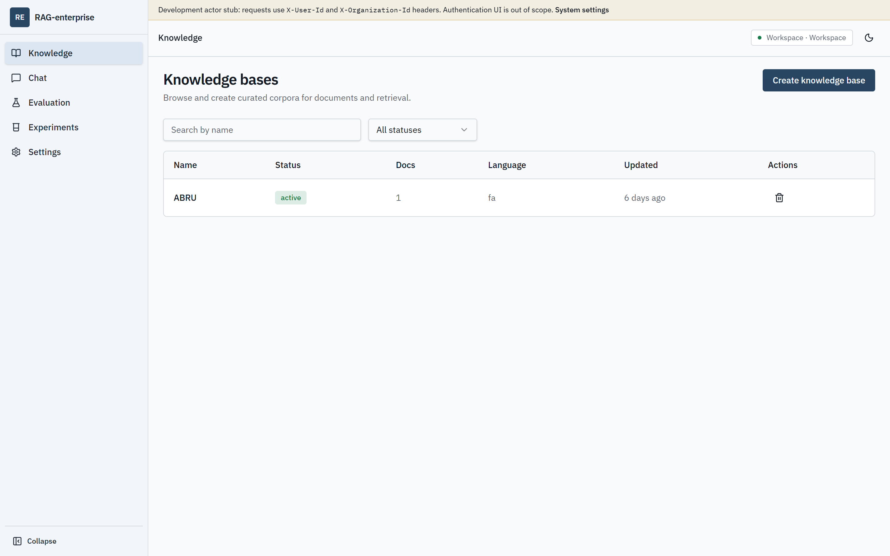
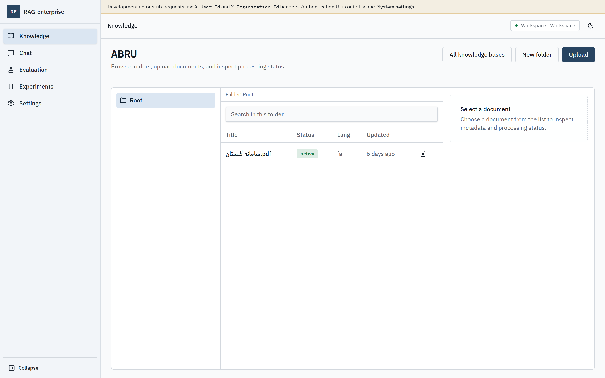
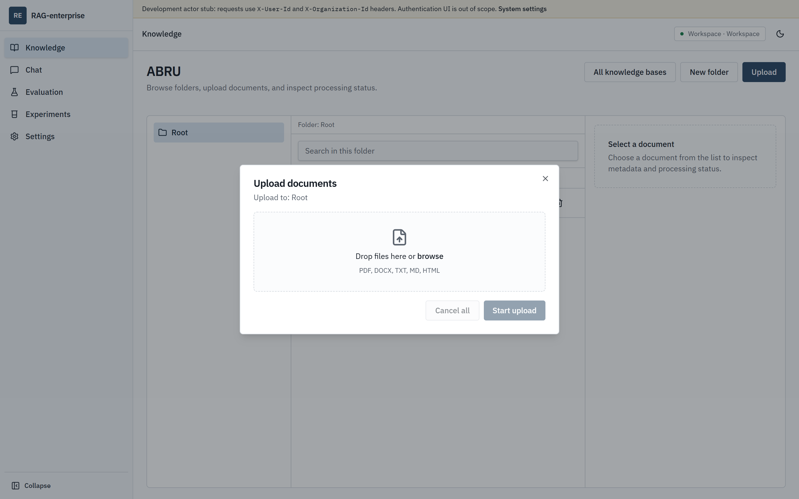
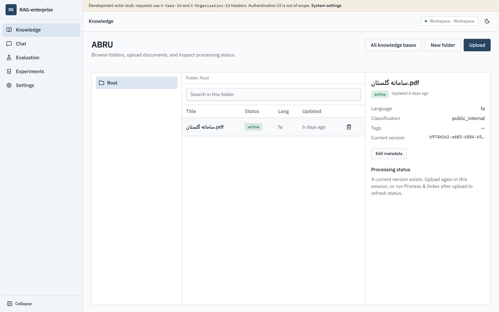
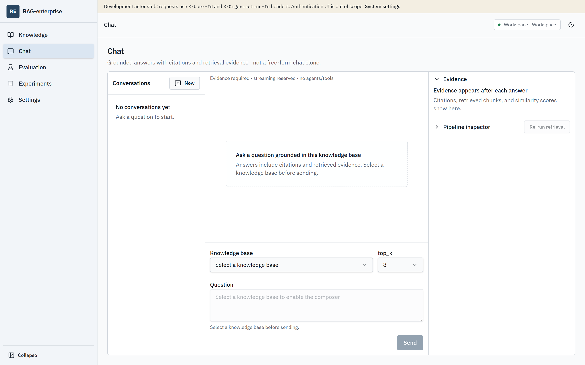
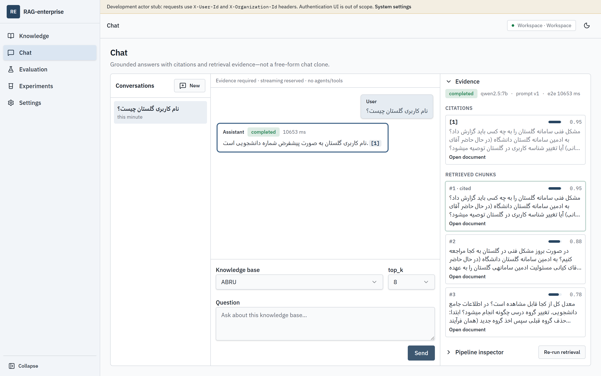
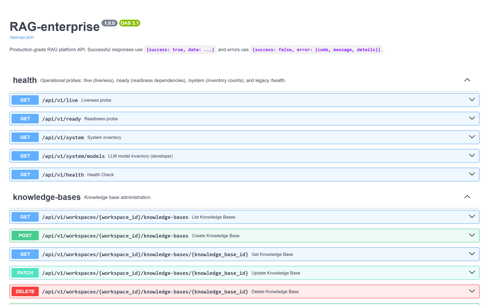
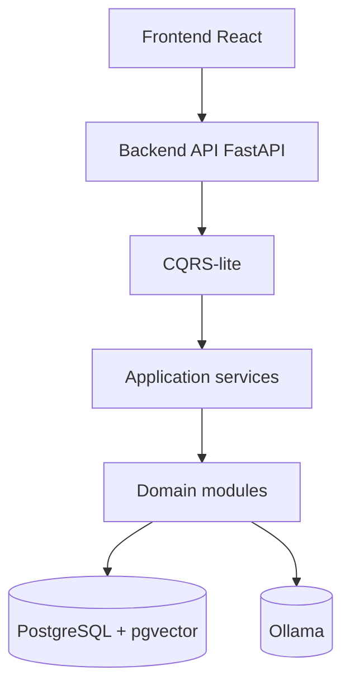
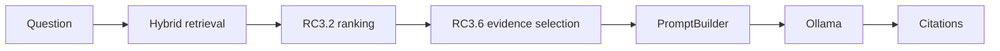

# RAG-enterprise


**Enterprise Persian RAG System — Version 1.0.0**

Production-ready Retrieval-Augmented Generation platform for curated enterprise
knowledge bases. Built as a modular monorepo (FastAPI + React) with hybrid
retrieval, deterministic evidence selection, grounded citations, and a local
Ollama generation path.

[Release Notes](RELEASE_NOTES.md) · [Changelog](CHANGELOG.md) · [Architecture](docs/ARCHITECTURE.md) · [Documentation index](docs/README.md)

---

## Overview

RAG-enterprise helps organizations turn internal documents into **grounded,
citable answers**—especially for Persian and mixed Persian/English corpora.

Operators create knowledge bases, upload documents, process and index them,
publish, then chat with retrieval-backed answers. The Version 1.0 AI path is
frozen as:

**Hybrid Retrieval → RC3.2 Ranking → RC3.6 Evidence Selection → PromptBuilder → Ollama → Citations**

---

## Features

- Knowledge base lifecycle: create, rename, publish (`draft` → `active`), delete
- Nested folders and recursive cascade cleanup
- Document upload, versioning, Process & Index, replace/delete
- Formats: **TXT**, **PDF** (text-layer), **DOCX**
- Persian normalization and bilingual grounded chat
- Dense embeddings with **BGE-M3**
- **Hybrid retrieval** (dense + BM25 + Reciprocal Rank Fusion)
- Deterministic **RC3.2** ranking calibration for Persian FAQ near-ties
- **RC3.6 evidence selection** (PRIMARY / SUPPLEMENTARY / IRRELEVANT)
- Grounded generation with citation validation and abstention
- Local LLM via **Ollama** (validated with `qwen2.5:7b`)
- Offline evaluation framework + operator console
- One-command launcher: `uv run python run.py`

---

## Screenshots

### Knowledge bases (home / dashboard)


### Knowledge base list



### Folder browser



### Upload



### Processing / document inspection



### Chat



### Citations & evidence



### OpenAPI / Swagger



---

## Architecture

High-level Version 1.0 layering:



Request path:



Full narrative, package map, and diagrams:
**[docs/ARCHITECTURE.md](docs/ARCHITECTURE.md)** ·
[`docs/architecture-diagrams/`](docs/architecture-diagrams/)

---

## Technology stack

| Area | Choice |
| --- | --- |
| Frontend | React, TypeScript, Vite, Tailwind, shadcn/ui, TanStack Query |
| Backend | Python 3.12+, uv, FastAPI, Pydantic, SQLAlchemy 2, Alembic |
| Database | PostgreSQL 16 + **pgvector** |
| Embeddings | **BAAI/bge-m3** (sentence-transformers) |
| LLM | **Ollama** (`qwen2.5:7b` validated path) |
| Launcher | `uv run python run.py` + Docker Compose |
| Testing | pytest, Vitest, Ruff, MyPy, GitHub Actions |

Details: [docs/TECH_STACK.md](docs/TECH_STACK.md).

---

## Installation

### Prerequisites

- [uv](https://docs.astral.sh/uv/)
- Node.js 20+ and npm
- Docker Desktop / Docker Compose
- [Ollama](https://ollama.com/) with your selected model (e.g. `qwen2.5:7b`)

### Configure environment

```bash
cp .env.example .env
cp .env.example backend/.env
```

Adjust ports if needed (this workspace commonly uses backend **8800** when 8000 is reserved).

Expanded setup: [docs/FIRST_RUN.md](docs/FIRST_RUN.md) · [docs/DEVELOPMENT.md](docs/DEVELOPMENT.md).

---

## Quick start

From the repository root:

```bash
uv run python run.py
```

This starts Postgres/Redis (Compose), runs migrations, and launches backend + frontend.

Typical URLs:

| Service | URL |
| --- | --- |
| Operator console | http://localhost:5173 |
| API docs (Swagger) | http://localhost:8800/docs *(or `BACKEND_PORT`)* |
| Liveness | `/api/v1/live` |
| Readiness | `/api/v1/ready` |

---

## Example workflow

```text
Create KB
    ↓
Upload documents
    ↓
Process & Index
    ↓
Publish (draft → active)
    ↓
Chat with citations
```

Demo corpus: [demo/](demo/README.md) · [Demo Guide](docs/DEMO_GUIDE.md).

---

## Performance highlights

Golestan Persian FAQ benchmarks from the RC3.x validation series
(local Ollama `qwen2.5:7b`, BGE-M3 embeddings):

| Metric | Result |
| --- | --- |
| Generation Pass (RC3.6 peak) | **16 / 20** |
| Hit@1 / MRR (retrieval) | **0.85 / 0.90** |
| Avg chat latency (RC3.6) | **~2.6 s** |
| Evidence selection overhead | **~30–40 ms** |
| Prompt size reduction (RC3.6) | **~70%** |
| Retrieval | Hybrid (dense + BM25 + RRF) |
| Embedding | BGE-M3 |
| LLM | Ollama (`qwen2.5:7b`) |

Sources: [RC3.6 Evidence Selection Report](RC3.6_EVIDENCE_SELECTION_REPORT.md),
[RC3.7 Validation Report](RC3.7_VALIDATION_REPORT.md),
[Performance Report](PERFORMANCE_REPORT.md).

---

## Project structure

```text
RAG-enterprise/
├── backend/                 # FastAPI app, tests, Alembic, eval tools
│   └── src/rag_enterprise/  # api · application · knowledge · retrieval · generation …
├── frontend/                # React operator console
├── demo/                    # Official Persian demo corpus
├── docs/                    # Architecture, guides, ADRs, screenshots
│   ├── ARCHITECTURE.md
│   ├── architecture-diagrams/
│   └── images/
├── specs/                   # Feature specifications
├── tools/dev_launcher/      # Launcher helpers
└── run.py                   # One-command developer launcher
```

---

## Documentation

| Document | Description |
| --- | --- |
| [ARCHITECTURE.md](docs/ARCHITECTURE.md) | System architecture, flows, decisions |
| [FIRST_RUN.md](docs/FIRST_RUN.md) | First-time local bring-up |
| [CONFIGURATION.md](docs/backend/CONFIGURATION.md) | Settings and validation |
| [DEPLOYMENT.md](docs/DEPLOYMENT.md) | Local Compose deployment |
| [EVALUATION_GUIDE.md](docs/EVALUATION_GUIDE.md) | Offline evaluation |
| [DEVELOPMENT.md](docs/DEVELOPMENT.md) | Daily developer setup |
| [Documentation index](docs/README.md) | Full doc map |

---

## Version

| Field | Value |
| --- | --- |
| Version | **1.0.0** |
| Status | **Production Ready** (local enterprise / demo profile) |
| Tag | `v1.0.0` |

Known V1 limitations (auth, workers, OCR, multi-node) are listed in
[RELEASE_NOTES.md](RELEASE_NOTES.md).

---

## License

[MIT](LICENSE)
