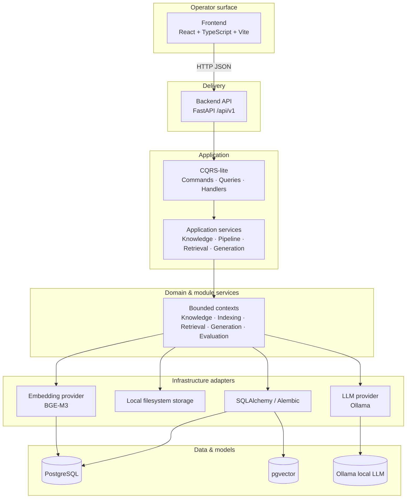
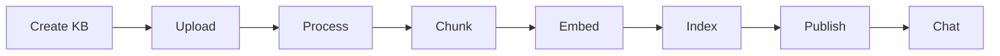
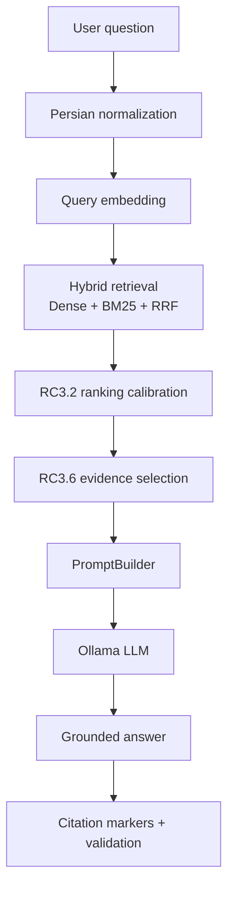
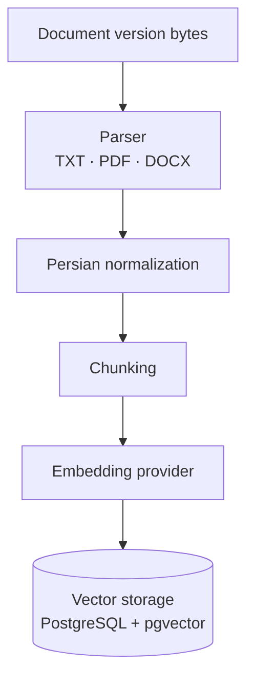
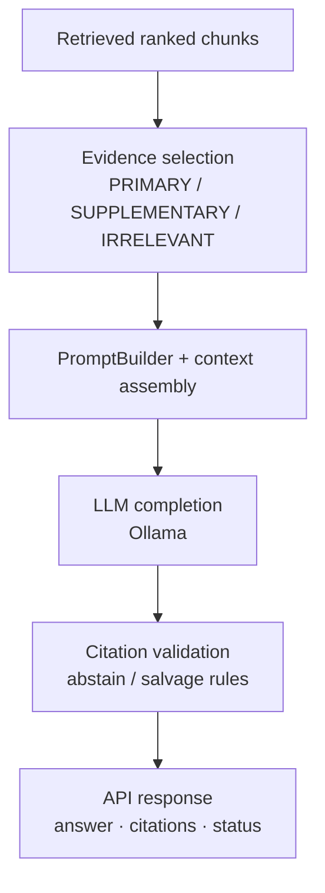
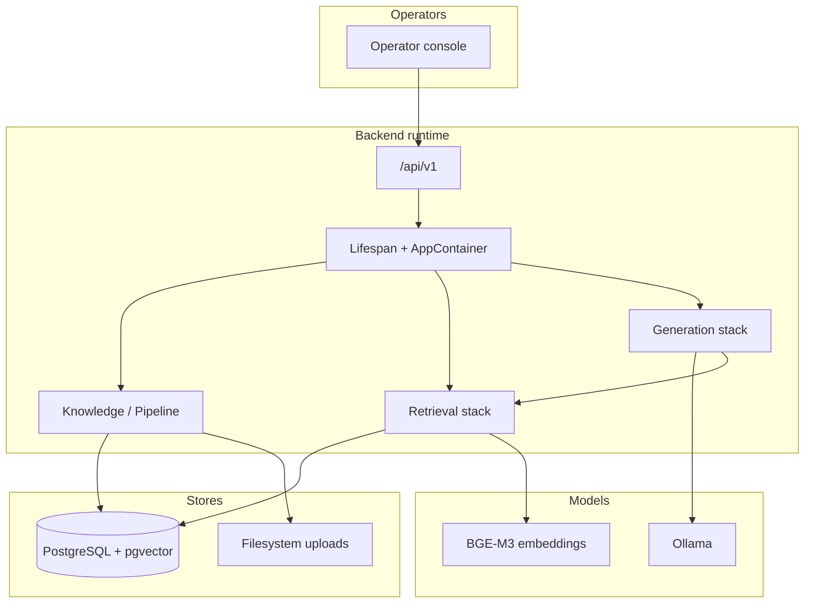

# Architecture — RAG-enterprise Version 1.0

> **Release:** 1.0.0  
> **Audience:** engineers, interviewers, portfolio reviewers, research collaborators  
> **Status:** Current system architecture for the shipped Version 1.0 freeze  
> **Companion diagrams:** [`architecture-diagrams/`](architecture-diagrams/)

This document describes how the **Enterprise Persian RAG System** is structured and
how data moves through it in Version 1.0. Durable decisions live in
[ADRs](DECISIONS.md). Feature contracts live in [`specs/`](../specs/). One-page map:
[Architecture Summary](ARCHITECTURE_SUMMARY.md).

---

## 1. High-level system architecture

Version 1.0 is a modular monorepo. Operators use a React console that calls a typed
FastAPI surface. The backend keeps a clear dependency direction: **API → application
(CQRS-lite) → domain/services → infrastructure → data stores and model providers**.



**Source file:** [`architecture-diagrams/01-system-architecture.mmd`](architecture-diagrams/01-system-architecture.mmd)

### Layer responsibilities

| Layer | Responsibility in V1.0 |
| --- | --- |
| Frontend | Operator UX for knowledge, process/index, chat, evaluation |
| Backend API | Auth-header tenancy (dev), validation, HTTP mapping, OpenAPI |
| CQRS-lite | Separate write commands from read queries at the application boundary |
| Application | Orchestrate use cases; no provider SDK types leak upward |
| Domain / modules | Knowledge lifecycle, processing, chunking, indexing, retrieval, generation |
| Infrastructure | Postgres/pgvector, filesystem uploads, embedding + LLM adapters |
| PostgreSQL + pgvector | Relational state and dense vectors |
| Ollama | Local grounded generation |

---

## 2. Knowledge base lifecycle

A knowledge base is curated before it becomes searchable. Publish is an explicit
operator action (`draft` → `active`).



**Source file:** [`architecture-diagrams/02-knowledge-base-lifecycle.mmd`](architecture-diagrams/02-knowledge-base-lifecycle.mmd)

| Stage | What happens |
| --- | --- |
| Create | KB metadata, language defaults, draft status |
| Upload | Multipart/session upload to local filesystem storage |
| Process | Parse + Persian normalization → extracted text |
| Chunk | Deterministic chunking with lineage offsets |
| Embed | Dense vectors (BGE-M3) written beside chunk rows |
| Index | Vector index readiness for retrieval |
| Publish | KB becomes `active` and eligible for search/chat |
| Chat | Retrieve → select evidence → generate with citations |

Module notes: [Knowledge management](backend/KNOWLEDGE_MANAGEMENT.md) ·
[Process & Index](backend/PROCESS_AND_INDEX.md).

---

## 3. Request flow (question → answer)

The frozen Version 1.0 answer path after a knowledge base is published:



**Source file:** [`architecture-diagrams/03-request-flow.mmd`](architecture-diagrams/03-request-flow.mmd)

### Stage intent

1. **Normalization** — unify Persian/Arabic letter forms and digits before embed/search.
2. **Embedding** — dense query vector for similarity search.
3. **Hybrid retrieval** — fuse dense cosine hits with BM25 lexical hits via RRF.
4. **RC3.2 ranking** — deterministic FAQ/lexical calibration on fused candidates.
5. **RC3.6 evidence selection** — keep 1–3 primary + 0–2 supplementary chunks; drop distractors.
6. **PromptBuilder** — versioned grounded prompt + context assembly.
7. **Ollama** — local generation under abstain/citation contracts.
8. **Citations** — validate markers against retrieved evidence; abstain when unsupported.

---

## 4. Indexing flow

Indexing turns a stored document version into searchable vectors without changing the
operator-facing API contract.



**Source file:** [`architecture-diagrams/04-indexing-flow.mmd`](architecture-diagrams/04-indexing-flow.mmd)

| Step | Package / concern |
| --- | --- |
| Parser | `processing` (format-specific extractors) |
| Normalization | `processing.normalization` |
| Chunking | `chunking` |
| Embedding | `indexing` + embedding providers |
| Vector storage | `db` / `indexing` repositories + pgvector |

---

## 5. Generation flow

Generation never invents unsupported facts. Evidence is filtered before prompting;
citations are validated after the model responds.



**Source file:** [`architecture-diagrams/05-generation-flow.mmd`](architecture-diagrams/05-generation-flow.mmd)

Details: [RAG generation](backend/RAG_GENERATION.md) · [Ollama](backend/OLLAMA.md) ·
[LLM provider layer](backend/LLM_PROVIDER_LAYER.md).

---

## 6. Project structure

### Monorepo

```text
RAG-enterprise/
├── backend/                 # FastAPI application (uv, Python 3.12+)
│   ├── src/rag_enterprise/  # Production packages
│   ├── tests/               # Pytest suite (mirrors packages)
│   ├── alembic/             # Schema migrations
│   └── tools/               # Eval / diagnostics CLIs (not runtime)
├── frontend/                # React operator console
├── demo/                    # Official Persian demo corpus
├── docs/                    # Guides, ADRs, this architecture document
├── specs/                   # Authoritative feature specifications
├── tools/dev_launcher/      # One-command local launcher support
├── infrastructure/          # V1 Compose metadata; cloud IaC = Version 2
├── scripts/                 # Developer helpers
└── run.py                   # Developer launcher entrypoint
```

### Backend packages (`backend/src/rag_enterprise/`)

| Package | Role |
| --- | --- |
| `api` | HTTP routes, middleware, envelopes, OpenAPI |
| `application` | CQRS-lite commands/queries/handlers, DTOs, provider interfaces |
| `core` | Settings, DI container, logging, health helpers |
| `db` | SQLAlchemy base, sessions, mixins, repositories helpers |
| `knowledge` | Knowledge bases, folders, documents, uploads, publish/delete |
| `processing` | Parsers + Persian normalization |
| `chunking` | Chunk splitting with lineage metadata |
| `indexing` | Embeddings, chunk/embedding persistence, index orchestration |
| `retrieval` | Hybrid retrieval, BM25, RRF, RC3.2 ranking |
| `generation` | Evidence selection, PromptBuilder, GenerationService, citations |
| `pipeline` | Synchronous Process & Index operator orchestration |
| `evaluation` | Offline golden-dataset experiments and metrics |

### Frontend packages (`frontend/src/`)

| Area | Role |
| --- | --- |
| `pages` / `routes` | Operator screens and routing |
| `features` | Knowledge, chat, evaluation feature modules |
| `components` | Shared UI primitives |
| `hooks` / `lib` | Data fetching and shared utilities |
| `test` | Vitest setup |

---

## 7. Technology stack

| Area | Version 1.0 choices |
| --- | --- |
| **Frontend** | React, TypeScript, Vite, Tailwind CSS, shadcn/ui, TanStack Query |
| **Backend** | Python 3.12+, uv, FastAPI, Pydantic Settings, SQLAlchemy 2 async, Alembic, structlog |
| **Database** | PostgreSQL 16 + **pgvector** (Docker Compose locally) |
| **Embeddings** | `BAAI/bge-m3` via sentence-transformers (deterministic provider in tests) |
| **LLM** | **Ollama** local models (validated path includes `qwen2.5:7b`); mock/echo in CI |
| **Launcher** | `uv run python run.py` → Docker Compose + migrations + backend + frontend |
| **Testing** | pytest, Vitest, Ruff, MyPy, GitHub Actions CI |
| **Storage** | Local filesystem under `FILE_STORAGE_ROOT` (uploads / extracted text) |

Full matrix: [Tech Stack](TECH_STACK.md).

---

## 8. Architecture decisions (why)

### CQRS-lite

**Why:** Keep write and read paths explicit so knowledge mutations (upload, delete,
publish) do not tangle with retrieval/generation reads. Handlers stay testable and
HTTP-thin.

**Trade-off:** Not a full dual-store CQRS. V1 uses one Postgres database with separate
command/query application contracts ([Application layer](backend/APPLICATION_LAYER.md)).

### Dependency injection

**Why:** Hide embedding/LLM/storage implementations behind narrow interfaces.
Application code depends on contracts; lifespan wires the `AppContainer`.

**Trade-off:** Slightly more bootstrap code; gains swapability (mock LLM, deterministic
embeddings) for tests and local demos.

### Hybrid retrieval

**Why:** Dense retrieval alone fails on exact Persian FAQ phrasing and rare tokens.
BM25 + RRF recovers lexical matches; RC3.2 ranking calibrates near-ties.

**Trade-off:** Extra candidate fusion cost (~sub-second) versus pure dense search;
accepted for Persian FAQ quality in V1.

### Evidence selection

**Why:** Ranked neighbors still include distractor FAQs that confuse small local LLMs.
A deterministic selector shrinks prompts (PRIMARY/SUPPLEMENTARY only) without a
cross-encoder or LLM judge.

**Trade-off:** Heuristic, not learned. Good for V1 explainability and latency; learned
rerankers deferred to post-1.0.

### Local LLM (Ollama)

**Why:** Enterprise demos and research setups often need offline or private inference.
Ollama provides a practical local generation backend with readiness probes.

**Trade-off:** Answer completeness is model-bound (e.g. 7B variance). Retrieval quality
and evidence selection are designed so abstention beats hallucination.

Supporting ADRs: [001 Monorepo](adr/001-monorepo-architecture.md) ·
[002 FastAPI](adr/002-backend-framework-selection.md) ·
[003 PostgreSQL + pgvector](adr/003-database-selection.md) ·
[004 React/Vite](adr/004-frontend-selection.md) ·
[005 AI platform principles](adr/005-ai-platform-principles.md).

---

## 9. End-to-end runtime picture



**Source file:** [`architecture-diagrams/06-runtime-overview.mmd`](architecture-diagrams/06-runtime-overview.mmd)

---

## 10. What Version 1.0 deliberately excludes

Documented as **Version 2** (see [Roadmap](ROADMAP.md)):

- End-user authentication and hardened authorization
- Background workers / distributed job queues
- Streaming chat transports
- LangGraph agent/tool orchestration
- Multi-node cloud deployment / managed object storage
- Learned cross-encoder reranking

---

## 11. Related documents

| Document | Use when |
| --- | --- |
| [Architecture Summary](ARCHITECTURE_SUMMARY.md) | Need a one-page map |
| [Feature Map](FEATURE_MAP.md) | Mapping specs 001–008 to modules |
| [Embeddings & retrieval](backend/EMBEDDINGS_AND_RETRIEVAL.md) | Hybrid + ranking detail |
| [RAG generation](backend/RAG_GENERATION.md) | Prompting, citations, abstain |
| [Data architecture](data/DATA_ARCHITECTURE.md) | Persistence model |
| [Bounded contexts](domain/BOUNDED_CONTEXTS.md) | Domain boundaries |
| [Release Notes](../RELEASE_NOTES.md) | Product-facing V1.0 narrative |
| [RC3.7 Validation Report](../RC3.7_VALIDATION_REPORT.md) | Release quality gate evidence |

---

## Diagram index

| File | Diagram |
| --- | --- |
| [`01-system-architecture.mmd`](architecture-diagrams/01-system-architecture.mmd) | Layered system architecture |
| [`02-knowledge-base-lifecycle.mmd`](architecture-diagrams/02-knowledge-base-lifecycle.mmd) | KB lifecycle |
| [`03-request-flow.mmd`](architecture-diagrams/03-request-flow.mmd) | Question → answer pipeline |
| [`04-indexing-flow.mmd`](architecture-diagrams/04-indexing-flow.mmd) | Document indexing |
| [`05-generation-flow.mmd`](architecture-diagrams/05-generation-flow.mmd) | Evidence → response |
| [`06-runtime-overview.mmd`](architecture-diagrams/06-runtime-overview.mmd) | Runtime collaboration |
