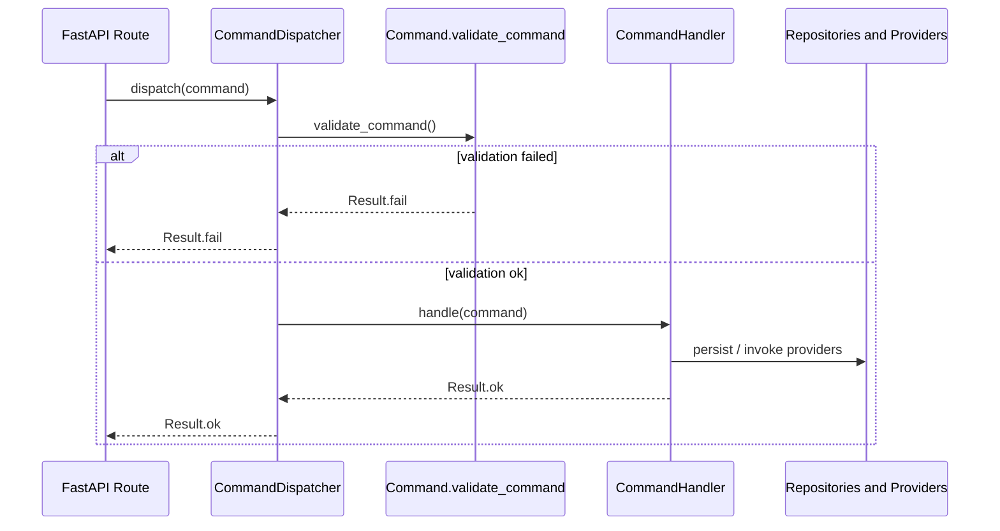
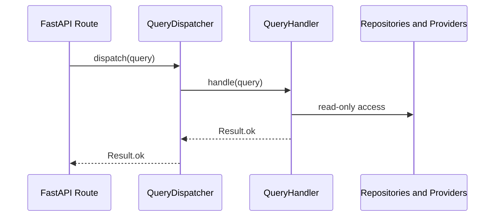

# Application Layer

> **Status:** Implemented infrastructure foundation.  
> **Authority:** Implements approved domain and data architecture without business use cases.

## Purpose

The application layer coordinates use cases between delivery mechanisms (FastAPI),
domain rules, and infrastructure adapters (persistence, providers, storage).

Location: `backend/src/rag_enterprise/application/`

Business entities, repositories, and use cases are intentionally not implemented yet.

## Package structure

```text
application/
  commands/      Write-side command markers and dispatcher
  queries/       Read-side query markers and dispatcher
  handlers/      Handler protocols
  dto/           Request, response, and pagination DTO bases
  interfaces/    Provider and infrastructure contracts
  events/        Domain event base types
  services/      Application service base classes
  common/        Result type and application errors
```

## CQRS-lite

RAG-enterprise uses a lightweight CQRS split:

| Side | Responsibility |
| --- | --- |
| Commands | Mutate state, enforce invariants, coordinate transactions |
| Queries | Read data without side effects |

This is CQRS-lite:

- separate dispatchers and handler contracts,
- no event sourcing,
- no external mediator framework,
- shared process and dependency container.

## Command flow



### Command rules

- Commands are immutable Pydantic models inheriting `CommandBase`.
- Handlers return `Result[T]`; they do not raise for expected business failures.
- Validation belongs in `validate_command()` and runs before handler execution.
- Registration is explicit through `CommandDispatcher.register()`.

## Query flow



### Query rules

- Queries are immutable and read-only.
- Queries do not call `validate_command()` at the dispatcher level.
- Handlers must not mutate state or publish side effects.
- Pagination and filtering belong in query handlers or DTOs.

## Result pattern

`Result[T]` is the standard application return type.

| State | Meaning |
| --- | --- |
| `Result.ok(value)` | Successful operation |
| `Result.fail(error)` | Expected failure with structured `ApplicationError` |

Benefits:

- business outcomes remain explicit,
- API layers map errors to HTTP responses deterministically,
- tests assert on outcomes instead of exception types.

Infrastructure failures may still raise exceptions at lower layers; application
handlers should translate them into `Result.fail(...)` when they represent expected
failure modes.

## DTO boundaries

| Type | Use |
| --- | --- |
| `RequestDTO` | Inbound API/application payloads |
| `ResponseDTO` | Outbound response payloads |
| `PaginationDTO[T]` | Paginated list responses |

DTOs are immutable Pydantic models for transport and validation. They are not domain
entities and must not leak ORM models across API boundaries.

## Domain events

`DomainEvent` provides a base type for future in-process and outbox-backed events.

Current scope:

- event identity and tenant context fields,
- immutable event envelope,
- no outbox integration yet.

Future handlers will publish events after successful command transactions.

## Interfaces

Application code depends on protocols, not provider SDKs:

| Interface | Purpose |
| --- | --- |
| `Clock` | Testable time access |
| `IdentityProvider` | Resolve authenticated subject |
| `FileStorage` | Binary object storage |
| `EmbeddingProvider` | Vector generation |
| `LLMProvider` | Text generation |
| `SearchProvider` | Retrieval candidates |

Concrete adapters live in infrastructure modules and are injected at composition time.

## Application services

| Base class | Use |
| --- | --- |
| `ApplicationService` | Coordinates commands and queries |
| `WriteApplicationService` | Command-only services |
| `ReadApplicationService` | Query-only services |

Services should remain thin orchestrators. Business rules belong in domain modules;
persistence belongs in repositories.

## Dependency boundaries

```text
API routes
  -> application dispatchers / services
    -> domain interfaces and rules
      -> repository and provider adapters
        -> db / external systems
```

Forbidden:

- routes calling repositories or ORM models directly,
- handlers importing FastAPI types,
- domain logic depending on Pydantic DTOs,
- provider SDK types crossing application interfaces.

## Testing strategy

Application infrastructure tests live in `backend/tests/application/` and cover:

- `Result` success and failure behavior,
- command and query dispatchers,
- DTO validation,
- command registration.

## Next implementation steps

1. Define domain entities and repositories on top of the persistence layer.
2. Add concrete command/query handlers for approved use cases.
3. Wire dispatchers into `AppContainer` and FastAPI dependencies.
4. Add domain event dispatch and outbox integration.

## Related documents

- [Persistence Layer](PERSISTENCE_LAYER.md)
- [Data Architecture](../data/DATA_ARCHITECTURE.md)
- [Domain Model](../domain/DOMAIN_MODEL.md)
