# Aggregates

> **Status:** Accepted — implementation-ready aggregate design.  
> **Purpose:** Define consistency boundaries that map to transactions, ownership, and future ORM aggregates.

## 1. Aggregate design rules

| Rule | Description |
| --- | --- |
| One transaction per aggregate | A single business operation mutates one aggregate root unless a governed saga coordinates multiple roots. |
| External references by ID only | Aggregates reference other aggregates by UUIDv7, not by embedded mutable objects. |
| Child entities belong to one root | Every non-root entity has exactly one aggregate root for lifecycle and deletion semantics. |
| Derived data is eventually consistent | Chunks, embeddings, and search readiness may lag content publication. |
| Immutable history is preserved | Versioned and cited artifacts are not updated in place. |

## 2. Aggregate map

```mermaid
flowchart TB
    subgraph tenant [Tenant Administration]
        OrgAgg[Organization Aggregate]
        OrgAgg --> Workspace
        OrgAgg --> Role
        OrgAgg --> Membership
    end

    subgraph identity [Identity]
        UserAgg[User Aggregate]
    end

    subgraph knowledge [Knowledge Content]
        KBAgg[KnowledgeBase Aggregate]
        KBAgg --> Folder
        KBAgg --> Document
        Document --> DocumentVersion
    end

    subgraph indexing [Knowledge Indexing]
        IndexAgg[Indexing Aggregate]
        IndexAgg --> Chunk
        IndexAgg --> Embedding
    end

    subgraph retrieval [Retrieval Configuration]
        RCAgg[RetrievalConfiguration Aggregate]
    end

    subgraph conversation [Conversational Experience]
        ConvAgg[Conversation Aggregate]
        ConvAgg --> Message
        Message --> Citation
    end

    subgraph ai [AI Configuration]
        ProviderAgg[LLMProvider Catalog Aggregate]
        EmbedModelAgg[EmbeddingModel Catalog Aggregate]
        PromptAgg[PromptTemplate Aggregate]
    end

    subgraph quality [Quality]
        EvalAgg[Evaluation Aggregate]
        EvalAgg --> Feedback
    end

    subgraph integration [Integrations]
        ConnAgg[IntegrationConnector Aggregate]
        ConnAgg --> ToolDefinition
    end
```

## 3. Aggregate catalog

### 3.1 Organization aggregate

| Item | Value |
| --- | --- |
| Root | `Organization` |
| Children | `Workspace`, `Role`, `Membership` |
| Invariants | Unique `slug` per platform; at least one admin path before activation |
| Consistency | Membership revocation immediately affects authorization cache |
| Transaction boundary | Org settings + role changes + membership updates in one unit when related |
| External references | `User` by ID only |

### 3.2 User aggregate

| Item | Value |
| --- | --- |
| Root | `User` |
| Children | none |
| Invariants | Verified `email` uniqueness; deleted users cannot authenticate |
| Consistency | Global identity independent of tenant membership |
| Transaction boundary | User profile and status only |
| External references | Memberships managed by organization aggregate |

### 3.3 KnowledgeBase aggregate

| Item | Value |
| --- | --- |
| Root | `KnowledgeBase` |
| Children | `Folder`, `Document`, `DocumentVersion` |
| Invariants | Folder path uniqueness within KB; document belongs to one folder; version numbers monotonic per document |
| Consistency | Document metadata and version creation are strongly consistent within the aggregate |
| Transaction boundary | Folder move/rename + document placement + version registration |
| External references | `RetrievalConfiguration` as separate aggregate |

**Note:** `DocumentVersion` content blobs are stored externally; the aggregate stores pointers and status.

### 3.4 Indexing aggregate

| Item | Value |
| --- | --- |
| Root | logical `IndexingJob` / `KnowledgeBase` indexing boundary |
| Children | `Chunk`, `Embedding` |
| Invariants | Chunk offsets unique per version; one active embedding generation per chunk+model at a time |
| Consistency | Eventually consistent with content aggregate |
| Transaction boundary | Chunk batch insert + embedding status updates per job partition |
| External references | `DocumentVersion`, `EmbeddingModel` |

Indexing is modeled as its own aggregate because chunk and embedding volume would bloat the content aggregate and re-indexing requires independent lifecycles.

### 3.5 RetrievalConfiguration aggregate

| Item | Value |
| --- | --- |
| Root | `RetrievalConfiguration` |
| Children | none |
| Invariants | Only one `active` configuration per knowledge base at a time |
| Consistency | Publication is atomic; conversations pin configuration version |
| Transaction boundary | New version insert + prior version deprecation |
| External references | `EmbeddingModel`, `LLMProvider`, `KnowledgeBase` |

### 3.6 Conversation aggregate

| Item | Value |
| --- | --- |
| Root | `Conversation` |
| Children | `Message`, `Citation` |
| Invariants | Messages append-only after completion; citations immutable once attached |
| Consistency | Message completion and citations written in one transaction |
| Transaction boundary | User message insert; assistant completion with citations |
| External references | pinned `RetrievalConfiguration`, `PromptTemplate`, `LLMProvider`, `Chunk` |

### 3.7 LLMProvider catalog aggregate

| Item | Value |
| --- | --- |
| Root | `LLMProvider` |
| Children | org enablement rows |
| Invariants | Catalog keys unique; retired providers cannot be enabled |
| Consistency | Platform-wide |
| Transaction boundary | Catalog update separate from tenant enablement |

### 3.8 EmbeddingModel catalog aggregate

| Item | Value |
| --- | --- |
| Root | `EmbeddingModel` |
| Children | org enablement rows |
| Invariants | Dimensions and provider/model key immutable |
| Consistency | Platform-wide |
| Transaction boundary | Catalog update separate from tenant enablement |

### 3.9 PromptTemplate aggregate

| Item | Value |
| --- | --- |
| Root | `PromptTemplate` |
| Children | none |
| Invariants | `(organization_id, name, locale, version)` unique; only approved versions activatable |
| Consistency | Versioned insert-only |
| Transaction boundary | New version insert + prior version deprecation |

### 3.10 Evaluation aggregate

| Item | Value |
| --- | --- |
| Root | `Evaluation` |
| Children | result artifacts, optional `Feedback` links |
| Invariants | Thresholds fixed at run start; result summary immutable after completion |
| Consistency | Strong within evaluation run metadata |
| Transaction boundary | Run state transitions and final result write |
| External references | `KnowledgeBase`, `RetrievalConfiguration` |

### 3.11 IntegrationConnector aggregate

| Item | Value |
| --- | --- |
| Root | `IntegrationConnector` |
| Children | `ToolDefinition` |
| Invariants | Connector type and workspace scope fixed; enabled tools require approval |
| Consistency | Connector enablement and tool approval managed together |
| Transaction boundary | Connector validation + tool enablement |
| External references | future tool invocation logs in conversation aggregate |

## 4. Cross-aggregate coordination

| Workflow | Aggregates involved | Pattern |
| --- | --- | --- |
| Document upload | KnowledgeBase, Indexing | saga: version created → event → chunk/embed |
| Re-index | KnowledgeBase, Indexing, RetrievalConfiguration | saga with parallel embedding generation |
| Chat answer | Conversation, Indexing, RetrievalConfiguration | read-only chunk access; write citations |
| Evaluation run | Evaluation, Conversation, Indexing | read-only with synthetic or fixture data |
| Connector import | IntegrationConnector, KnowledgeBase | saga: external fetch → document version |

## 5. ORM mapping guidance

| Aggregate root | Suggested module boundary |
| --- | --- |
| `Organization` | tenant administration |
| `User` | identity |
| `KnowledgeBase` | knowledge content |
| Indexing boundary | knowledge indexing |
| `RetrievalConfiguration` | retrieval configuration |
| `Conversation` | conversational experience |
| Catalog roots | ai configuration |
| `Evaluation` | quality |
| `IntegrationConnector` | integrations |

Repositories load one aggregate root and its children per transaction unless a saga explicitly spans roots.

## 6. Related documents

- [Data Architecture](DATA_ARCHITECTURE.md)
- [Relationships](RELATIONSHIPS.md)
- [Event Model](EVENT_MODEL.md)
