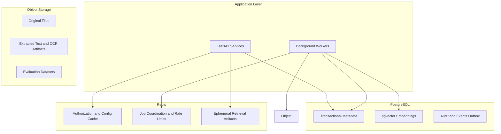

# Data Architecture

> **Status:** Accepted — implementation-ready data architecture.  
> **Authority:** Implements the approved business domain in `docs/domain/` without redesigning it.  
> **Scope:** Persistence, indexing, storage placement, lifecycle, and event coordination. No SQL, ORM, or migration code.

## 1. Purpose

This document translates the approved RAG-enterprise domain model into a physical data
architecture that can later be mapped almost directly to SQLAlchemy models and Alembic
migrations.

The architecture optimizes for:

- hard multi-tenant isolation,
- immutable content lineage,
- versioned AI configuration,
- high-volume indexing artifacts,
- auditability and retention compliance,
- future OCR, web search, SQL agents, and MCP integrations.

## 2. Physical architecture overview

## 3. Cross-cutting data conventions

### 3.1 Primary identifier strategy

**Recommendation: UUID version 7 (UUIDv7) for all primary keys.**

| Option | Assessment |
| --- | --- |
| **UUIDv7 (recommended)** | Time-ordered 128-bit identifiers with strong index locality in PostgreSQL B-tree indexes, distributed generation without coordination, and native `uuid` storage. |
| ULID | Similar time-ordering benefits, but requires `text`/`bytea` storage or conversion; weaker native PostgreSQL ergonomics than `uuid`. |
| UUIDv4 | Excellent randomness and simplicity, but poor insert locality and fragmented indexes at scale. |

**Decision:** Use UUIDv7 for every entity primary key and foreign key reference.

**Additional rules:**

- Never expose sequential integer primary keys externally.
- Use monotonic `version_number`, `sequence_number`, and `rank` only inside an aggregate.
- Generate IDs in the application layer; do not rely on database sequences for public identifiers.
- Store all IDs as PostgreSQL `uuid` type.

### 3.2 Standard audit columns

All mutable transactional tables include:

| Column | Type | Policy |
| --- | --- | --- |
| `created_at` | `timestamptz` | Immutable after insert |
| `updated_at` | `timestamptz` | Updated on every mutation |
| `created_by_user_id` | `uuid` nullable | Immutable after insert |
| `updated_by_user_id` | `uuid` nullable | Changes with mutation |
| `row_version` | `integer` | Optimistic concurrency on contested aggregates |

### 3.3 Soft delete columns

Soft-deletable entities include:

| Column | Type | Policy |
| --- | --- | --- |
| `deleted_at` | `timestamptz` nullable | Null means active |
| `deleted_by_user_id` | `uuid` nullable | Set on soft delete |
| `delete_reason` | `text` nullable | Operational or legal context |

Hard delete occurs only through governed retention jobs after the retention window.

### 3.4 Tenant boundary columns

| Scope | Required columns |
| --- | --- |
| Organization-owned | `organization_id` |
| Workspace-owned | `organization_id`, `workspace_id` |
| Knowledge-owned | `organization_id`, `workspace_id`, `knowledge_base_id` |
| Conversation-owned | `organization_id`, `workspace_id`, `conversation_id` |
| Global catalog | no tenant columns; use enablement join tables |

`organization_id` is denormalized on child rows for defense-in-depth filtering and
must always match the parent scope.

### 3.5 Immutability classes

| Class | Examples | Rule |
| --- | --- | --- |
| Immutable business snapshot | `DocumentVersion`, `Citation`, evaluation result payload | Insert-only; corrections create new records |
| Versioned configuration | `PromptTemplate`, `RetrievalConfiguration` | New version row; old version retained |
| Mutable operational state | `Document`, `Conversation`, `Membership` | Updates allowed with audit |
| Derived artifact | `Chunk`, `Embedding` | Regenerated on re-index; old generations retained until retention |

## 4. Entity data dictionary

The table below defines the implementation-ready physical model for every approved
entity. Storage placement is summarized here and detailed in [STORAGE_STRATEGY.md](STORAGE_STRATEGY.md).

### Organization

| Attribute | Value |
| --- | --- |
| Aggregate root | Yes |
| Primary identifier | `id` UUIDv7 |
| Ownership | Platform tenant root |
| Mutable fields | `legal_name`, `slug`, `status`, `default_locale`, `data_residency_policy`, billing metadata |
| Immutable fields | `id`, `created_at`, provisioning audit |
| Soft delete | No direct soft delete; use `status = decommissioned` |
| Audit requirements | Full admin audit for status and policy changes |
| Tenant boundary | Root tenant record |
| Expected size | Low thousands of rows platform-wide |
| Retention policy | Indefinite metadata; business data deleted per decommission workflow |
| Storage | PostgreSQL |

### Workspace

| Attribute | Value |
| --- | --- |
| Aggregate root | Yes |
| Primary identifier | `id` UUIDv7 |
| Ownership | `Organization` |
| Mutable fields | `name`, `slug`, `status`, `primary_locale`, settings |
| Immutable fields | `id`, `organization_id`, `created_at` |
| Soft delete | Yes via `deleted_at` after `archived` state |
| Audit requirements | Admin changes and archive/delete |
| Tenant boundary | `organization_id` |
| Expected size | 1–500 per organization |
| Retention policy | Archive immediately; hard delete after org retention window |
| Storage | PostgreSQL |

### User

| Attribute | Value |
| --- | --- |
| Aggregate root | Yes |
| Primary identifier | `id` UUIDv7 |
| Ownership | Global identity |
| Mutable fields | `display_name`, `status`, `preferred_locale`, auth linkage metadata |
| Immutable fields | `id`, `email` after verification, `created_at` |
| Soft delete | Yes via `status = deleted` and `deleted_at` |
| Audit requirements | Identity lifecycle and auth changes |
| Tenant boundary | Global |
| Expected size | Up to millions platform-wide |
| Retention policy | Anonymize or purge per privacy policy after deletion |
| Storage | PostgreSQL |

### Role

| Attribute | Value |
| --- | --- |
| Aggregate root | Yes |
| Primary identifier | `id` UUIDv7 |
| Ownership | `Organization` |
| Mutable fields | `name`, `permission_set`, `status` |
| Immutable fields | `id`, `organization_id`, `scope_type`, `created_at` |
| Soft delete | No; use `status = deprecated` |
| Audit requirements | Permission changes |
| Tenant boundary | `organization_id` |
| Expected size | 10–100 per organization |
| Retention policy | Retain deprecated roles for audit attribution |
| Storage | PostgreSQL |

### Membership

| Attribute | Value |
| --- | --- |
| Aggregate root | No — child of tenant administration aggregate |
| Primary identifier | `id` UUIDv7 |
| Ownership | `Organization` |
| Mutable fields | `role_id`, `status`, `workspace_id` assignment |
| Immutable fields | `id`, `organization_id`, `user_id`, `created_at` |
| Soft delete | Revocation via `status = revoked`; retain row |
| Audit requirements | Invite, approve, revoke |
| Tenant boundary | `organization_id`, optional `workspace_id` |
| Expected size | Users × workspaces |
| Retention policy | Retain revoked memberships for audit |
| Storage | PostgreSQL |

### KnowledgeBase

| Attribute | Value |
| --- | --- |
| Aggregate root | Yes |
| Primary identifier | `id` UUIDv7 |
| Ownership | `Workspace` |
| Mutable fields | `name`, `status`, `default_language`, `visibility_policy`, retention class |
| Immutable fields | `id`, `organization_id`, `workspace_id`, `created_at` |
| Soft delete | Yes after `archived` |
| Audit requirements | Publish, archive, reindex, delete |
| Tenant boundary | `organization_id`, `workspace_id` |
| Expected size | 1–200 per workspace |
| Retention policy | Deleted with workspace or by KB-specific policy |
| Storage | PostgreSQL |

### Folder

| Attribute | Value |
| --- | --- |
| Aggregate root | No — child of `KnowledgeBase` aggregate |
| Primary identifier | `id` UUIDv7 |
| Ownership | `KnowledgeBase` |
| Mutable fields | `name`, `parent_folder_id`, materialized `path`, `status` |
| Immutable fields | `id`, `knowledge_base_id`, `organization_id`, `workspace_id` |
| Soft delete | Yes |
| Audit requirements | Move, rename, archive |
| Tenant boundary | `organization_id`, `workspace_id`, `knowledge_base_id` |
| Expected size | 10–10,000 per knowledge base |
| Retention policy | Delete with knowledge base or cascade from folder delete |
| Storage | PostgreSQL |

### Document

| Attribute | Value |
| --- | --- |
| Aggregate root | Yes |
| Primary identifier | `id` UUIDv7 |
| Ownership | `KnowledgeBase` |
| Mutable fields | `title`, `folder_id`, `status`, `declared_language`, `classification_label`, `owner_user_id`, ACL references |
| Immutable fields | `id`, `knowledge_base_id`, `organization_id`, `workspace_id`, `source_type`, `created_at` |
| Soft delete | Yes; legal hold blocks purge |
| Audit requirements | Create, move, publish, archive, delete, ACL changes |
| Tenant boundary | `organization_id`, `workspace_id`, `knowledge_base_id` |
| Expected size | 1,000–5,000,000 per large tenant |
| Retention policy | Classification-driven; versions and citations may outlive active document |
| Storage | PostgreSQL metadata; binaries in object storage |

### DocumentVersion

| Attribute | Value |
| --- | --- |
| Aggregate root | No — immutable child of `Document` aggregate |
| Primary identifier | `id` UUIDv7 |
| Ownership | `Document` |
| Mutable fields | `processing_status` only during pipeline |
| Immutable fields | `document_id`, `version_number`, `extraction_method`, `content_hash`, `effective_at`, storage pointers, page and language maps |
| Soft delete | No; use `superseded_at` |
| Audit requirements | Extraction and indexing transitions |
| Tenant boundary | denormalized `organization_id`, `workspace_id`, `knowledge_base_id`, `document_id` |
| Expected size | 2–20 per document |
| Retention policy | Retain while referenced by citations or legal hold |
| Storage | PostgreSQL metadata; extracted content in object storage |

### Chunk

| Attribute | Value |
| --- | --- |
| Aggregate root | No — child of indexing aggregate |
| Primary identifier | `id` UUIDv7 |
| Ownership | `KnowledgeBase` |
| Mutable fields | `status` only |
| Immutable fields | offsets, `sequence_number`, `language`, `chunking_profile`, lineage to `document_version_id` |
| Soft delete | Use `status = deleted`; retain while cited |
| Audit requirements | Generation and supersession |
| Tenant boundary | `organization_id`, `workspace_id`, `knowledge_base_id` |
| Expected size | 50–500 per document version; largest tenant table |
| Retention policy | Supersede on re-chunk; purge after citation and retention checks |
| Storage | PostgreSQL metadata; optional chunk text in object storage if large |

### Embedding

| Attribute | Value |
| --- | --- |
| Aggregate root | No — child of indexing aggregate |
| Primary identifier | `id` UUIDv7 |
| Ownership | `Chunk` / `KnowledgeBase` |
| Mutable fields | `index_status`, `indexed_at`, `stale_at` |
| Immutable fields | `chunk_id`, `embedding_model_id`, vector payload reference, dimensions |
| Soft delete | Use `status`; old generations retained during migration |
| Audit requirements | Index and re-index completion |
| Tenant boundary | denormalized tenant and knowledge base keys |
| Expected size | 1–N per chunk per model generation |
| Retention policy | Delete stale generations after successful re-index |
| Storage | PostgreSQL metadata + pgvector column |

### EmbeddingModel

| Attribute | Value |
| --- | --- |
| Aggregate root | Yes — catalog aggregate |
| Primary identifier | `id` UUIDv7 |
| Ownership | Platform catalog |
| Mutable fields | `status`, capability metadata, dimensions, provider reference |
| Immutable fields | `provider_key`, `model_key`, catalog version |
| Soft delete | No; use `retired` |
| Audit requirements | Enablement and retirement |
| Tenant boundary | Global catalog plus `organization_embedding_model` enablement |
| Expected size | Low hundreds platform-wide |
| Retention policy | Indefinite catalog history |
| Storage | PostgreSQL |

### RetrievalConfiguration

| Attribute | Value |
| --- | --- |
| Aggregate root | Yes |
| Primary identifier | `id` UUIDv7 |
| Ownership | `KnowledgeBase` |
| Mutable fields | `status` only after publication |
| Immutable fields | versioned policy payload, `embedding_model_id`, ranking policy, tool filters |
| Soft delete | No; use `retired` |
| Audit requirements | Publish, deprecate, retire |
| Tenant boundary | `organization_id`, `workspace_id`, `knowledge_base_id` |
| Expected size | 1–50 versions per knowledge base |
| Retention policy | Retain all versions referenced by conversations/evaluations |
| Storage | PostgreSQL |

### LLMProvider

| Attribute | Value |
| --- | --- |
| Aggregate root | Yes — catalog aggregate |
| Primary identifier | `id` UUIDv7 |
| Ownership | Platform catalog with org enablement |
| Mutable fields | `status`, `inference_defaults`, endpoint metadata |
| Immutable fields | `provider_type`, `model_key` |
| Soft delete | No; use `retired` |
| Audit requirements | Enable, disable, retire |
| Tenant boundary | Global catalog plus `organization_llm_provider` enablement |
| Expected size | Low hundreds |
| Retention policy | Indefinite catalog history |
| Storage | PostgreSQL; secrets in secret store |

### PromptTemplate

| Attribute | Value |
| --- | --- |
| Aggregate root | Yes |
| Primary identifier | `id` UUIDv7 |
| Ownership | `Organization` |
| Mutable fields | `status` only after approval |
| Immutable fields | `name`, `locale`, `version`, body hash, `llm_provider_id` |
| Soft delete | No; use `retired` |
| Audit requirements | Draft, approve, activate, retire |
| Tenant boundary | `organization_id` |
| Expected size | 10–500 versions per org |
| Retention policy | Retain versions used in production conversations |
| Storage | PostgreSQL; large bodies may move to object storage |

### Conversation

| Attribute | Value |
| --- | --- |
| Aggregate root | Yes |
| Primary identifier | `id` UUIDv7 |
| Ownership | `Workspace` |
| Mutable fields | `status`, `title`, sharing policy |
| Immutable fields | pinned config IDs, `user_id`, `locale`, `created_at` |
| Soft delete | Yes after archive |
| Audit requirements | Create, archive, delete, share changes |
| Tenant boundary | `organization_id`, `workspace_id` |
| Expected size | High volume; 10–10,000 per workspace |
| Retention policy | User and org retention driven |
| Storage | PostgreSQL |

### Message

| Attribute | Value |
| --- | --- |
| Aggregate root | No — child of `Conversation` |
| Primary identifier | `id` UUIDv7 |
| Ownership | `Conversation` |
| Mutable fields | `generation_status` during processing only |
| Immutable fields | `role`, final `content`, provider usage metadata after completion |
| Soft delete | No; conversation retention governs |
| Audit requirements | Completion, abstention, moderation flags |
| Tenant boundary | denormalized tenant and conversation keys |
| Expected size | 5–100 per conversation |
| Retention policy | Delete with conversation unless legal hold |
| Storage | PostgreSQL |

### Citation

| Attribute | Value |
| --- | --- |
| Aggregate root | No — immutable child of `Message` |
| Primary identifier | `id` UUIDv7 |
| Ownership | `Message` |
| Mutable fields | `validation_status` only |
| Immutable fields | `chunk_id`, `rank`, `relevance_score`, `excerpt`, source snapshot |
| Soft delete | Never while parent message retained |
| Audit requirements | Attachment and validation |
| Tenant boundary | denormalized tenant keys and `message_id` |
| Expected size | 0–20 per assistant message |
| Retention policy | Retain for audit and feedback analysis |
| Storage | PostgreSQL |

### Evaluation

| Attribute | Value |
| --- | --- |
| Aggregate root | Yes |
| Primary identifier | `id` UUIDv7 |
| Ownership | `Organization` |
| Mutable fields | `status`, execution timestamps |
| Immutable fields | dataset reference, thresholds, result summary after completion |
| Soft delete | Archive only |
| Audit requirements | Start, pass/fail, archive |
| Tenant boundary | `organization_id` |
| Expected size | Hundreds per org |
| Retention policy | Retain benchmark history |
| Storage | PostgreSQL metadata; datasets in object storage |

### Feedback

| Attribute | Value |
| --- | --- |
| Aggregate root | No — child of quality aggregate |
| Primary identifier | `id` UUIDv7 |
| Ownership | `Message` |
| Mutable fields | `review_status`, triage metadata |
| Immutable fields | `feedback_type`, `reason_code`, `user_id`, submitted payload |
| Soft delete | No |
| Audit requirements | Submission and review |
| Tenant boundary | denormalized tenant keys |
| Expected size | Fraction of messages |
| Retention policy | Org retention and anonymization policy |
| Storage | PostgreSQL |

### IntegrationConnector

| Attribute | Value |
| --- | --- |
| Aggregate root | Yes |
| Primary identifier | `id` UUIDv7 |
| Ownership | `Workspace` |
| Mutable fields | `status`, config metadata, health state |
| Immutable fields | `connector_type`, registration audit |
| Soft delete | Retire; do not hard delete |
| Audit requirements | Register, validate, enable, disable |
| Tenant boundary | `organization_id`, `workspace_id` |
| Expected size | Low tens per workspace |
| Retention policy | Retain disabled connectors for audit |
| Storage | PostgreSQL; credentials in secret store |

### ToolDefinition

| Attribute | Value |
| --- | --- |
| Aggregate root | No — child of `IntegrationConnector` |
| Primary identifier | `id` UUIDv7 |
| Ownership | `IntegrationConnector` |
| Mutable fields | `status`, `approval_policy` |
| Immutable fields | `tool_key`, `capability_class`, `input_schema` version |
| Soft delete | Retire |
| Audit requirements | Approve and enable |
| Tenant boundary | denormalized connector and workspace keys |
| Expected size | 1–50 per connector |
| Retention policy | Retain while referenced in audit logs |
| Storage | PostgreSQL |

## 5. Supporting persistence constructs

These are not business entities but are required by the physical model:

| Construct | Purpose |
| --- | --- |
| `organization_embedding_model` | Many-to-many enablement of catalog models per tenant |
| `organization_llm_provider` | Many-to-many enablement of generation providers per tenant |
| `document_acl` | Resource ACL for restricted documents |
| `knowledge_base_acl` | Visibility overrides |
| `domain_event_outbox` | Reliable event publication |
| `audit_log` | Immutable security and admin events |
| `ingestion_job` | Operational tracking for uploads and connector imports |
| `reindex_job` | Operational tracking for embedding migrations |

## 6. Translation guidance for ORM and migrations

When implementation begins:

1. One aggregate root maps to a primary table and optional child tables in the same migration group.
2. Immutable/versioned entities use insert-only patterns or status transitions guarded in application code.
3. All tenant-scoped tables include the tenant key columns defined here even when normalized.
4. Vector columns live on `embedding` or a dedicated `embedding_vector` table if row width requires separation.
5. Large payloads never belong in hot transactional rows.
6. Foreign keys use `ON DELETE RESTRICT` by default; governed cascades are explicit and documented in [RELATIONSHIPS.md](RELATIONSHIPS.md).

## 7. Related documents

- [Aggregates](AGGREGATES.md)
- [Relationships](RELATIONSHIPS.md)
- [Indexing Strategy](INDEXING_STRATEGY.md)
- [Storage Strategy](STORAGE_STRATEGY.md)
- [Data Lifecycle](DATA_LIFECYCLE.md)
- [Event Model](EVENT_MODEL.md)
