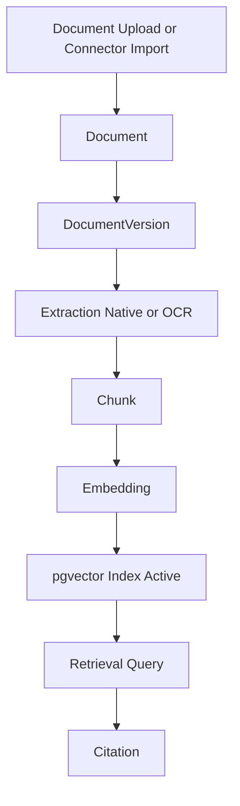

# Data Lifecycle

> **Status:** Accepted — implementation-ready lifecycle design.  
> **Purpose:** Describe physical lifecycle for the knowledge pipeline and re-indexing scenarios.

## 1. Pipeline overview

The pipeline is eventually consistent across stages. Status columns in PostgreSQL
represent the authoritative progress of each stage.

## 2. Stage-by-stage lifecycle

### Document

| Stage | Physical state | Storage |
| --- | --- | --- |
| Create | `document` row inserted with `status = draft` | PostgreSQL |
| Activate | `status = active` after first successful index | PostgreSQL |
| Archive | `status = archived`; hidden from default browse | PostgreSQL |
| Delete | `deleted_at` set; versions retained per policy | PostgreSQL |

**Triggers:** user upload, connector import, admin create.

**Downstream effect:** creation of first `DocumentVersion`.

---

### DocumentVersion

| Stage | Physical state | Storage |
| --- | --- | --- |
| Upload complete | `processing_status = uploaded`; original object stored | PostgreSQL + object storage |
| Extraction | `extracting` → `extracted` | extracted text in object storage |
| Chunking | `chunking` → `chunked` | chunk rows created |
| Indexing | `indexing` → `indexed` | embeddings created and indexed |
| Failure | `failed` with error metadata | PostgreSQL only |
| Supersession | `superseded` when newer version indexed | PostgreSQL |

**Immutability:** extracted content and hash are immutable once `extracted`.

**Future OCR:** OCR output creates `extraction_method = ocr` with additional layout artifacts in object storage; lifecycle stages remain the same.

---

### Chunk

| Stage | Physical state | Storage |
| --- | --- | --- |
| Generated | `status = created` | PostgreSQL metadata; text inline or object storage |
| Embedded | `status = embedded` | PostgreSQL |
| Indexed | `status = indexed` | retrieval-ready |
| Superseded | old version chunks marked `superseded` | retained for citations |
| Deleted | hard delete only after retention and citation checks | PostgreSQL |

**Invariants:**

- chunk references exactly one `document_version_id`,
- `sequence_number` is stable within a version,
- `language` is set per chunk for multilingual corpora.

---

### Embedding

| Stage | Physical state | Storage |
| --- | --- | --- |
| Pending | `index_status = pending` | PostgreSQL metadata |
| Computed | vector computed in worker | pgvector write pending |
| Indexed | vector index updated | PostgreSQL + pgvector |
| Stale | old model or superseded chunk | excluded from active retrieval |
| Reindexed | new generation row created | old generation retained until cleanup |
| Deleted | cleanup job removes stale generation | PostgreSQL + pgvector |

**Multiple models:** each `chunk + embedding_model + generation` is a distinct embedding row.

---

### Citation

| Stage | Physical state | Storage |
| --- | --- | --- |
| Proposed | retrieval candidate selected | application memory |
| Attached | `citation` row inserted with message | PostgreSQL |
| Validated optional | reviewer or policy validation | PostgreSQL status |
| Historical retention | remains after chunk supersession | PostgreSQL |

**Invariant:** citations reference the chunk ID used at generation time; they do not rewrite when a newer chunk exists.

## 3. End-to-end happy path

| Step | Event | Physical change |
| --- | --- | --- |
| 1 | Document uploaded | `document`, `document_version`, original object |
| 2 | Extraction completed | extracted text object; version `extracted` |
| 3 | Chunks generated | `chunk` rows inserted |
| 4 | Embeddings computed | `embedding` rows + vectors |
| 5 | Knowledge base indexed | KB ready; active retrieval config can serve results |
| 6 | Conversation query | retrieval over active embeddings |
| 7 | Message generated | `message` + `citation` rows |

## 4. Re-indexing scenarios

### Scenario A: New document version only

| Item | Behavior |
| --- | --- |
| Trigger | User uploads updated file |
| DocumentVersion | new version row |
| Chunk | new chunk set created |
| Embedding | new embeddings generated |
| Old data | previous chunks `superseded`; embeddings `stale` |
| Retrieval | active config uses latest indexed version |
| Citations | old conversations keep old chunk references |

### Scenario B: Chunking profile change

| Item | Behavior |
| --- | --- |
| Trigger | knowledge admin changes chunking policy |
| DocumentVersion | reuse latest extracted version or re-chunk from stored text |
| Chunk | regenerate chunks from version without re-upload |
| Embedding | regenerate all affected embeddings |
| Knowledge base | enters `reindexing` status |

### Scenario C: Embedding model migration

| Item | Behavior |
| --- | --- |
| Trigger | org enables new `EmbeddingModel` and publishes retrieval config |
| Embedding | create new generation rows for all active chunks |
| Vector index | build new HNSW scope per model |
| Old embeddings | marked `stale` after cutover |
| Retrieval config | switch active config after evaluation pass |
| Rollback | retain old embeddings until migration confirmed |

### Scenario D: Retrieval configuration change only

| Item | Behavior |
| --- | --- |
| Trigger | ranking policy or top-k changes |
| Chunk / Embedding | unchanged |
| RetrievalConfiguration | new version published |
| Conversations | continue pinning prior config unless user starts new conversation |

### Scenario E: Document delete with citations

| Item | Behavior |
| --- | --- |
| Trigger | authorized delete |
| Document | `deleted_at` set |
| Chunks / embeddings | excluded from active retrieval |
| Citations | retained while messages remain |
| Hard purge | blocked until citation and legal-hold checks pass |

### Scenario F: Knowledge base archive

| Item | Behavior |
| --- | --- |
| Trigger | workspace or KB archive |
| New ingestion | blocked |
| Existing embeddings | remain for audit but not searchable in user apps |
| Conversations | existing history readable per policy |

## 5. Re-index job model

`reindex_job` tracks bulk lifecycle operations.

| Field concept | Purpose |
| --- | --- |
| `knowledge_base_id` | Target corpus |
| `trigger_type` | `model_migration`, `chunk_profile_change`, `manual` |
| `embedding_model_id` | Target model for migration |
| `status` | `queued`, `running`, `completed`, `failed`, `rolled_back` |
| `processed_count` | Progress |
| `started_at` / `completed_at` | Operations |

Workers process partitions by `document_version_id` or chunk ranges to limit blast radius.

## 6. Retention interactions

| Object | Retention driver |
| --- | --- |
| Original file | document classification and org policy |
| Extracted text | tied to document version retention |
| Chunks | citation and legal hold |
| Embeddings | follow chunk lifecycle |
| Citations | follow conversation retention |
| Messages | conversation retention |

## 7. Failure and retry lifecycle

| Failure point | State | Retry policy |
| --- | --- | --- |
| Extraction | `document_version.failed` | retry with backoff; no chunk creation |
| Chunking | `failed` after `extracted` | re-run chunk job idempotently |
| Embedding | `embedding.pending` stuck | worker retry; dead-letter after threshold |
| Vector index write | `computed` not `indexed` | index rebuild job |
| Generation | `message.failed` | user-visible retry; no partial citation write |

## 8. Future capability lifecycle impact

| Capability | Lifecycle addition |
| --- | --- |
| OCR | new extraction branch before chunking |
| Web search | ephemeral evidence not in chunk pipeline unless saved |
| SQL agent | query result artifact optional `DocumentVersion` with `source_type = sql_export` |
| MCP import | connector creates `Document` or ephemeral evidence based on policy |

## 9. Related documents

- [Entity Lifecycle in domain model](../domain/ENTITY_LIFECYCLE.md)
- [Event Model](EVENT_MODEL.md)
- [Indexing Strategy](INDEXING_STRATEGY.md)
- [Relationships](RELATIONSHIPS.md)
