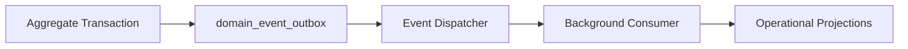
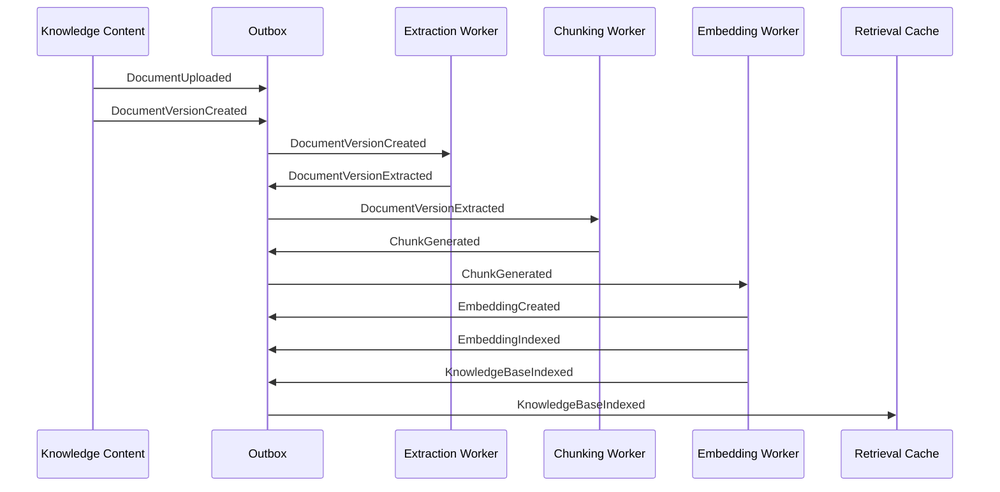
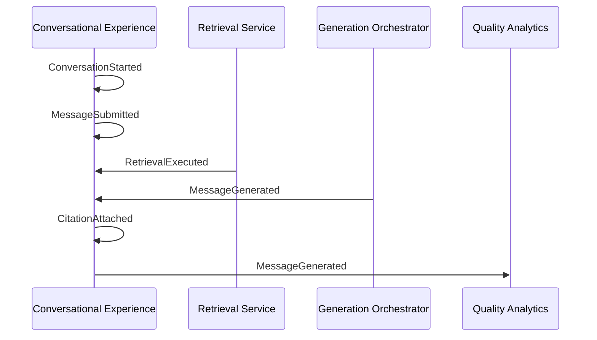
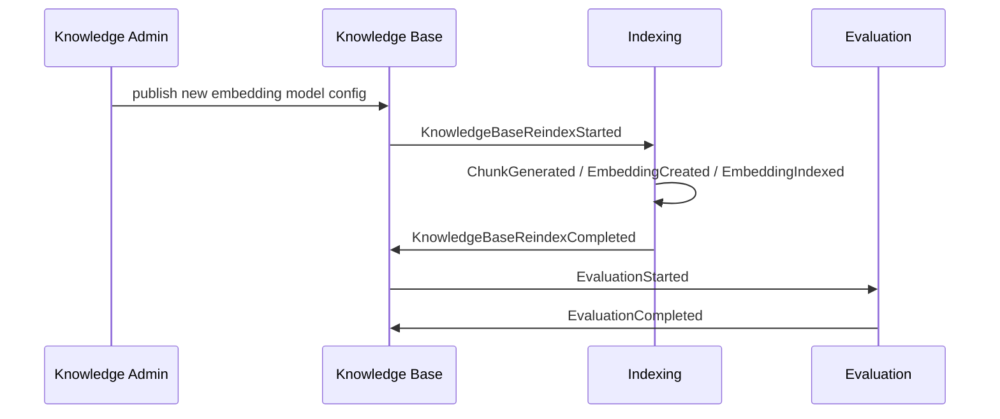

# Event Model

> **Status:** Accepted — implementation-ready domain event design.  
> **Purpose:** Define domain events, publishers, consumers, and coordination purpose. No implementation detail.

## 1. Eventing principles

| Principle | Rule |
| --- | --- |
| Past tense names | Events describe facts that already happened |
| Immutable payloads | Event data is a snapshot of identifiers and relevant metadata |
| Outbox first | Business transaction writes state and outbox entry atomically |
| At-least-once delivery | Consumers must be idempotent |
| No sensitive payloads | Events carry IDs and status, not raw document text or secrets |
| Tenant context required | Every event includes `organization_id` and usually `workspace_id` |

## 2. Event transport model

Implementation may use a queue behind the dispatcher; the domain requires reliable publication, not a specific broker.

## 3. Standard event envelope

| Field | Purpose |
| --- | --- |
| `event_id` | UUIDv7 |
| `event_type` | Canonical name |
| `occurred_at` | Timestamp |
| `organization_id` | Tenant scope |
| `workspace_id` | Optional scope |
| `aggregate_type` | Root entity type |
| `aggregate_id` | Root entity ID |
| `correlation_id` | Workflow trace |
| `causation_id` | Parent event ID |
| `payload` | Typed identifiers and status metadata |
| `schema_version` | Event schema version |

## 4. Event catalog

### Tenant and identity events

| Event | Publisher | Consumers | Purpose |
| --- | --- | --- | --- |
| `OrganizationProvisioned` | Tenant Administration | Audit, Billing future, Policy cache | Tenant ready for workspaces |
| `WorkspaceCreated` | Tenant Administration | Audit, Authorization cache | Workspace available |
| `MembershipGranted` | Tenant Administration | AuthZ cache, Audit | User receives access |
| `MembershipRevoked` | Tenant Administration | AuthZ cache, Audit, Session invalidation | Access removed |

### Knowledge content events

| Event | Publisher | Consumers | Purpose |
| --- | --- | --- | --- |
| `DocumentUploaded` | Knowledge Content | Ingestion worker, Audit | New logical document or upload initiated |
| `DocumentVersionCreated` | Knowledge Content | Extraction worker, Audit | New immutable version registered |
| `DocumentVersionExtracted` | Knowledge Content | Chunking worker, Audit | Extracted text available |
| `DocumentArchived` | Knowledge Content | Indexing, Retrieval cache, Audit | Remove from active browse and retrieval |
| `DocumentDeleted` | Knowledge Content | Indexing cleanup, Audit | Begin deletion workflow |

### Indexing events

| Event | Publisher | Consumers | Purpose |
| --- | --- | --- | --- |
| `ChunkGenerated` | Knowledge Indexing | Embedding worker, Metrics | Chunks ready for embedding |
| `EmbeddingCreated` | Knowledge Indexing | Vector index worker, Metrics | Vector computed |
| `EmbeddingIndexed` | Knowledge Indexing | Retrieval readiness, Metrics | Vector searchable |
| `EmbeddingsStale` | Knowledge Indexing | Re-index scheduler, Metrics | Old generation should be excluded |
| `KnowledgeBaseIndexed` | Knowledge Indexing | Retrieval cache, Evaluation scheduler, Notifications | Corpus ready for active config |
| `KnowledgeBaseReindexStarted` | Knowledge Indexing | Operations dashboard, Rate limits | Migration in progress |
| `KnowledgeBaseReindexCompleted` | Knowledge Indexing | Retrieval cache, Evaluation, Release workflow | Migration complete |

### Retrieval and AI configuration events

| Event | Publisher | Consumers | Purpose |
| --- | --- | --- | --- |
| `RetrievalConfigurationPublished` | Retrieval Configuration | Conversation defaults, Evaluation, Cache | New active retrieval policy |
| `PromptTemplateApproved` | AI Configuration | Audit, Release workflow | Prompt cleared for use |
| `PromptTemplateActivated` | AI Configuration | Conversation defaults, Cache | Active prompt version changed |
| `LLMProviderEnabled` | AI Configuration | Conversation routing, Audit | Provider available to tenant |
| `LLMProviderDisabled` | AI Configuration | Conversation routing, Kill switch | Block new generation on provider |
| `EmbeddingModelEnabled` | AI Configuration | Indexing, Retrieval config UI | Model available for indexing |

### Conversational events

| Event | Publisher | Consumers | Purpose |
| --- | --- | --- | --- |
| `ConversationStarted` | Conversational Experience | Metrics, Audit, Rate limits | New chat session |
| `MessageSubmitted` | Conversational Experience | Retrieval orchestrator | User turn accepted |
| `RetrievalExecuted` | Retrieval service | Metrics, Evaluation, Audit | Authorized evidence selected |
| `MessageGenerated` | Conversational Experience | Feedback UI, Metrics, Audit | Assistant answer persisted |
| `MessageAbstained` | Conversational Experience | Metrics, Quality review | Insufficient evidence or policy block |
| `CitationAttached` | Conversational Experience | Feedback, Audit, Quality analytics | Evidence linked to answer |

### Quality events

| Event | Publisher | Consumers | Purpose |
| --- | --- | --- | --- |
| `EvaluationStarted` | Quality and Evaluation | Worker, Metrics | Benchmark run begins |
| `EvaluationCompleted` | Quality and Evaluation | Release workflow, Audit, Dashboards | Pass/fail result recorded |
| `FeedbackSubmitted` | Quality and Evaluation | Triage queue, Quality analytics | User signal captured |
| `FeedbackReviewed` | Quality and Evaluation | Product workflow, Audit | Human triage completed |

### Integration events (future)

| Event | Publisher | Consumers | Purpose |
| --- | --- | --- | --- |
| `IntegrationConnectorRegistered` | Integrations | Validation worker, Audit | Connector created |
| `IntegrationConnectorValidated` | Integrations | Tool enablement, Audit | Connectivity confirmed |
| `ToolInvocationRequested` | Conversational Experience / Agent | Policy engine, Audit | Tool call initiated |
| `ToolInvocationCompleted` | Integrations | Conversation aggregate, Audit | Tool result returned |
| `ExternalDocumentImported` | Integrations | Knowledge Content ingestion | Connector created a document |

## 5. Event choreography by workflow

### Upload to searchable knowledge

### Conversation answer

### Re-index migration

## 6. Publisher and consumer matrix

| Consumer | Events consumed | Purpose |
| --- | --- | --- |
| Extraction worker | `DocumentVersionCreated` | Start OCR/native extraction |
| Chunking worker | `DocumentVersionExtracted` | Build chunks |
| Embedding worker | `ChunkGenerated` | Compute vectors |
| Vector index worker | `EmbeddingCreated` | Write pgvector index |
| Retrieval cache warmer | `KnowledgeBaseIndexed`, `RetrievalConfigurationPublished` | Low-latency chat |
| Conversation orchestrator | `MessageSubmitted` | Begin retrieval and generation |
| Evaluation worker | `EvaluationStarted`, `KnowledgeBaseIndexed` | Benchmark quality |
| AuthZ cache invalidator | membership and role events | Fresh permissions |
| Audit projector | all security/admin events | Immutable audit trail |
| Operations dashboard | re-index and provider events | Observability |
| Release workflow | `EvaluationCompleted`, `PromptTemplateActivated` | Govern production AI changes |

## 7. Idempotency and ordering

| Rule | Description |
| --- | --- |
| Consumer deduplication | Consumers store `event_id` or business idempotency key |
| Per-aggregate ordering | Events for one `document_version_id` or `knowledge_base_id` processed in order |
| Parallelism | Different documents and chunk partitions may process concurrently |
| Retry | Failed consumers retry with backoff; poison events go to dead-letter review |
| Compensation | No distributed rollback; forward recovery via retry or manual reindex |

## 8. Event payload guidelines

| Include | Exclude |
| --- | --- |
| entity IDs | raw document text |
| status transitions | API keys and secrets |
| version numbers | full prompt bodies |
| processing metrics | PII unless policy explicitly allows |
| correlation IDs | provider raw responses |

## 9. Projections and read models

Events may eventually maintain read models:

| Projection | Source events |
| --- | --- |
| Knowledge base search readiness | `KnowledgeBaseIndexed`, `KnowledgeBaseReindexCompleted` |
| Ingestion dashboard | upload and version events |
| Provider health dashboard | provider enable/disable and generation failures |
| Quality dashboard | `EvaluationCompleted`, `FeedbackSubmitted` |
| Audit timeline | admin, security, and deletion events |

Projections are derived data; PostgreSQL entity tables remain authoritative.

## 10. Related documents

- [Data Architecture](DATA_ARCHITECTURE.md)
- [Aggregates](AGGREGATES.md)
- [Data Lifecycle](DATA_LIFECYCLE.md)
- [Domain events in business model](../domain/DOMAIN_MODEL.md)
