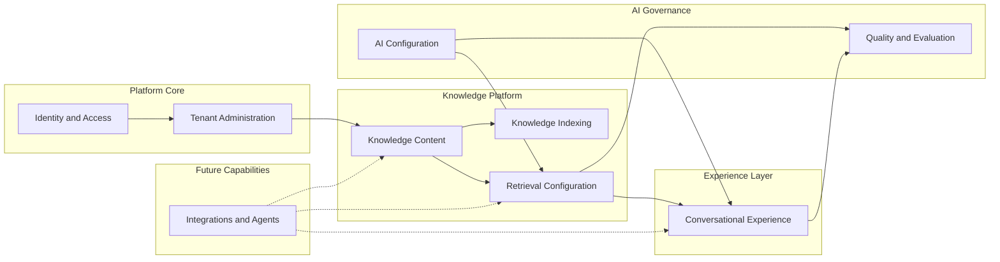

# Bounded Contexts

> **Status:** Accepted domain design.  
> **Purpose:** Define modular domain boundaries for RAG-enterprise and explain entity placement.

## 1. Context map

Solid arrows indicate upstream/downstream relationships in the current platform design.
Dotted arrows indicate planned integration boundaries.

## 2. Context definitions

### 2.1 Identity and Access

**Responsibility:** Authentication identity, session trust, and subject resolution.

| Entity | Why it belongs here |
| --- | --- |
| `User` | Global identity is independent of any one organization. |

**Does not own:** Authorization decisions, workspace membership, or resource ACLs.

**Integrates with:** Tenant Administration for membership; all contexts consume trusted identity.

---

### 2.2 Tenant Administration

**Responsibility:** Tenant structure, membership, roles, and workspace governance.

| Entity | Why it belongs here |
| --- | --- |
| `Organization` | Legal and commercial tenant root. |
| `Workspace` | Operational collaboration boundary under an organization. |
| `Role` | Permission bundles are tenant-administration artifacts. |
| `Membership` | Access assignment is an administrative act, not a knowledge concern. |

**Does not own:** Document content, embeddings, conversations, or provider secrets.

**Integrates with:** Every downstream context through tenant and workspace identifiers.

---

### 2.3 Knowledge Content

**Responsibility:** Logical knowledge assets, hierarchy, versions, and content lifecycle.

| Entity | Why it belongs here |
| --- | --- |
| `KnowledgeBase` | Corpus boundary for curated knowledge. |
| `Folder` | Content organization within a corpus. |
| `Document` | Stable business identity of a knowledge asset. |
| `DocumentVersion` | Immutable content snapshots and extraction outcomes. |

**Does not own:** Vector indexes, retrieval ranking, chat transcripts, or model configuration.

**Publishes events to:** Knowledge Indexing when a version is ready for chunking.

**Future extensions:** OCR pipelines produce new `DocumentVersion` records with
`extraction_method = ocr`; connector imports create documents with
`source_type = connector`.

---

### 2.4 Knowledge Indexing

**Responsibility:** Chunking, embedding generation, and index lineage.

| Entity | Why it belongs here |
| --- | --- |
| `Chunk` | Derived retrieval unit from extracted content. |
| `Embedding` | Vector artifact bound to chunk and model version. |
| `EmbeddingModel` | Indexing capability catalog and compatibility metadata. |

**Does not own:** Folder hierarchy, chat messages, or retrieval policy selection.

**Consumes:** `DocumentVersion` from Knowledge Content.

**Publishes events to:** Retrieval Configuration when embeddings are searchable.

**Future extensions:** Multiple embeddings per chunk, sparse indexes, and OCR layout blocks
mapped into chunk metadata without changing the content aggregate.

---

### 2.5 Retrieval Configuration

**Responsibility:** Search and context assembly policy for a knowledge base.

| Entity | Why it belongs here |
| --- | --- |
| `RetrievalConfiguration` | Versioned policy object combining filters, ranking, and tool routing. |

**Does not own:** Chunks, embeddings, or final natural-language answers.

**References:** `EmbeddingModel`, optional `LLMProvider`, and future connector filters.

**Consumed by:** Conversational Experience and Quality and Evaluation.

**Future extensions:**

- `web_search` augmentation through IntegrationConnector filters,
- `sql_agent` routing to approved data-source tools,
- `mcp` tool allowlists by workspace policy.

---

### 2.6 Conversational Experience

**Responsibility:** User-facing knowledge consumption as dialogue, the first product client.

| Entity | Why it belongs here |
| --- | --- |
| `Conversation` | Session container for knowledge consumption. |
| `Message` | Dialogue turn and generation state. |
| `Citation` | User-visible evidence binding answer to retrieved chunks. |

**Does not own:** Source documents, embeddings, or provider credential storage.

**Consumes:** Retrieval Configuration, Prompt Template, and LLM Provider.

**Future extensions:** Agent plans, tool invocation records, and human approval checkpoints
remain inside this context as conversation artifacts.

---

### 2.7 AI Configuration

**Responsibility:** Versioned provider and prompt governance.

| Entity | Why it belongs here |
| --- | --- |
| `LLMProvider` | Generation capability registration and defaults. |
| `PromptTemplate` | Instruction artifact versioned independently from conversations. |

**Does not own:** Retrieval results, document content, or permission decisions.

**Consumed by:** Conversational Experience and Retrieval Configuration.

**Future extensions:** Additional provider families, locale-specific prompt sets, and policy
classes (`standard`, `restricted`, `regulated`).

---

### 2.8 Quality and Evaluation

**Responsibility:** Measurement, feedback, and release evidence.

| Entity | Why it belongs here |
| --- | --- |
| `Evaluation` | Controlled benchmark of retrieval and answer behavior. |
| `Feedback` | Operational signal from real usage. |

**Does not own:** Live conversation orchestration or indexing jobs.

**Consumes:** Knowledge base scope, retrieval configuration versions, and conversation outputs.

**Future extensions:** Multilingual eval suites, safety benchmarks, and connector-specific tests.

---

### 2.9 Integrations and Agents (future)

**Responsibility:** External systems and executable tools that extend platform capabilities.

| Entity | Why it belongs here |
| --- | --- |
| `IntegrationConnector` | Registration of MCP servers, web search providers, SQL endpoints, OCR services. |
| `ToolDefinition` | Narrow executable contract with schema and approval policy. |

**Does not own:** Core knowledge records or tenant identity.

**Integrates with:**

- Knowledge Content for OCR and connector ingestion,
- Retrieval Configuration for augmenting evidence sources,
- Conversational Experience for tool invocation during dialogue.

**Future capability classes:**

| Capability | Connector type | Domain impact |
| --- | --- | --- |
| OCR | `ocr_service` | Creates or enriches `DocumentVersion` |
| Web search | `web_search` | Supplies ephemeral evidence outside knowledge base |
| SQL agent | `sql_data_source` | Executes approved read-only queries via `ToolDefinition` |
| MCP | `mcp_server` | Exposes external tools under workspace policy |

## 3. Anti-corruption boundaries

| Boundary | Rule |
| --- | --- |
| Content vs Indexing | Content contexts never mutate embeddings directly; they emit version events. |
| Indexing vs Retrieval | Indexing exposes searchable artifacts; retrieval chooses and ranks them. |
| Retrieval vs Conversation | Conversations reference configuration versions; they do not embed ranking logic. |
| Conversation vs Content | Chat messages never become authoritative document versions without explicit ingestion. |
| Integrations vs Security | Connectors and tools are disabled by default and require policy approval. |

## 4. Shared kernel (minimal)

Only these identifiers and policies may cross contexts as plain values:

- `organization_id`
- `workspace_id`
- `user_id`
- `knowledge_base_id`
- `locale`
- `classification_label`
- `correlation_id`

Shared mutable models are forbidden across contexts.

## 5. Related documents

- [Domain Model](DOMAIN_MODEL.md)
- [Ownership Model](OWNERSHIP_MODEL.md)
- [Permission Model](PERMISSION_MODEL.md)
- [Multi-Tenancy](MULTI_TENANCY.md)
