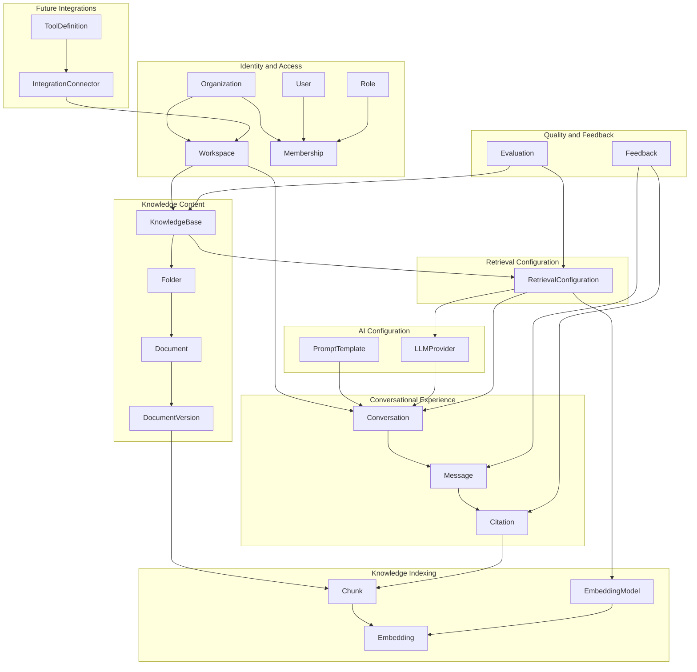

# Domain Model

> **Status:** Accepted domain design — architecture documentation only.  
> **Scope:** Business domain for RAG-enterprise as an enterprise knowledge platform whose first product surface is a RAG chatbot.

## 1. Purpose

RAG-enterprise is an enterprise knowledge platform. It governs organizational knowledge,
access control, ingestion, indexing, retrieval, and AI-assisted consumption. The RAG
chatbot is the first client experience, not the platform boundary.

The domain model separates:

- **who** may access knowledge (identity and permissions),
- **what** knowledge exists and how it evolves (content lifecycle),
- **how** knowledge is made retrievable (indexing and retrieval configuration),
- **how** knowledge is consumed (conversations, citations, feedback),
- **how** AI behavior is configured and measured (providers, prompts, evaluation).

Deterministic application code owns authorization, tenancy, policy, and side effects.
Model output and retrieved content remain untrusted data.

## 2. Design principles

| Principle | Meaning |
| --- | --- |
| Platform over chatbot | Conversations are one consumer of knowledge and retrieval services. |
| Tenant-first ownership | Every business entity is owned by an `Organization` and usually scoped to a `Workspace`. |
| Explicit lineage | Documents, versions, chunks, embeddings, and citations preserve provenance. |
| Versioned AI configuration | Providers, models, prompts, and retrieval settings are versioned and auditable. |
| Extensible ingestion | Documents support multiple extraction paths (native text today, OCR and connectors later). |
| Pluggable capabilities | Web search, SQL agents, and MCP integrations attach through integration contracts. |
| Multilingual by metadata | Language is modeled on content and configuration, not assumed globally. |

## 3. Aggregate overview

## 4. Entity relationship diagram

```mermaid
erDiagram
    Organization ||--o{ Workspace : contains
    Organization ||--o{ Membership : grants
    User ||--o{ Membership : holds
    Role ||--o{ Membership : defines
    Workspace ||--o{ KnowledgeBase : owns
    Workspace ||--o{ Conversation : hosts
    Workspace ||--o{ IntegrationConnector : configures

    KnowledgeBase ||--o{ Folder : organizes
    Folder ||--o{ Folder : nests
    Folder ||--o{ Document : contains
    Document ||--o{ DocumentVersion : versions
    DocumentVersion ||--o{ Chunk : segments

    EmbeddingModel ||--o{ Embedding : produces
    Chunk ||--o{ Embedding : indexed_as
    KnowledgeBase ||--o{ RetrievalConfiguration : configures
    RetrievalConfiguration }o--|| EmbeddingModel : uses
    RetrievalConfiguration }o--o| LLMProvider : default_generation

    LLMProvider ||--o{ PromptTemplate : supports
    PromptTemplate ||--o{ Conversation : applies_to
    LLMProvider ||--o{ Conversation : generates_with
    RetrievalConfiguration ||--o{ Conversation : retrieves_with

    Conversation ||--o{ Message : contains
    Message ||--o{ Citation : cites
    Citation }o--|| Chunk : references

    KnowledgeBase ||--o{ Evaluation : measured_on
    RetrievalConfiguration ||--o{ Evaluation : benchmarked_by
    Message ||--o{ Feedback : receives
    Citation ||--o{ Feedback : annotates

    IntegrationConnector ||--o{ ToolDefinition : exposes
    ToolDefinition }o--o{ Conversation : may_invoke

    Organization {
        uuid id PK
        string legal_name
        string slug
        string status
        string default_locale
        string data_residency_policy
    }

    Workspace {
        uuid id PK
        uuid organization_id FK
        string name
        string slug
        string status
        string primary_locale
    }

    User {
        uuid id PK
        string email
        string display_name
        string status
        string preferred_locale
    }

    Role {
        uuid id PK
        uuid organization_id FK
        string name
        string scope_type
        json permission_set
    }

    Membership {
        uuid id PK
        uuid organization_id FK
        uuid workspace_id FK
        uuid user_id FK
        uuid role_id FK
        string status
    }

    KnowledgeBase {
        uuid id PK
        uuid organization_id FK
        uuid workspace_id FK
        string name
        string status
        string default_language
        string visibility_policy
    }

    Folder {
        uuid id PK
        uuid knowledge_base_id FK
        uuid parent_folder_id FK
        string name
        string path
    }

    Document {
        uuid id PK
        uuid knowledge_base_id FK
        uuid folder_id FK
        string title
        string status
        string source_type
        string declared_language
    }

    DocumentVersion {
        uuid id PK
        uuid document_id FK
        int version_number
        string extraction_method
        string content_hash
        string processing_status
        datetime effective_at
    }

    Chunk {
        uuid id PK
        uuid document_version_id FK
        uuid knowledge_base_id FK
        int sequence_number
        string language
        int start_offset
        int end_offset
        string chunking_profile
    }

    EmbeddingModel {
        uuid id PK
        uuid organization_id FK
        string provider_key
        string model_key
        int dimensions
        string status
    }

    Embedding {
        uuid id PK
        uuid chunk_id FK
        uuid embedding_model_id FK
        string index_status
        datetime indexed_at
    }

    RetrievalConfiguration {
        uuid id PK
        uuid knowledge_base_id FK
        uuid embedding_model_id FK
        uuid default_llm_provider_id FK
        string name
        string retrieval_mode
        json ranking_policy
        string status
    }

    LLMProvider {
        uuid id PK
        uuid organization_id FK
        string provider_type
        string model_key
        string status
        json inference_defaults
    }

    PromptTemplate {
        uuid id PK
        uuid organization_id FK
        uuid llm_provider_id FK
        string name
        string locale
        int version
        string status
    }

    Conversation {
        uuid id PK
        uuid workspace_id FK
        uuid user_id FK
        uuid retrieval_configuration_id FK
        uuid prompt_template_id FK
        uuid llm_provider_id FK
        string status
        string locale
    }

    Message {
        uuid id PK
        uuid conversation_id FK
        string role
        string content
        string generation_status
    }

    Citation {
        uuid id PK
        uuid message_id FK
        uuid chunk_id FK
        int rank
        float relevance_score
        string excerpt
    }

    Evaluation {
        uuid id PK
        uuid organization_id FK
        uuid knowledge_base_id FK
        uuid retrieval_configuration_id FK
        string evaluation_type
        string status
        json acceptance_thresholds
    }

    Feedback {
        uuid id PK
        uuid message_id FK
        uuid citation_id FK
        uuid user_id FK
        string feedback_type
        string reason_code
    }

    IntegrationConnector {
        uuid id PK
        uuid organization_id FK
        uuid workspace_id FK
        string connector_type
        string status
    }

    ToolDefinition {
        uuid id PK
        uuid integration_connector_id FK
        string tool_key
        string capability_class
        json input_schema
        string approval_policy
    }
```

## 5. Core entity catalog

### Organization

| Attribute | Description |
| --- | --- |
| **Purpose** | Top-level commercial, legal, and security tenant. Owns billing, SSO policy, data residency, and org-wide roles. |
| **Ownership** | Platform operator provisions; customer administrators manage settings. |
| **Relationships** | Has many `Workspace`, `Membership`, `Role`, org-scoped `EmbeddingModel`, `LLMProvider`, `PromptTemplate`, `Evaluation`, `IntegrationConnector`. |
| **Lifecycle** | `provisioning` → `active` → `suspended` → `decommissioned`. Decommission triggers retention and export workflows. |
| **Future extensibility** | Add subscription plans, legal entities, compliance profiles, and cross-workspace policy packs. |

### Workspace

| Attribute | Description |
| --- | --- |
| **Purpose** | Primary collaboration and authorization boundary for teams, departments, or projects. |
| **Ownership** | Owned by one `Organization`; administered by workspace admins. |
| **Relationships** | Contains `KnowledgeBase`, `Conversation`, and workspace-scoped `IntegrationConnector`; linked to users through `Membership`. |
| **Lifecycle** | `active` → `archived` → `deleted`. Archival blocks new ingestion and conversations while preserving audit history. |
| **Future extensibility** | Support workspace templates, environment labels (`dev`, `staging`, `prod`), and delegated admin. |

### User

| Attribute | Description |
| --- | --- |
| **Purpose** | Human identity that authenticates to the platform and acts within organizations and workspaces. |
| **Ownership** | Global identity; membership defines tenant access. |
| **Relationships** | Holds many `Membership`; authors `Conversation`, `Message`, and `Feedback`. |
| **Lifecycle** | `invited` → `active` → `disabled` → `deleted`. Disabled users retain audit attribution but lose access. |
| **Future extensibility** | Service accounts, SCIM provisioning, delegated identities, and machine users for automation. |

### Role

| Attribute | Description |
| --- | --- |
| **Purpose** | Named permission bundle applied at organization or workspace scope. |
| **Ownership** | Owned by `Organization`; may be system-defined or custom. |
| **Relationships** | Assigned through `Membership`; governs access to knowledge, conversations, configuration, and integrations. |
| **Lifecycle** | `draft` → `active` → `deprecated`. Deprecated roles remain on historical memberships for audit. |
| **Future extensibility** | Attribute-based conditions, time-bound grants, and break-glass emergency roles. |

### Membership

| Attribute | Description |
| --- | --- |
| **Purpose** | Links a `User` to an `Organization` and optionally a `Workspace` with a `Role`. |
| **Ownership** | Owned by `Organization`. |
| **Relationships** | Connects `User`, `Organization`, `Workspace`, and `Role`. |
| **Lifecycle** | `pending` → `active` → `revoked`. Revocation is immediate for access enforcement. |
| **Future extensibility** | Just-in-time access, approval workflows, and external collaborator memberships. |

### Knowledge Base

| Attribute | Description |
| --- | --- |
| **Purpose** | Curated corpus boundary for retrieval, permissions, indexing policy, and evaluation. |
| **Ownership** | Owned by `Workspace` within an `Organization`. |
| **Relationships** | Contains `Folder` and `Document`; owns `RetrievalConfiguration` and `Evaluation` scope. |
| **Lifecycle** | `draft` → `active` → `reindexing` → `archived` → `deleted`. |
| **Future extensibility** | Federated knowledge bases, shared read-only corpora, and domain-specific retention classes. |

### Folder

| Attribute | Description |
| --- | --- |
| **Purpose** | Hierarchical organization of documents within a knowledge base. |
| **Ownership** | Owned by `KnowledgeBase`. |
| **Relationships** | Belongs to `KnowledgeBase`; may nest under another `Folder`; contains `Document`. |
| **Lifecycle** | `active` → `archived` → `deleted`. Deletion requires empty or cascaded document policy. |
| **Future extensibility** | Virtual folders, smart collections, and synced external folder mirrors. |

### Document

| Attribute | Description |
| --- | --- |
| **Purpose** | Logical knowledge asset representing a business document regardless of file format or source. |
| **Ownership** | Owned by `KnowledgeBase`; placed in one `Folder`. |
| **Relationships** | Has many `DocumentVersion`; contributes to `Chunk` through current or historical versions. |
| **Lifecycle** | `draft` → `active` → `archived` → `deleted`. Legal hold may block deletion. |
| **Future extensibility** | URL sources, mailbox items, tickets, wiki pages, and connector-sourced documents. |

### Document Version

| Attribute | Description |
| --- | --- |
| **Purpose** | Immutable snapshot of extracted or supplied content for a document at a point in time. |
| **Ownership** | Owned by `Document`. |
| **Relationships** | Produces many `Chunk`; referenced by ingestion and OCR pipelines. |
| **Lifecycle** | `uploaded` → `extracting` → `extracted` → `chunking` → `chunked` → `indexing` → `indexed` → `failed` / `superseded`. |
| **Future extensibility** | OCR outputs, layout-aware blocks, table extraction, and multilingual segment maps. |

### Chunk

| Attribute | Description |
| --- | --- |
| **Purpose** | Retrieval unit derived from a document version with stable offsets and lineage. |
| **Ownership** | Owned by `KnowledgeBase` via `DocumentVersion`. |
| **Relationships** | Belongs to `DocumentVersion`; has many `Embedding`; referenced by `Citation`. |
| **Lifecycle** | `created` → `embedded` → `indexed` → `superseded` → `deleted`. |
| **Future extensibility** | Semantic, structural, and hybrid chunk types; passage-level metadata and entity tags. |

### Embedding

| Attribute | Description |
| --- | --- |
| **Purpose** | Vector representation of a chunk for similarity retrieval under a specific embedding model. |
| **Ownership** | Owned by indexing subsystem; scoped to `KnowledgeBase` and `Organization`. |
| **Relationships** | Belongs to `Chunk` and `EmbeddingModel`. |
| **Lifecycle** | `pending` → `computed` → `indexed` → `stale` → `reindexed` / `deleted`. |
| **Future extensibility** | Multiple embeddings per chunk, sparse vectors, and migration between model generations. |

### Embedding Model

| Attribute | Description |
| --- | --- |
| **Purpose** | Registered embedding capability with provider, dimensions, and operational status. |
| **Ownership** | Platform catalog with optional org-specific enablement. |
| **Relationships** | Used by `Embedding` and `RetrievalConfiguration`. |
| **Lifecycle** | `available` → `enabled` → `deprecated` → `retired`. Retirement requires re-embedding plan. |
| **Future extensibility** | Multilingual models, domain-tuned models, and on-prem inference endpoints. |

### Retrieval Configuration

| Attribute | Description |
| --- | --- |
| **Purpose** | Versioned policy describing how a knowledge base is searched, ranked, filtered, and assembled for generation. |
| **Ownership** | Owned by `KnowledgeBase`. |
| **Relationships** | References `EmbeddingModel` and optional default `LLMProvider`; used by `Conversation` and `Evaluation`. |
| **Lifecycle** | `draft` → `active` → `deprecated` → `retired`. |
| **Future extensibility** | Hybrid lexical + vector retrieval, rerankers, web-search augmentation, SQL tool routing, and MCP tool filters. |

### LLM Provider

| Attribute | Description |
| --- | --- |
| **Purpose** | Registered large-language-model endpoint and model defaults for generation. |
| **Ownership** | Platform catalog with org-level configuration and secrets references. |
| **Relationships** | Supports `PromptTemplate`; used by `Conversation` and optionally `RetrievalConfiguration`. |
| **Lifecycle** | `available` → `enabled` → `degraded` → `disabled` → `retired`. |
| **Future extensibility** | Region-specific endpoints, failover chains, cost caps, and policy-class routing. |

### Prompt Template

| Attribute | Description |
| --- | --- |
| **Purpose** | Versioned, locale-aware instruction set for grounded generation and tool-use behavior. |
| **Ownership** | Owned by `Organization`; may be workspace-scoped in future. |
| **Relationships** | Associated with `LLMProvider`; applied to `Conversation`. |
| **Lifecycle** | `draft` → `approved` → `active` → `deprecated` → `retired`. |
| **Future extensibility** | Prompt variants by use case, safety class, tool policy, and evaluation baselines. |

### Conversation

| Attribute | Description |
| --- | --- |
| **Purpose** | User session consuming retrieval and generation services over workspace knowledge. |
| **Ownership** | Owned by `Workspace`; created by `User`. |
| **Relationships** | Uses `RetrievalConfiguration`, `PromptTemplate`, and `LLMProvider`; contains `Message`. |
| **Lifecycle** | `active` → `idle` → `archived` → `deleted`. |
| **Future extensibility** | Shared conversations, workflow handoff, agent plans, and human approval checkpoints. |

### Message

| Attribute | Description |
| --- | --- |
| **Purpose** | Single turn in a conversation from user, assistant, system, or tool origin. |
| **Ownership** | Owned by `Conversation`. |
| **Relationships** | Contains zero or more `Citation`; receives `Feedback`. |
| **Lifecycle** | `submitted` → `retrieving` → `generating` → `completed` / `failed` / `abstained`. |
| **Future extensibility** | Tool call payloads, structured answers, attachments, and moderation states. |

### Citation

| Attribute | Description |
| --- | --- |
| **Purpose** | Evidence link from an assistant message to a retrieved chunk and source span. |
| **Ownership** | Owned by `Message`. |
| **Relationships** | References `Chunk`; may receive `Feedback`. |
| **Lifecycle** | `proposed` → `attached` → `validated` / `rejected`. |
| **Future extensibility** | Multi-source citations, confidence bands, and reviewer validation workflows. |

### Evaluation

| Attribute | Description |
| --- | --- |
| **Purpose** | Offline or controlled measurement of retrieval and answer quality against acceptance thresholds. |
| **Ownership** | Owned by `Organization`; scoped to `KnowledgeBase` and `RetrievalConfiguration`. |
| **Relationships** | Benchmarks knowledge base and retrieval setup; informs release decisions. |
| **Lifecycle** | `defined` → `running` → `passed` / `failed` → `archived`. |
| **Future extensibility** | Multilingual eval sets, safety suites, regression baselines, and per-connector evaluations. |

### Feedback

| Attribute | Description |
| --- | --- |
| **Purpose** | Human signal on answer quality, citation usefulness, or policy violations. |
| **Ownership** | Submitted by `User`; retained under tenant policy. |
| **Relationships** | Targets `Message` and optionally `Citation`. |
| **Lifecycle** | `submitted` → `reviewed` → `actioned` / `dismissed`. |
| **Future extensibility** | RLHF export, reviewer queues, and automated triage labels. |

### IntegrationConnector

| Attribute | Description |
| --- | --- |
| **Purpose** | Future-facing registration of an external capability source such as MCP, web search, SQL, or OCR services. |
| **Ownership** | Owned by `Organization` and scoped to `Workspace`. |
| **Relationships** | Exposes many `ToolDefinition`; may participate in conversations through approved tools. |
| **Lifecycle** | `registered` → `validated` → `enabled` → `disabled` → `retired`. |
| **Future extensibility** | Connector health checks, credential rotation, and per-tenant allowlists. |

### ToolDefinition

| Attribute | Description |
| --- | --- |
| **Purpose** | Executable capability contract exposed to agent workflows with schema and approval policy. |
| **Ownership** | Owned by `IntegrationConnector`. |
| **Relationships** | May be invoked by future agent nodes in `Conversation` flows. |
| **Lifecycle** | `draft` → `approved` → `enabled` → `deprecated` → `retired`. |
| **Future extensibility** | SQL query tools, web search tools, MCP tools, and human-approved side effects. |

## 6. Domain events (conceptual)

These events coordinate bounded contexts without implying implementation:

| Event | Significance |
| --- | --- |
| `OrganizationProvisioned` | Tenant ready for workspaces and policy configuration. |
| `DocumentVersionExtracted` | Content available for chunking; OCR or connector extraction may vary by method. |
| `ChunksCreated` | Retrieval units ready for embedding. |
| `EmbeddingsIndexed` | Knowledge base searchable under a model and configuration version. |
| `RetrievalConfigurationActivated` | New retrieval behavior available to conversations and evaluations. |
| `ConversationMessageCompleted` | Assistant output and citations persisted. |
| `FeedbackSubmitted` | Quality loop captured for evaluation and product improvement. |
| `EvaluationCompleted` | Release or rollback decision input for AI configuration. |

## 7. Related documents

- [Bounded Contexts](BOUNDED_CONTEXTS.md)
- [Entity Lifecycle](ENTITY_LIFECYCLE.md)
- [Ownership Model](OWNERSHIP_MODEL.md)
- [Permission Model](PERMISSION_MODEL.md)
- [Multi-Tenancy](MULTI_TENANCY.md)
- [Domain Glossary](DOMAIN_GLOSSARY.md)
