# Entity Lifecycle

> **Status:** Accepted domain design.  
> **Purpose:** Define lifecycle states, transitions, and invariants for core entities.

## 1. Lifecycle conventions

| Convention | Rule |
| --- | --- |
| Terminal states | `deleted`, `retired`, and `decommissioned` are terminal for active use. |
| Supersession | New versions supersede old ones; historical records remain for audit and citation. |
| Authorization | State transitions that expose data require permission checks before entry. |
| Idempotency | Repeated transition requests must not create duplicate active versions. |
| Audit | Security, deletion, and AI configuration transitions emit audit events. |

## 2. Tenant entities

### Organization

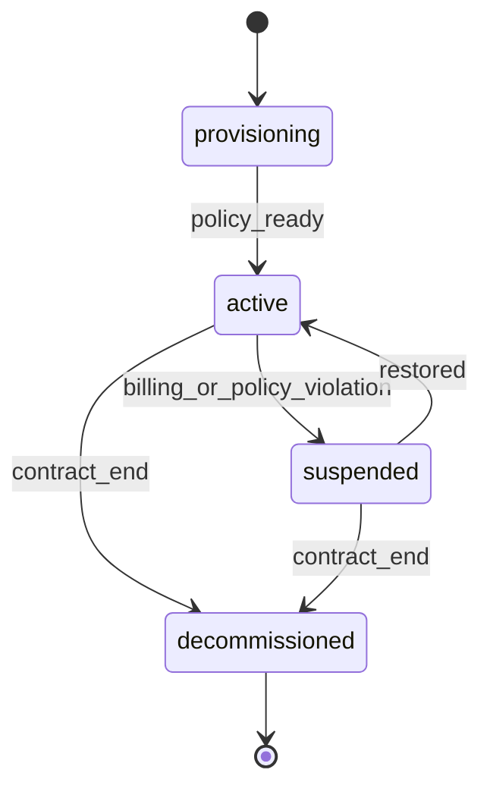

| State | Meaning | Allowed operations |
| --- | --- | --- |
| `provisioning` | Tenant created; baseline policy incomplete | Configure org settings only |
| `active` | Fully operational | All approved operations |
| `suspended` | Access restricted | Read-only or admin-only per policy |
| `decommissioned` | Tenant wind-down complete | Export and audit only |

**Invariants:** At least one active workspace admin pathway must exist before leaving `provisioning`.

---

### Workspace

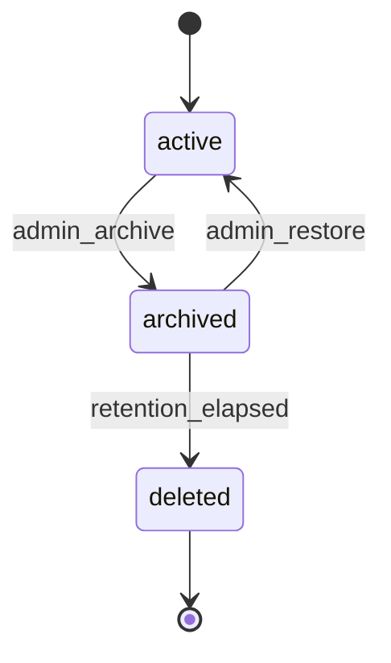

| State | Meaning |
| --- | --- |
| `active` | Normal operations |
| `archived` | No new ingestion or conversations; read and audit allowed |
| `deleted` | Logical deletion after retention window |

---

### User

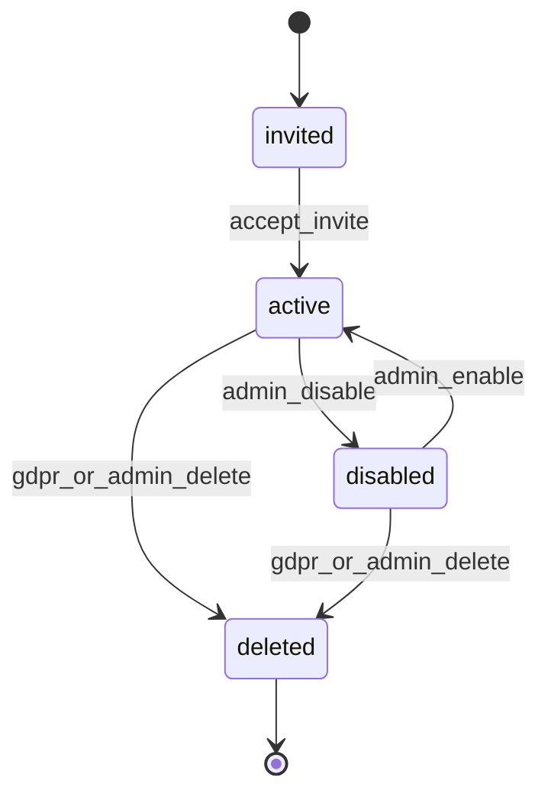

---

### Membership

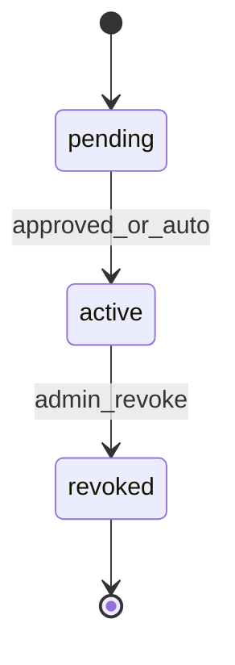

## 3. Knowledge entities

### Knowledge Base

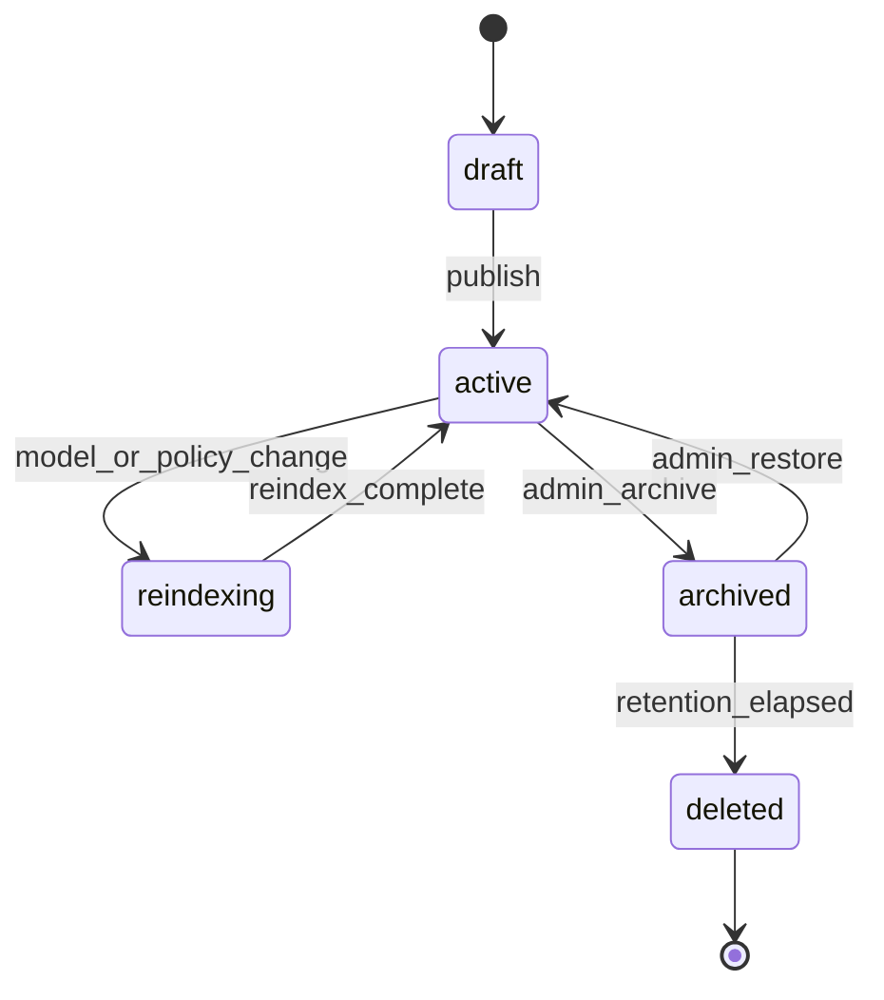

**Operator lifecycle (RC1.6):** `draft` → **Publish** → `active` → **Archive** → `archived` → **Restore** → `active`.

**Transition notes:**

- `POST .../knowledge-bases/{id}/publish` is the only draft → active transition (empty KB allowed).
- Entering `reindexing` does not delete existing chunks; new embeddings may be built in parallel.
- Conversations may continue during `reindexing` using the last active retrieval configuration unless policy blocks it.
- Retrieval behavior is unchanged: only `active` knowledge bases are searchable.

---

### Document

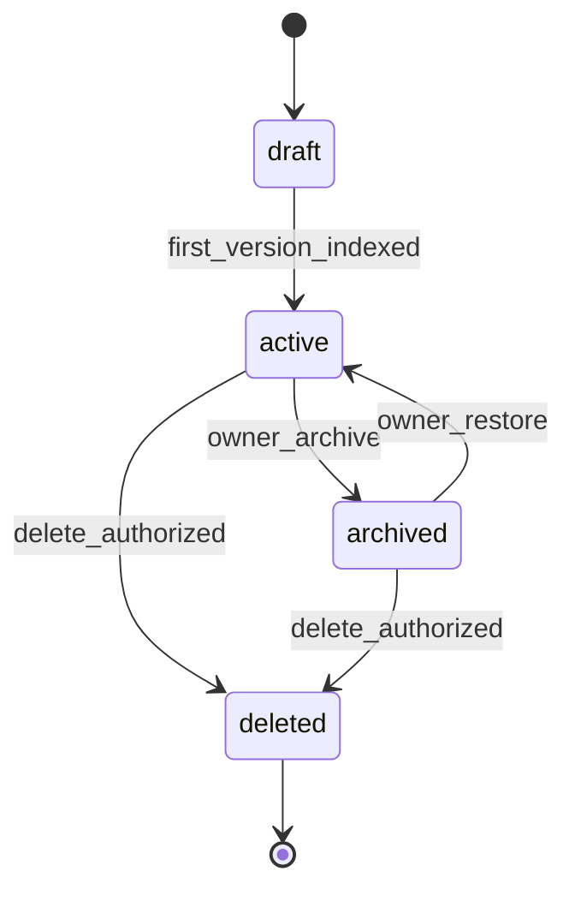

**Invariant:** A `deleted` document retains historical versions and citations for audit unless legal deletion applies.

---

### Document Version

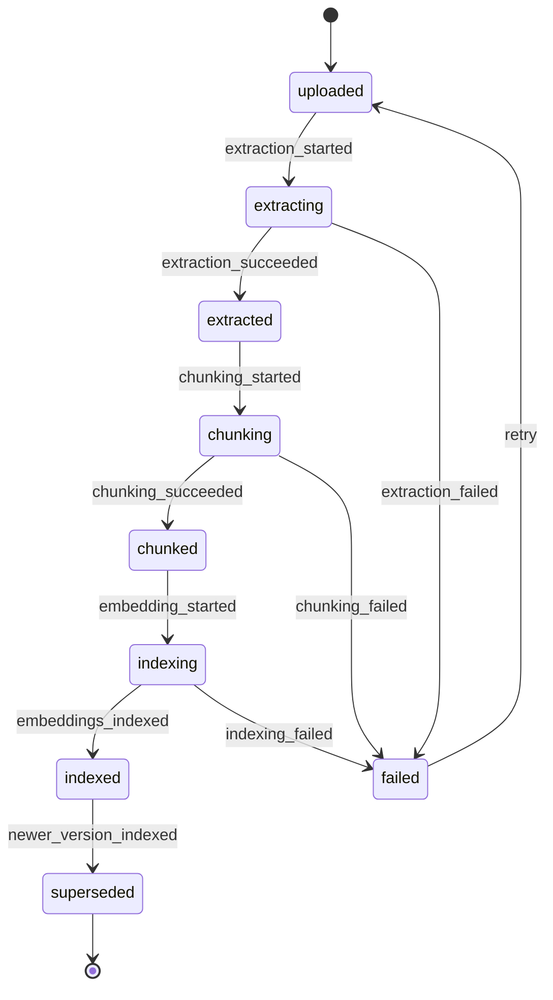

**Extraction methods:**

| Method | Current | Future |
| --- | --- | --- |
| `native_text` | Supported | PDF, DOCX, HTML text extraction |
| `ocr` | Planned | Scanned PDFs and images |
| `connector_import` | Planned | External systems via IntegrationConnector |
| `manual_edit` | Planned | Human-authored corrections |

---

### Chunk

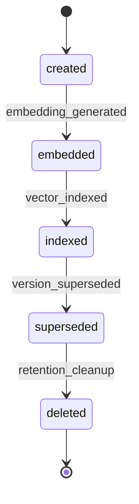

**Invariant:** Citations may reference `superseded` chunks for historical conversations.

---

### Embedding

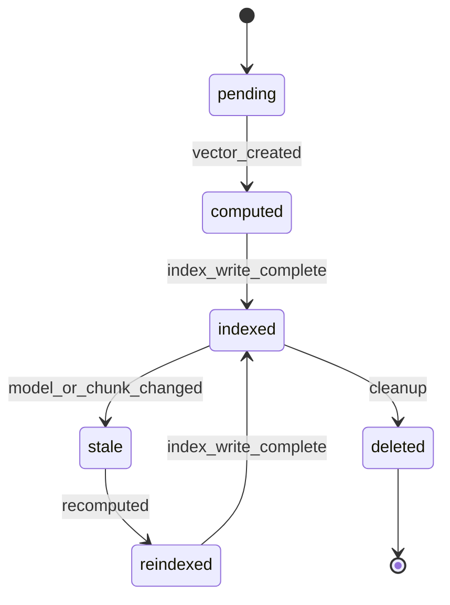

## 4. AI configuration entities

### Embedding Model

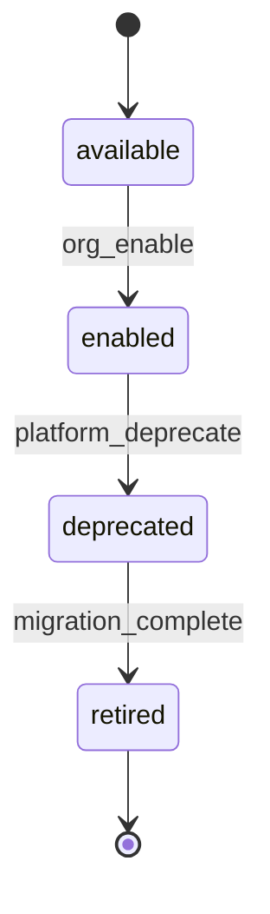

---

### LLM Provider

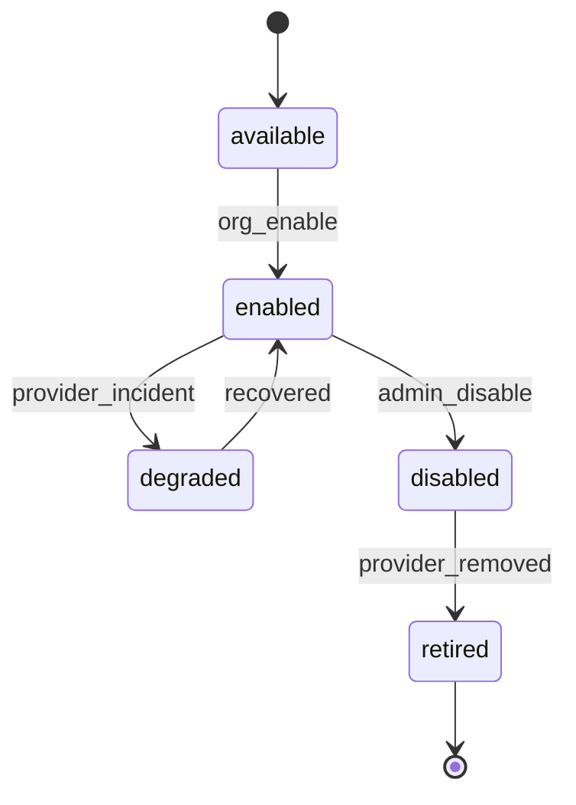

---

### Prompt Template

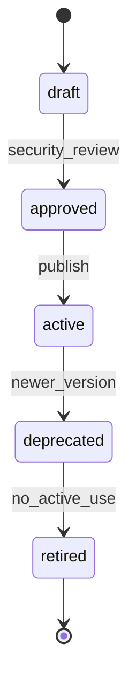

**Invariant:** Only `approved` or `active` templates may be bound to production conversations.

---

### Retrieval Configuration

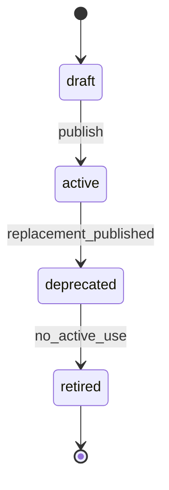

## 5. Conversational entities

### Conversation

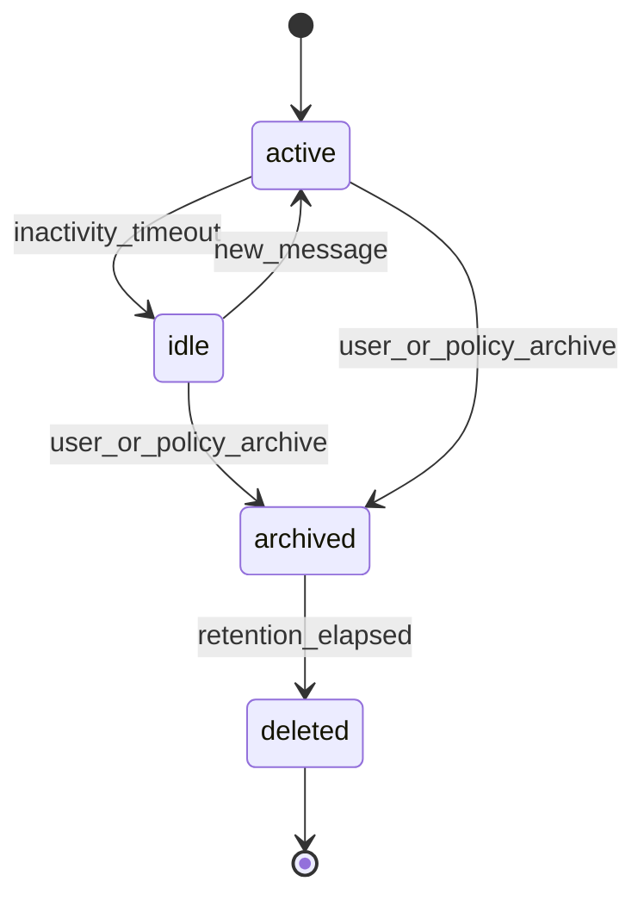

---

### Message

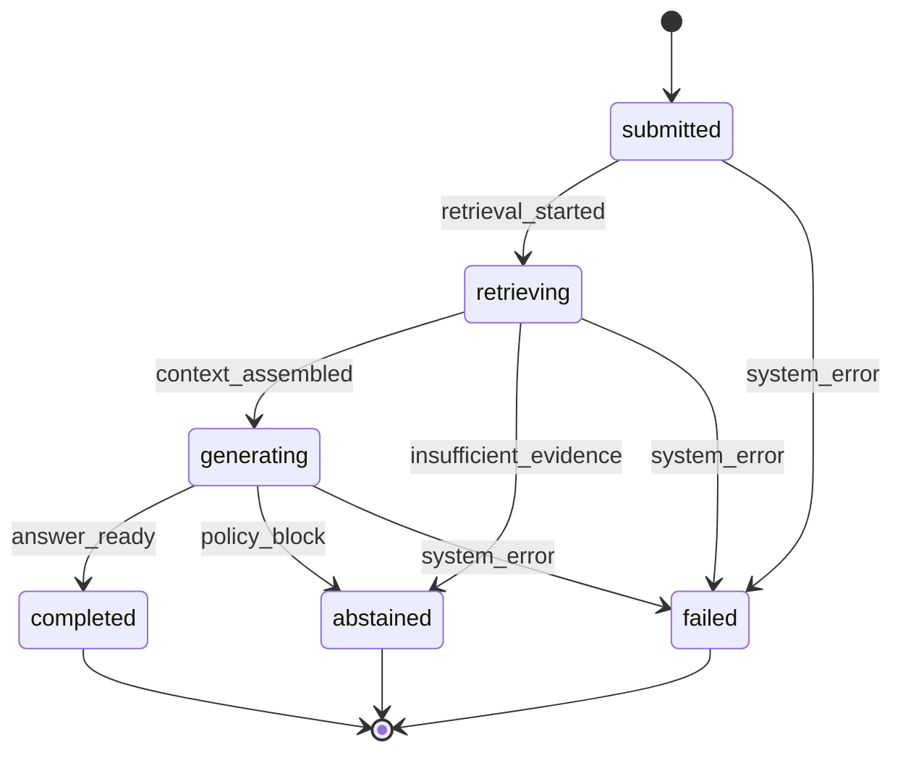

**Invariant:** `completed` and `abstained` messages are immutable except for moderation flags.

---

### Citation

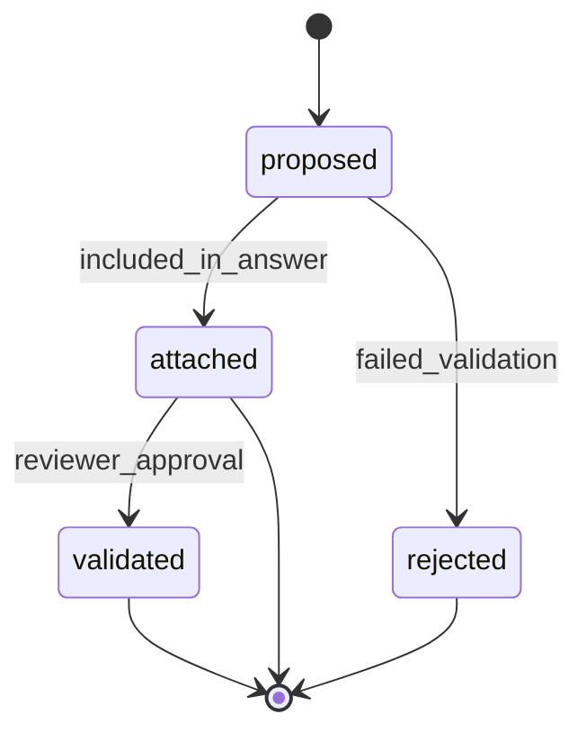

## 6. Quality entities

### Evaluation

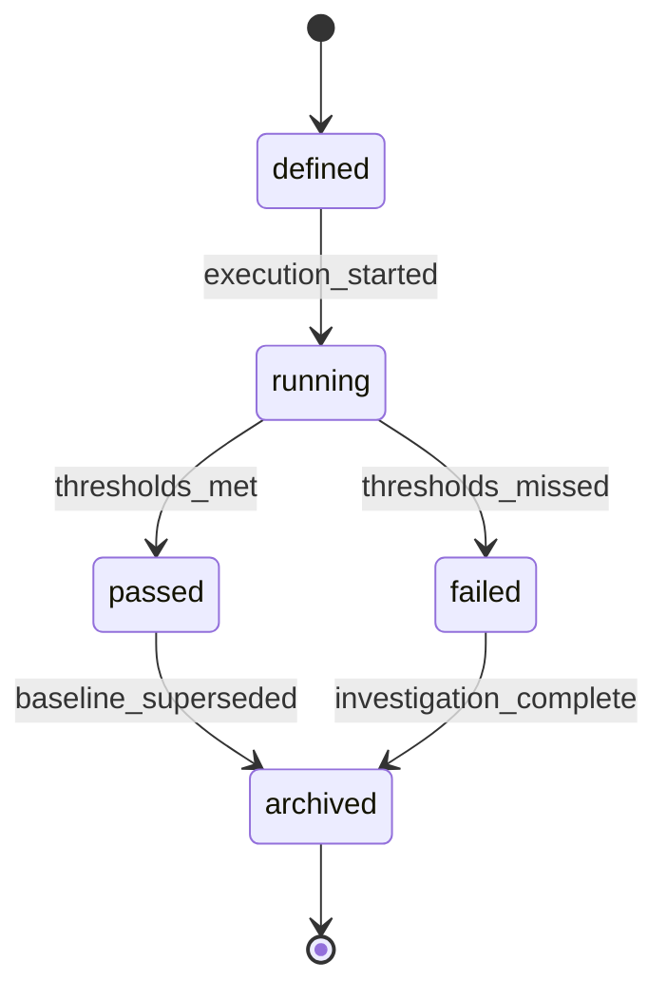

---

### Feedback

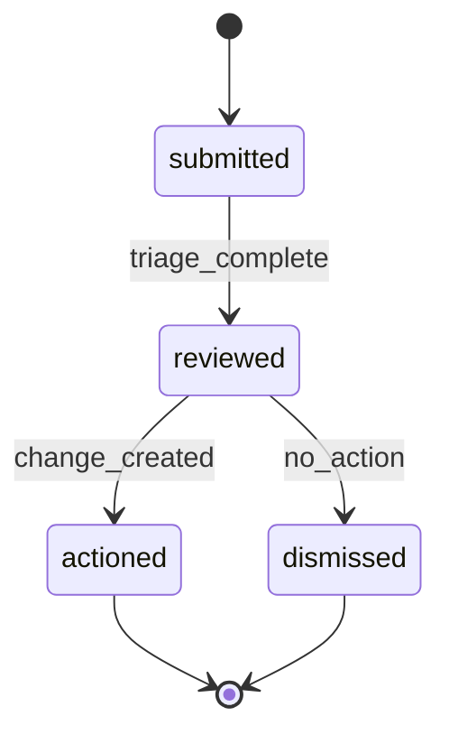

## 7. Future integration entities

### IntegrationConnector

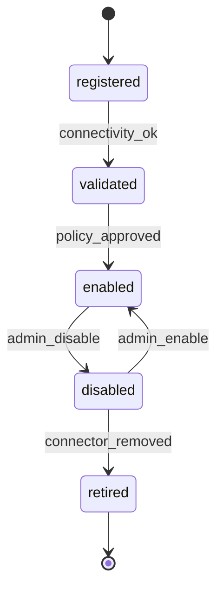

---

### ToolDefinition

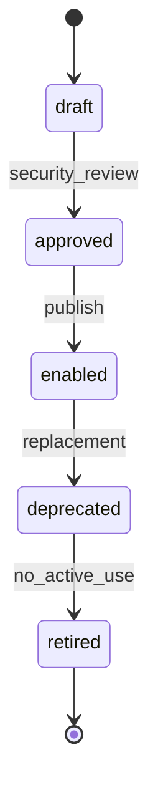

## 8. Cross-entity lifecycle rules

| Rule | Description |
| --- | --- |
| Version supersession | Publishing a new indexed `DocumentVersion` supersedes prior chunks for active retrieval but preserves citation lineage. |
| Model migration | Changing `EmbeddingModel` moves knowledge base to `reindexing` until required embeddings are `indexed`. |
| Configuration pinning | `Conversation` stores the retrieval, prompt, and provider versions used at creation time. |
| Safe deletion | `Organization` decommission cascades workspace archival; hard deletion follows retention policy. |
| Legal hold | Entities under hold cannot enter `deleted` regardless of user action. |

## 9. Related documents

- [Domain Model](DOMAIN_MODEL.md)
- [Ownership Model](OWNERSHIP_MODEL.md)
- [Permission Model](PERMISSION_MODEL.md)
