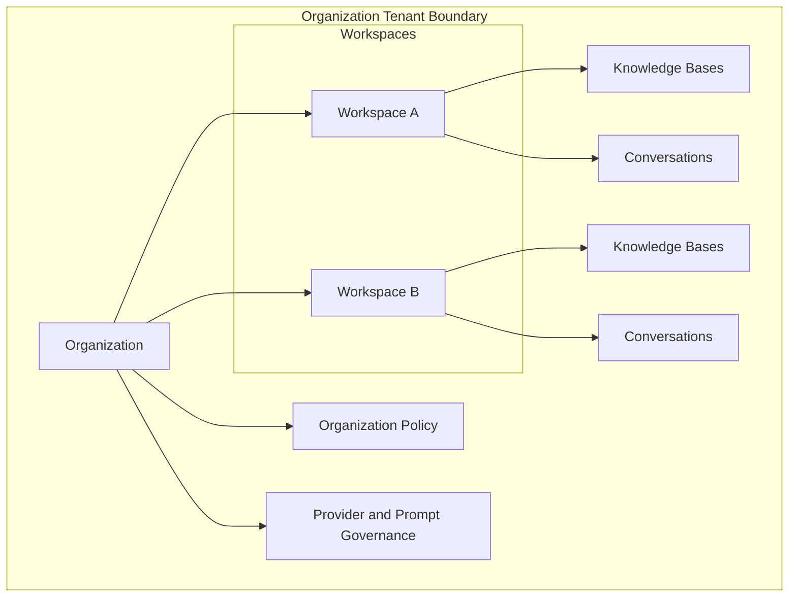
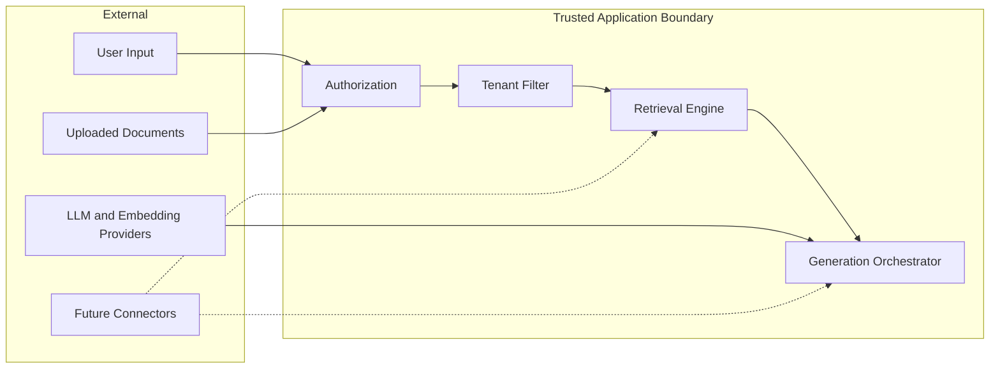

# Multi-Tenancy

> **Status:** Accepted domain design.  
> **Purpose:** Define tenant isolation, data partitioning, and cross-tenant boundaries for RAG-enterprise.

## 1. Tenancy model

RAG-enterprise uses a **hierarchical multi-tenant** model:

| Layer | Isolation purpose |
| --- | --- |
| `Organization` | Hard tenant boundary for security, billing, policy, and data residency |
| `Workspace` | Operational isolation for teams, projects, and day-to-day collaboration |
| `KnowledgeBase` | Corpus isolation for retrieval scope and permissions |

There is no shared mutable business data between organizations.

## 2. Tenant identifiers

Every tenant-owned record carries authoritative scope keys:

| Key | Required on | Purpose |
| --- | --- | --- |
| `organization_id` | All tenant-owned entities | Hard isolation and policy enforcement |
| `workspace_id` | Workspace-scoped entities | Collaboration and resource grouping |
| `knowledge_base_id` | Knowledge and indexing artifacts | Retrieval and ACL scope |

### Denormalization rule

`organization_id` is stored on workspace-scoped children such as `Document`, `Chunk`,
and `Conversation` to enable efficient tenant filtering and defense-in-depth queries.
The value must match the parent workspace organization and is validated on write.

## 3. Isolation guarantees

| Guarantee | Description |
| --- | --- |
| Read isolation | No query may return records outside the caller's authorized organization. |
| Write isolation | Creates and updates validate parent scope before persistence. |
| Search isolation | Vector and metadata retrieval always filter by authorized knowledge bases. |
| Cache isolation | Cache keys include `organization_id` and usually `workspace_id`. |
| Queue isolation | Background jobs include tenant scope and reject ambiguous jobs. |
| Observability isolation | Metrics and traces are tenant-taggable; sensitive content is excluded. |
| Model isolation | Provider credentials and prompts are organization-scoped secrets/config. |

## 4. Trust boundaries

Untrusted inputs never bypass `AuthZ` and `TenantFilter`.

## 5. Workspace patterns

| Pattern | Use case |
| --- | --- |
| One workspace per department | Default enterprise pattern |
| One workspace per product or project | Cross-functional teams |
| Shared org workspace | Company-wide internal knowledge |
| Restricted workspace | Confidential or regulated content |

### Cross-workspace rules

| Rule | Policy |
| --- | --- |
| Default | No cross-workspace access |
| Org-wide knowledge base | Read-only sharing via explicit `visibility = organization` |
| User in multiple workspaces | Separate memberships; no implicit access |
| Admin visibility | Org admins may have audited break-glass access per policy |

## 6. Multilingual tenancy

Multilingual support is modeled without separate language tenants.

| Mechanism | Description |
| --- | --- |
| Organization default locale | UI and fallback language |
| Workspace primary locale | Team default for new conversations |
| User preferred locale | Personal UI and prompt selection |
| Document declared language | Content metadata for ingestion and retrieval |
| Chunk language | Retrieval filter and ranking feature |
| Prompt template locale | Localized instructions and safety wording |

A single knowledge base may contain multiple languages. Retrieval configurations may
prefer matching conversation locale while still allowing cross-language fallback when
configured and authorized.

## 7. Multiple providers and models

Provider and model tenancy is **catalog plus tenant enablement**:

| Asset | Tenancy behavior |
| --- | --- |
| Global provider catalog | Platform-maintained metadata |
| Organization enablement | Tenant chooses allowed providers and models |
| Workspace policy | May restrict to a subset for specific teams |
| Conversation binding | Stores exact provider, prompt, and retrieval versions used |

This allows one organization to use OpenAI-compatible and Azure-hosted models while
another uses on-prem inference, without cross-tenant credential access.

## 8. Future capability tenancy

| Capability | Tenancy design |
| --- | --- |
| OCR services | Workspace-owned `IntegrationConnector`; OCR output stored as `DocumentVersion` in tenant scope |
| Web search | Ephemeral results tagged with `organization_id` and `conversation_id`; not shared across tenants |
| SQL agents | Connector per workspace; datasource credentials organization-scoped; query tools read-only by default |
| MCP integrations | One connector registration per workspace or org policy; tool allowlists scoped to workspace roles |

## 9. Data residency and retention

| Policy object | Scope |
| --- | --- |
| `data_residency_policy` | Organization |
| Retention period | Organization and classification label |
| Legal hold | Organization, workspace, knowledge base, or document |
| Export entitlement | Organization administrator |

Deletion workflows must cascade across:

- content (`Document`, `DocumentVersion`)
- indexes (`Chunk`, `Embedding`)
- conversations (`Conversation`, `Message`, `Citation`)
- evaluations and feedback retained only per policy

## 10. Noisy neighbor controls

| Control | Application |
| --- | --- |
| Per-tenant rate limits | API, ingestion, embedding, and generation |
| Per-tenant cost budgets | Provider usage and tool invocation |
| Queue fairness | Background indexing and evaluation jobs |
| Retrieval top-k caps | Prevent excessive context assembly |
| Tool concurrency limits | Future agent and connector invocations |

## 11. Testing tenancy scenarios

The domain requires explicit tests for:

- cross-tenant read and search denial
- cross-workspace denial by default
- org-wide shared knowledge base read behavior
- citation access when document ACL is narrower than conversation access
- connector/tool access limited to registering workspace
- provider credential isolation

## 12. Related documents

- [Ownership Model](OWNERSHIP_MODEL.md)
- [Permission Model](PERMISSION_MODEL.md)
- [Domain Model](DOMAIN_MODEL.md)
