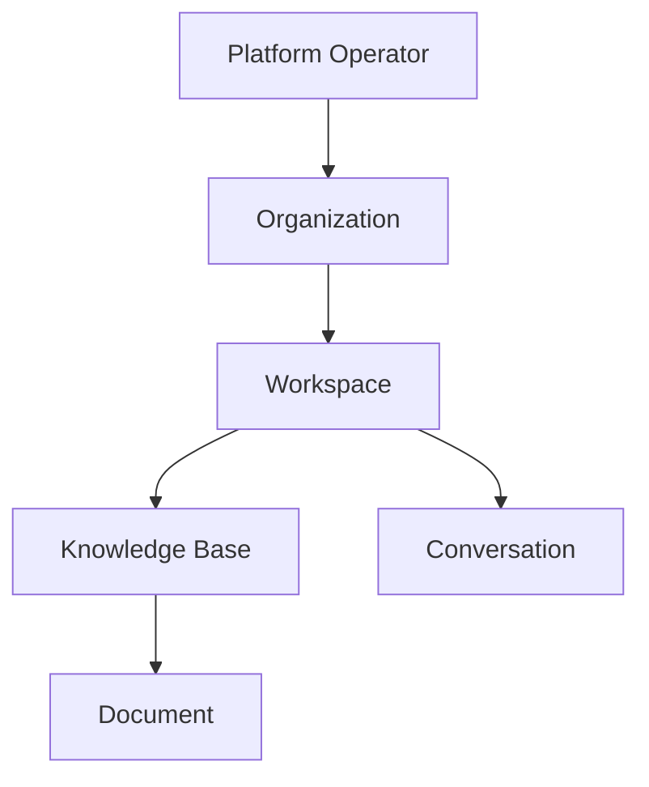

# Ownership Model

> **Status:** Accepted domain design.  
> **Purpose:** Define who owns each entity, how ownership cascades, and how responsibility is assigned.

## 1. Ownership principles

| Principle | Description |
| --- | --- |
| Single authoritative owner | Every entity has exactly one owning aggregate root. |
| Tenant cascade | Tenant-owned entities always carry `organization_id`; operational entities also carry `workspace_id`. |
| Creator is not owner | Creating a resource does not override aggregate ownership rules. |
| Administrative vs content ownership | Tenant admins govern access; workspace owners govern knowledge organization. |
| Platform stewardship | Platform operator owns global catalogs; tenants own enablement and configuration. |

## 2. Ownership hierarchy

## 3. Entity ownership matrix

| Entity | Owning aggregate | Scope key | Stewardship |
| --- | --- | --- | --- |
| `Organization` | Platform tenant root | `organization_id` | Customer org admin |
| `Workspace` | `Organization` | `organization_id` | Workspace admin |
| `User` | Platform identity | global | User and platform admin |
| `Role` | `Organization` | `organization_id` | Org admin |
| `Membership` | `Organization` | `organization_id` | Org admin |
| `KnowledgeBase` | `Workspace` | `workspace_id` | Workspace knowledge admin |
| `Folder` | `KnowledgeBase` | `knowledge_base_id` | Knowledge admin |
| `Document` | `KnowledgeBase` | `knowledge_base_id` | Document owner role |
| `DocumentVersion` | `Document` | `document_id` | Ingestion workflow |
| `Chunk` | `KnowledgeBase` | `knowledge_base_id` | Indexing workflow |
| `Embedding` | `Chunk` | `chunk_id` | Indexing workflow |
| `EmbeddingModel` | Platform catalog | global + org enablement | Platform operator |
| `RetrievalConfiguration` | `KnowledgeBase` | `knowledge_base_id` | Knowledge admin |
| `LLMProvider` | Platform catalog | global + org enablement | Platform operator |
| `PromptTemplate` | `Organization` | `organization_id` | AI governance admin |
| `Conversation` | `Workspace` | `workspace_id` | Creating user |
| `Message` | `Conversation` | `conversation_id` | Conversation owner |
| `Citation` | `Message` | `message_id` | Generation workflow |
| `Evaluation` | `Organization` | `organization_id` | AI governance admin |
| `Feedback` | `Message` | `message_id` | Submitting user |
| `IntegrationConnector` | `Workspace` | `workspace_id` | Integration admin |
| `ToolDefinition` | `IntegrationConnector` | `connector_id` | Integration admin |

## 4. Responsibility roles (business, not RBAC detail)

| Role | Ownership responsibilities |
| --- | --- |
| Platform operator | Operates global catalogs, baseline security, and provider availability. |
| Organization administrator | Owns tenant policy, org roles, provider enablement, and decommission. |
| Workspace administrator | Owns workspace membership, knowledge base creation, and connector policy. |
| Knowledge administrator | Owns folder structure, ingestion policy, and retrieval configuration publication. |
| Content owner | Owns specific documents and approves publication or deletion. |
| AI governance administrator | Owns prompt templates, evaluations, and production AI configuration approval. |
| End user | Owns conversations they create and feedback they submit. |

## 5. Ownership by bounded context

### Tenant Administration

- `Organization`, `Workspace`, `Role`, `Membership`
- Tenant admins may delegate workspace administration but retain ultimate tenant ownership.

### Knowledge Content

- `KnowledgeBase`, `Folder`, `Document`, `DocumentVersion`
- Content ownership remains with the knowledge base even when ingestion is automated.

### Knowledge Indexing

- `Chunk`, `Embedding`
- Indexing artifacts are owned by the knowledge base for isolation and deletion semantics.

### AI Configuration

- `EmbeddingModel`, `LLMProvider` catalogs are platform-owned.
- Tenant enablement and credentials are organization-owned configuration overlays.
- `PromptTemplate` is organization-owned because instructions express tenant policy.

### Conversational Experience

- `Conversation`, `Message`, `Citation`
- Conversations belong to the workspace; users retain access only through membership.

### Quality and Evaluation

- `Evaluation` is organization-owned because release decisions are tenant governance acts.
- `Feedback` is user-attributed but retained under workspace and organization policy.

### Integrations and Agents

- `IntegrationConnector` and `ToolDefinition` are workspace-owned with organization policy constraints.

## 6. Data custody and deletion

| Scenario | Rule |
| --- | --- |
| Workspace deletion | Archives knowledge bases and conversations; hard delete after retention. |
| Knowledge base deletion | Supersedes chunks and embeddings; citations remain as historical references if required. |
| User deletion | Disables identity; reattributes or anonymizes feedback per policy. |
| Provider retirement | Does not delete historical messages; new conversations must select active providers. |
| Connector retirement | Disables tools; does not delete imported documents unless explicitly purged. |

## 7. Multilingual ownership

Language metadata is owned by the entity that carries the content:

| Entity | Language ownership |
| --- | --- |
| `Document` | `declared_language` chosen by content owner or detected at ingestion |
| `DocumentVersion` | May contain multilingual segments in future |
| `Chunk` | `language` per chunk for retrieval filtering |
| `PromptTemplate` | `locale` per template version |
| `Conversation` | `locale` chosen at conversation creation |

Organization default locale influences UI and fallbacks but does not override explicit entity language.

## 8. Future extensibility

| Extension | Ownership impact |
| --- | --- |
| OCR service output | Produces `DocumentVersion` owned by the same `Document` |
| Web search evidence | Ephemeral retrieval artifact; not a `Document` unless explicitly saved |
| SQL agent queries | Executed through workspace-owned connector; results not authoritative documents by default |
| MCP tools | Owned by `IntegrationConnector`; invocation records belong to `Conversation` |

## 9. Related documents

- [Permission Model](PERMISSION_MODEL.md)
- [Multi-Tenancy](MULTI_TENANCY.md)
- [Bounded Contexts](BOUNDED_CONTEXTS.md)
