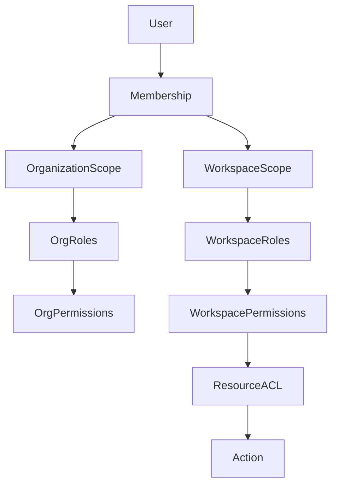
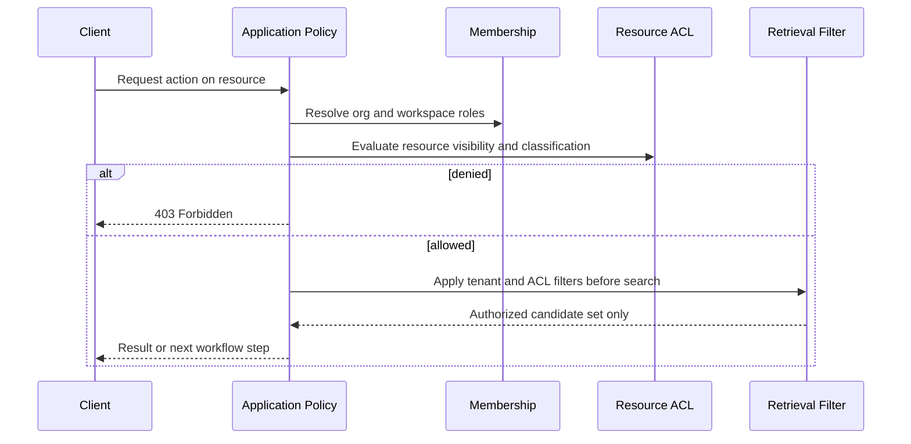

# Permission Model

> **Status:** Accepted domain design.  
> **Purpose:** Define authorization concepts for an enterprise knowledge platform with workspace-scoped access and AI capabilities.

## 1. Authorization principles

| Principle | Rule |
| --- | --- |
| Server-side enforcement | Authorization is evaluated in application code before any read, search, generation, or tool action. |
| Deny by default | Absence of permission means denial. |
| Scope every query | Tenant and workspace identifiers are mandatory filters on resource access. |
| Object-level checks | Membership alone is insufficient; resource ACLs and ownership must be evaluated. |
| Separation of duties | AI configuration approval, integration enablement, and content deletion may require distinct permissions. |
| No model-enforced auth | Prompts and retrieved text must never be relied on for access control. |

## 2. Scope model

### Scope types

| Scope | Applies to |
| --- | --- |
| `organization` | Org settings, org roles, provider enablement, prompt templates, evaluations |
| `workspace` | Knowledge bases, conversations, connectors, workspace membership |
| `resource` | Document, folder, knowledge base, conversation, connector instance |

## 3. Permission taxonomy

Permissions use `resource:action` naming.

### Organization permissions

| Permission | Description |
| --- | --- |
| `organization:read` | View org profile and policy |
| `organization:manage` | Update org settings and residency policy |
| `organization:member:invite` | Invite users |
| `organization:member:revoke` | Revoke memberships |
| `organization:role:manage` | Create and update roles |
| `organization:provider:manage` | Enable LLM and embedding providers |
| `organization:prompt:manage` | Manage prompt templates |
| `organization:evaluation:manage` | Define and run evaluations |

### Workspace permissions

| Permission | Description |
| --- | --- |
| `workspace:read` | View workspace metadata |
| `workspace:manage` | Update workspace settings |
| `workspace:member:manage` | Manage workspace memberships |
| `workspace:knowledge_base:create` | Create knowledge bases |
| `workspace:conversation:create` | Start conversations |
| `workspace:connector:manage` | Register and enable integrations |

### Knowledge permissions

| Permission | Description |
| --- | --- |
| `knowledge_base:read` | View knowledge base metadata |
| `knowledge_base:manage` | Update KB settings and publish retrieval configuration |
| `folder:read` | Browse folders |
| `folder:manage` | Create, move, and archive folders |
| `document:read` | Read document metadata and authorized content |
| `document:create` | Upload or register documents |
| `document:update` | Publish new versions or metadata |
| `document:delete` | Archive or delete documents |
| `document:download` | Export original or extracted content |

### Conversation permissions

| Permission | Description |
| --- | --- |
| `conversation:read` | View own or shared conversations per policy |
| `conversation:manage` | Archive or delete own conversations |
| `conversation:share` | Share conversation within workspace policy |
| `message:create` | Submit user messages |
| `feedback:submit` | Submit feedback on messages and citations |

### AI and integration permissions

| Permission | Description |
| --- | --- |
| `retrieval_configuration:publish` | Activate retrieval configuration versions |
| `tool:invoke` | Allow agent tool invocation in conversations |
| `tool:approve` | Approve human-gated tool actions |
| `connector:validate` | Validate integration connectivity and schema |

## 4. Default role bundles

Roles are tenant-configurable; these are platform defaults.

| Role | Scope | Intent |
| --- | --- | --- |
| `org_admin` | Organization | Full tenant administration |
| `ai_governance_admin` | Organization | Prompt, evaluation, and provider governance |
| `workspace_admin` | Workspace | Workspace membership and knowledge administration |
| `knowledge_admin` | Workspace | Folder, document, and retrieval configuration management |
| `contributor` | Workspace | Create and update documents |
| `member` | Workspace | Read authorized knowledge and use chat |
| `viewer` | Workspace | Read-only knowledge and chat |
| `integration_admin` | Workspace | Manage connectors and tools |

## 5. Resource ACL overlays

Some resources require explicit ACLs in addition to role permissions.

| Resource | ACL dimensions |
| --- | --- |
| `KnowledgeBase` | `visibility`: `private`, `workspace`, `organization` |
| `Folder` | Inherits from knowledge base unless overridden |
| `Document` | `owner`, `editors`, `viewers`, `classification_label` |
| `Conversation` | `owner`, optional `shared_with` |
| `IntegrationConnector` | `enabled_for_roles`, `approval_policy` |

### Classification labels

| Label | Typical restriction |
| --- | --- |
| `public_internal` | All workspace members |
| `restricted` | Explicit viewers and editors only |
| `confidential` | Named individuals and audited access |
| `regulated` | Additional logging and export controls |

## 6. Authorization decision flow

**Critical rule:** Retrieval and citation assembly occur only after authorization filters are applied.

## 7. AI-specific permission rules

| Scenario | Rule |
| --- | --- |
| Chat over knowledge base | Requires `conversation:create` and `knowledge_base:read` on targeted corpora |
| Citation display | User must have `document:read` on cited document |
| Prompt changes | Production prompt activation requires `organization:prompt:manage` and governance approval |
| Provider use | Provider must be enabled at org level and allowed by workspace policy |
| Tool invocation | Requires `tool:invoke`; privileged tools also require `tool:approve` or workflow approval |
| Evaluation run | Requires `organization:evaluation:manage` and read access to benchmark knowledge base |

## 8. Future capability permissions

| Future capability | Permission extension |
| --- | --- |
| OCR ingestion | `document:create` plus `connector:validate` for OCR service |
| Web search augmentation | `tool:invoke` on `web_search` tool definitions |
| SQL agent | `tool:invoke` on read-only SQL tools with datasource ACL |
| MCP integrations | `connector:manage` and per-tool `tool:invoke` |

## 9. Audit requirements

The following actions must produce immutable audit records:

- Membership and role changes
- Provider and prompt activation
- Retrieval configuration publication
- Document deletion and legal hold changes
- Connector and tool enablement
- Privileged tool approvals
- Evaluation pass/fail results affecting production

## 10. Related documents

- [Ownership Model](OWNERSHIP_MODEL.md)
- [Multi-Tenancy](MULTI_TENANCY.md)
- [Bounded Contexts](BOUNDED_CONTEXTS.md)
