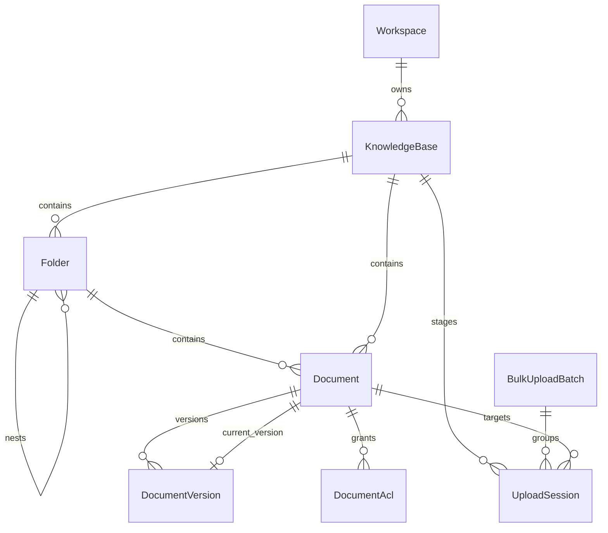

# Knowledge Management — Database Design

> **Status:** Draft — design only, no SQL or ORM  
> **Aggregate root:** `KnowledgeBase`  
> **Primary keys:** UUIDv7 on all entities

## Overview

Knowledge Management persists metadata in PostgreSQL and file payloads in object storage.
This document maps the feature onto the approved domain model without prescribing SQL DDL.

Supporting workflow entities (`upload_session`, `bulk_upload_batch`) are introduced as
infrastructure tables owned by the Knowledge Content context. They are not domain entities
exposed to retrieval or chat.

## Entity catalog

### KnowledgeBase

| Attribute | Required | Type | Description |
| --- | --- | --- | --- |
| `id` | Yes | UUID | Primary key |
| `organization_id` | Yes | UUID | Tenant denormalization |
| `workspace_id` | Yes | UUID | Owning workspace |
| `name` | Yes | string | Display name |
| `slug` | No | string | URL-safe identifier; optional in v1 |
| `description` | No | string | Summary text |
| `status` | Yes | enum | `draft`, `active`, `reindexing`, `archived`, `deleted` |
| `default_language` | Yes | string | BCP-47 default for new documents |
| `visibility_policy` | Yes | enum | `private`, `workspace`, `organization` |
| `document_count` | No | int | Denormalized counter |
| `version` | Yes | int | Optimistic concurrency |
| `created_at` | Yes | datetime | UTC |
| `updated_at` | Yes | datetime | UTC |
| `created_by` | Yes | UUID | User reference |
| `updated_by` | Yes | UUID | User reference |
| `deleted_at` | No | datetime | Soft delete timestamp |
| `archived_at` | No | datetime | Archive timestamp |

**Storage:** PostgreSQL only.

---

### Folder

| Attribute | Required | Type | Description |
| --- | --- | --- | --- |
| `id` | Yes | UUID | Primary key |
| `organization_id` | Yes | UUID | Tenant denormalization |
| `workspace_id` | Yes | UUID | Tenant denormalization |
| `knowledge_base_id` | Yes | UUID | Parent KB |
| `parent_folder_id` | No | UUID | Null for KB root children |
| `name` | Yes | string | Folder name |
| `path` | Yes | string | Materialized path (e.g. `/policies/hr`) |
| `depth` | Yes | int | Depth from KB root (0 = root level) |
| `status` | Yes | enum | `active`, `archived`, `deleted` |
| `version` | Yes | int | Optimistic concurrency |
| `created_at` | Yes | datetime | UTC |
| `updated_at` | Yes | datetime | UTC |
| `created_by` | Yes | UUID | User reference |
| `updated_by` | Yes | UUID | User reference |
| `deleted_at` | No | datetime | Soft delete |
| `archived_at` | No | datetime | Archive timestamp |

**Storage:** PostgreSQL only.

---

### Document

| Attribute | Required | Type | Description |
| --- | --- | --- | --- |
| `id` | Yes | UUID | Primary key |
| `organization_id` | Yes | UUID | Tenant denormalization |
| `workspace_id` | Yes | UUID | Tenant denormalization |
| `knowledge_base_id` | Yes | UUID | Parent KB |
| `folder_id` | No | UUID | Null = KB root |
| `title` | Yes | string | Display title |
| `status` | Yes | enum | `draft`, `active`, `archived`, `deleted` |
| `source_type` | Yes | enum | `upload`, future: `connector`, `url` |
| `declared_language` | Yes | string | BCP-47 |
| `classification_label` | Yes | enum | `public_internal`, `restricted`, `confidential`, `regulated` |
| `current_version_id` | No | UUID | Pointer to current version row |
| `tags` | No | string[] | Normalized tags |
| `metadata` | No | JSON | Custom metadata object |
| `owner_user_id` | No | UUID | Document steward |
| `legal_hold` | No | bool | Default false; blocks delete |
| `version` | Yes | int | Optimistic concurrency |
| `created_at` | Yes | datetime | UTC |
| `updated_at` | Yes | datetime | UTC |
| `created_by` | Yes | UUID | User reference |
| `updated_by` | Yes | UUID | User reference |
| `deleted_at` | No | datetime | Soft delete |
| `archived_at` | No | datetime | Archive timestamp |

**Storage:** PostgreSQL metadata; no binary in row.

---

### DocumentVersion

| Attribute | Required | Type | Description |
| --- | --- | --- | --- |
| `id` | Yes | UUID | Primary key |
| `organization_id` | Yes | UUID | Tenant denormalization |
| `workspace_id` | Yes | UUID | Tenant denormalization |
| `knowledge_base_id` | Yes | UUID | Denormalized for queue queries |
| `document_id` | Yes | UUID | Parent document |
| `version_number` | Yes | int | Monotonic per document |
| `extraction_method` | Yes | enum | `native_text`, `ocr`, `connector_import`, `manual_edit` |
| `processing_status` | Yes | enum | Pipeline state |
| `content_hash` | Yes | string | SHA-256 of original bytes |
| `file_name` | Yes | string | Original filename |
| `file_size_bytes` | Yes | int | Byte size |
| `mime_type` | Yes | string | Detected MIME |
| `storage_key_original` | Yes | string | Object storage key |
| `storage_key_extracted` | No | string | Extracted text object key |
| `failure_reason` | No | string | Sanitized error code/message |
| `change_summary` | No | string | User note |
| `effective_at` | No | datetime | When version became current |
| `indexed_at` | No | datetime | When indexing completed |
| `created_at` | Yes | datetime | UTC |
| `created_by` | Yes | UUID | User reference |
| `superseded_at` | No | datetime | When replaced by newer indexed version |

**Storage:** PostgreSQL metadata; originals and extracted text in object storage.

**Immutability:** Rows are insert-only; status transitions only along approved lifecycle.

---

### DocumentAcl (supporting)

| Attribute | Required | Type | Description |
| --- | --- | --- | --- |
| `id` | Yes | UUID | Primary key |
| `document_id` | Yes | UUID | Parent document |
| `principal_type` | Yes | enum | `user`, `role` |
| `principal_id` | Yes | UUID | Principal identifier |
| `permission` | Yes | enum | `view`, `edit`, `manage` |
| `created_at` | Yes | datetime | UTC |
| `created_by` | Yes | UUID | Granting user |

**Storage:** PostgreSQL. Used when `classification_label` requires explicit ACL.

---

### UploadSession (infrastructure)

| Attribute | Required | Type | Description |
| --- | --- | --- | --- |
| `id` | Yes | UUID | Primary key |
| `organization_id` | Yes | UUID | Tenant scope |
| `workspace_id` | Yes | UUID | Tenant scope |
| `knowledge_base_id` | Yes | UUID | Target KB |
| `document_id` | No | UUID | Set when uploading new version |
| `bulk_batch_id` | No | UUID | Set for bulk uploads |
| `file_name` | Yes | string | Declared filename |
| `file_size_bytes` | Yes | int | Declared size |
| `mime_type` | No | string | Client hint |
| `status` | Yes | enum | `pending`, `uploading`, `completed`, `cancelled`, `expired` |
| `storage_key_staging` | No | string | Staging object key |
| `checksum_sha256` | No | string | Verified on complete |
| `expires_at` | Yes | datetime | Session expiry |
| `created_at` | Yes | datetime | UTC |
| `created_by` | Yes | UUID | User reference |
| `completed_at` | No | datetime | UTC |

**Storage:** PostgreSQL + object storage staging prefix.

---

### BulkUploadBatch (infrastructure)

| Attribute | Required | Type | Description |
| --- | --- | --- | --- |
| `id` | Yes | UUID | Primary key |
| `organization_id` | Yes | UUID | Tenant scope |
| `workspace_id` | Yes | UUID | Tenant scope |
| `knowledge_base_id` | Yes | UUID | Target KB |
| `folder_id` | No | UUID | Default folder |
| `status` | Yes | enum | `open`, `completing`, `completed`, `expired` |
| `total_files` | Yes | int | Declared count |
| `succeeded_count` | Yes | int | Progress |
| `failed_count` | Yes | int | Progress |
| `expires_at` | Yes | datetime | Batch expiry |
| `created_at` | Yes | datetime | UTC |
| `created_by` | Yes | UUID | User reference |

---

## Relationships



### Cardinality summary

| Relationship | Cardinality | Ownership |
| --- | --- | --- |
| Workspace → KnowledgeBase | 1:N | Workspace |
| KnowledgeBase → Folder | 1:N | KnowledgeBase |
| Folder → Folder | 1:N | KnowledgeBase |
| Folder → Document | 1:N | KnowledgeBase |
| Document → DocumentVersion | 1:N | Document |
| Document → current version | 1:0..1 | Document (mutable pointer) |
| Document → DocumentAcl | 1:N | Document |
| KnowledgeBase → UploadSession | 1:N | UploadSession |
| BulkUploadBatch → UploadSession | 1:N | BulkUploadBatch |

### Delete and orphan policies

| Parent action | Child behavior |
| --- | --- |
| KB archive | Folders and documents → `archived` |
| KB soft delete | Folders and documents → `deleted` |
| Folder delete (empty) | Soft delete folder |
| Folder delete (cascade) | Subtree archived/deleted per command |
| Document soft delete | Versions retained; `current_version_id` retained |
| Version supersede | Prior version `processing_status` → `superseded` |
| Upload session expire | Staging object deleted; row → `expired` |

No chunk or embedding rows are owned by this feature's tables.

---

## Constraints

### Uniqueness

| Scope | Fields | Condition |
| --- | --- | --- |
| Workspace | `name` among KnowledgeBase | `status NOT IN (deleted)` |
| Sibling folders | `knowledge_base_id`, `parent_folder_id`, `name` | active folders only |
| Document versions | `document_id`, `version_number` | always |
| Upload binding | `upload_id` → one DocumentVersion | completed uploads |
| User email | N/A | Identity context |

### Referential integrity

| Rule | Enforcement |
| --- | --- |
| `folder.parent_folder_id` must reference folder in same KB | Application + FK |
| `document.folder_id` must reference folder in same KB | Application + FK |
| `document_version.document_id` must match document's KB | Application + FK |
| Cannot delete folder with active children unless cascade | Application guard |
| `current_version_id` must reference version of same document | Application guard |

### Business invariants

| ID | Invariant |
| --- | --- |
| DB-01 | `version_number` increments by 1 with no gaps per document |
| DB-02 | Only one version per document may be `is_current` at a time |
| DB-03 | `path` is consistent with parent chain after every folder move |
| DB-04 | `depth` ≤ configured maximum |
| DB-05 | Archived KB cannot have active-only child rows without explicit restore |
| DB-06 | `content_hash` immutable after version creation |
| DB-07 | `legal_hold = true` blocks `deleted` transition |

### Check constraints (conceptual)

| Entity | Rule |
| --- | --- |
| DocumentVersion | `file_size_bytes > 0` |
| Folder | `depth >= 0` |
| UploadSession | `expires_at > created_at` |
| BulkUploadBatch | `succeeded_count + failed_count ≤ total_files` |

---

## Indexes

Recommended indexes follow `docs/data/INDEXING_STRATEGY.md`.

### KnowledgeBase

| Index | Columns | Purpose |
| --- | --- | --- |
| Primary | `id` | Row lookup |
| Composite | `(organization_id, workspace_id, status)` | Workspace listing |
| Partial unique | `(workspace_id, name) WHERE deleted_at IS NULL` | Name uniqueness |

### Folder

| Index | Columns | Purpose |
| --- | --- | --- |
| Composite | `(knowledge_base_id, parent_folder_id, name)` | Sibling uniqueness |
| Composite | `(knowledge_base_id, path)` | Path resolution |
| Composite | `(knowledge_base_id, status)` | Active tree queries |

### Document

| Index | Columns | Purpose |
| --- | --- | --- |
| Composite | `(knowledge_base_id, folder_id, status)` | Folder browsing |
| Composite | `(organization_id, workspace_id, status, updated_at)` | Admin views |
| Composite | `(knowledge_base_id, declared_language, status)` | Language filter |
| GIN (future) | `tags` | Tag search when needed |

### DocumentVersion

| Index | Columns | Purpose |
| --- | --- | --- |
| Unique composite | `(document_id, version_number)` | Ordering |
| Composite | `(document_id, processing_status)` | Version status |
| Composite | `(knowledge_base_id, processing_status, created_at)` | Ingestion queue |
| Composite | `(content_hash, knowledge_base_id)` | Dedup hints |

### UploadSession

| Index | Columns | Purpose |
| --- | --- | --- |
| Composite | `(knowledge_base_id, status, expires_at)` | Expiry sweeper |
| Composite | `(created_by, created_at)` | User upload history |

### DocumentAcl

| Index | Columns | Purpose |
| --- | --- | --- |
| Composite | `(document_id, principal_type, principal_id)` | ACL lookup |

---

## Soft delete

| Entity | Soft delete field | Active query filter |
| --- | --- | --- |
| KnowledgeBase | `deleted_at` | `deleted_at IS NULL` |
| Folder | `deleted_at` | `deleted_at IS NULL` |
| Document | `deleted_at` | `deleted_at IS NULL` |
| DocumentVersion | none (retain all) | filter via document visibility |
| UploadSession | `status = expired/cancelled` | exclude from active uploads |

**Retention:** Hard purge is performed by background jobs per `docs/data/DATA_LIFECYCLE.md` after retention period and legal hold clearance.

**Partial indexes:** Hot paths exclude soft-deleted rows per indexing strategy.

---

## Versioning

### Entity optimistic concurrency

`KnowledgeBase`, `Folder`, and `Document` expose integer `version` incremented on each
mutating command. Clients may send `expected_version` to detect concurrent edits.

### Document content versioning

| Concept | Behavior |
| --- | --- |
| Immutable versions | Each upload creates a new `DocumentVersion` row |
| Monotonic numbers | `version_number` assigned atomically per document |
| Current pointer | `Document.current_version_id` updated when version reaches `indexed` |
| Supersession | Prior indexed version → `superseded`; chunks marked downstream |
| Historical access | All versions listable; download allowed per permission |

### Materialized folder path versioning

Folder moves rewrite `path` and `depth` for the moved subtree in one transaction.
`version` on each affected folder row increments.

---

## Object storage layout

Per `docs/data/STORAGE_STRATEGY.md`:

```text
org/{organization_id}/workspace/{workspace_id}/knowledge-base/{knowledge_base_id}/
  document/{document_id}/version/{version_id}/original/{filename}
  document/{document_id}/version/{version_id}/extracted/text.txt
uploads/staging/{upload_id}/...
```

Staging objects are promoted to permanent keys on version creation.

---

## Events (outbound)

Knowledge Management emits domain events for downstream indexing (conceptual names):

| Event | Trigger |
| --- | --- |
| `KnowledgeBaseCreated` | KB created |
| `KnowledgeBaseArchived` | KB archived |
| `DocumentCreated` | Document registered |
| `DocumentVersionUploaded` | Version row created from completed upload |
| `DocumentVersionExtracted` | Extraction succeeded |
| `DocumentVersionIndexed` | Indexing pipeline completion (consumed back for status) |
| `DocumentArchived` | Document archived |
| `DocumentDeleted` | Document soft deleted |

Event payloads include `organization_id`, `workspace_id`, `knowledge_base_id`,
`correlation_id`, and entity IDs only — no embedded content.

---

## Related documents

- [README.md](README.md)
- [API.md](API.md)
- [WORKFLOWS.md](WORKFLOWS.md)
- [../../docs/data/RELATIONSHIPS.md](../../docs/data/RELATIONSHIPS.md)
- [../../docs/data/STORAGE_STRATEGY.md](../../docs/data/STORAGE_STRATEGY.md)
