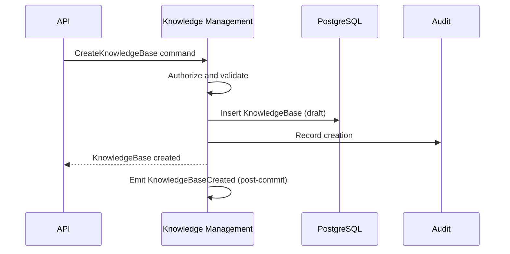
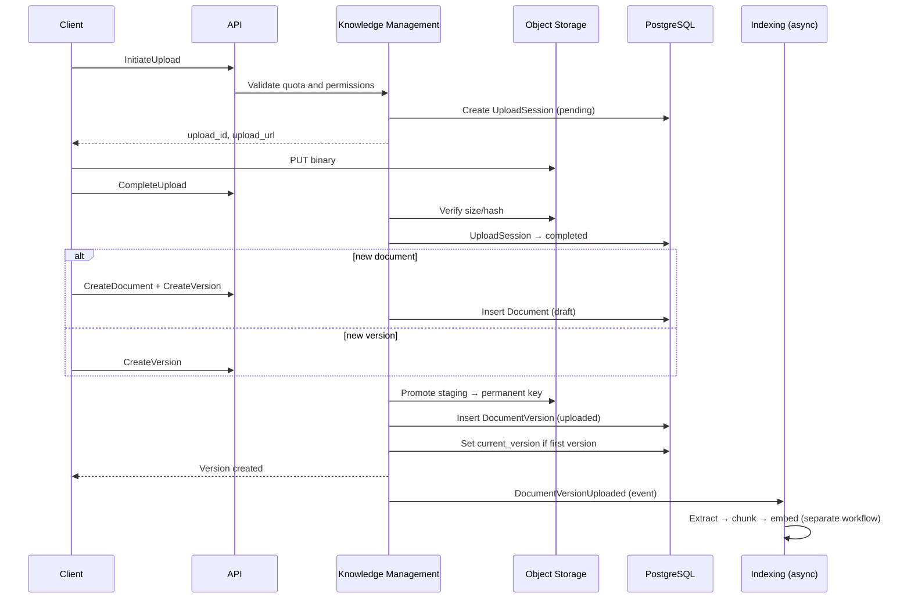
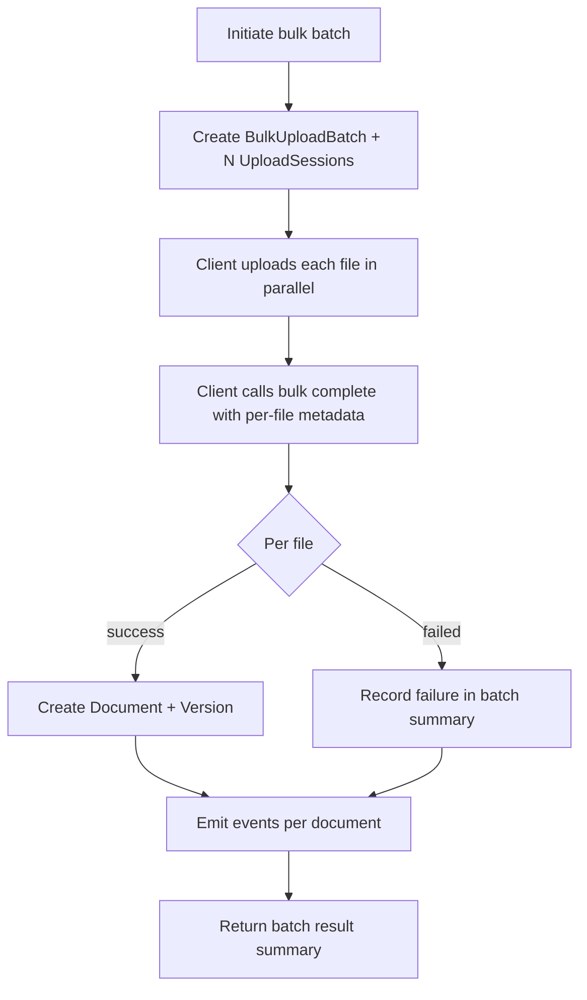
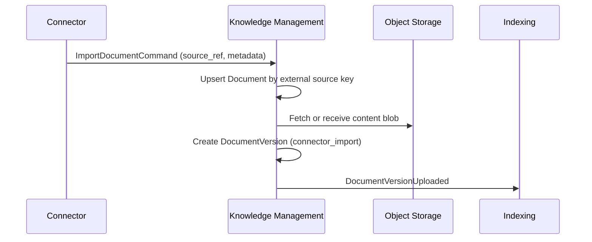

# Knowledge Management — Workflows

> **Status:** Draft — process design only  
> **Pattern:** Application commands, aggregate transactions, async domain events

## Workflow conventions

| Convention | Rule |
| --- | --- |
| Command boundary | One aggregate mutation per transaction unless documented saga |
| Authorization first | Permission check before any read for mutation workflows |
| Event after commit | Domain events published after successful transaction commit |
| Async processing | Extraction, chunking, and indexing run outside the request thread |
| Correlation | All steps propagate `correlation_id` from the initiating API request |

---

## 1. Create Knowledge Base

### Trigger

`POST /workspaces/{workspace_id}/knowledge-bases`

### Preconditions

- Workspace status is `active`
- Actor has `workspace:knowledge_base:create`
- Name unique among non-deleted KBs in workspace

### Steps

### Postconditions

- Knowledge base exists in `draft` or `active` per request policy (default `draft`)
- `organization_id` and `workspace_id` denormalized
- No folders or documents created automatically

### Failure modes

| Failure | Outcome |
| --- | --- |
| Duplicate name | `409 conflict` |
| Workspace archived | `403 forbidden` |
| Invalid language code | `422 validation_failed` |

---

## 2. Upload Document

### Trigger

Combination of: initiate upload → transfer bytes → complete upload → create document (if new) → create version

### Preconditions

- Knowledge base `active` (or `draft` if policy allows ingestion before publish)
- Target folder `active` if specified
- Actor has `document:create`
- File within size and format policy

### Steps

### Postconditions

- `DocumentVersion` in `uploaded` state
- Original file stored at permanent object key
- Document remains `draft` until first successful index (or immediately `active` per policy)

### Failure modes

| Failure | Outcome |
| --- | --- |
| Upload expired | Session `expired`; client must re-initiate |
| Hash mismatch | `422 validation_failed` |
| Unsupported MIME | `422 validation_failed` after server detection |

---

## 3. Create New Version

### Trigger

`POST .../documents/{document_id}/versions` with completed `upload_id`

### Preconditions

- Document status `draft` or `active`
- Document not `archived` or `deleted`
- Actor has `document:update`
- Upload session `completed` and unbound

### Steps

1. Load document aggregate with optimistic lock
2. Assign `version_number = max + 1`
3. Bind upload session to version; promote storage object
4. Insert immutable `DocumentVersion` (`uploaded`)
5. Do not change `current_version_id` until new version is indexed (configurable: immediate pointer for management UI)
6. Emit `DocumentVersionUploaded`

### Postconditions

- New version row exists
- Prior versions unchanged
- Indexing pipeline picks up new version

### Failure modes

| Failure | Outcome |
| --- | --- |
| Upload already bound | `409 conflict` |
| Document archived | `409 conflict` |
| Concurrent version create | One succeeds; other may retry |

---

## 4. Move Document

### Trigger

`POST .../documents/{document_id}/move`

### Preconditions

- Document `active` or `draft`
- Target folder in same KB and `active`
- Actor has `document:update`
- No name collision in target folder (title uniqueness optional per policy)

### Steps

1. Authorize read on document and target folder
2. Validate target folder not under archived subtree
3. Update `document.folder_id` in single transaction
4. Emit `DocumentMoved` (audit)

### Postconditions

- Document appears in target folder listings
- Versions and storage keys unchanged
- No re-index required

### Failure modes

| Failure | Outcome |
| --- | --- |
| Target archived | `409 conflict` |
| KB archived | `403 forbidden` |

---

## 5. Archive Document

### Trigger

`POST .../documents/{document_id}/archive`

### Preconditions

- Document `active` or `draft`
- Actor has archive permission
- No blocking legal workflow (future)

### Steps

1. Transition document `status` → `archived`
2. Set `archived_at`
3. Emit `DocumentArchived`
4. Notify indexing to exclude from active retrieval filters (event consumer)

### Postconditions

- Document hidden from default browse and upload targets
- Versions and citations preserved
- Mutations blocked except restore and delete

---

## 6. Restore Document

### Trigger

`POST .../documents/{document_id}/restore`

### Preconditions

- Document `archived`
- Parent folder and KB not `deleted`
- Actor has `document:update`

### Steps

1. Validate ancestor folder chain `active`
2. Transition document → `active`
3. Clear `archived_at`
4. Emit `DocumentRestored`

### Postconditions

- Document eligible for retrieval again when versions indexed
- No automatic re-index unless embeddings stale

---

## 7. Delete Document

### Trigger

`DELETE .../documents/{document_id}`

### Preconditions

- Actor has `document:delete`
- `legal_hold` is false
- Document not already `deleted`

### Steps

1. Soft delete: `status` → `deleted`, set `deleted_at`
2. Retain all versions and storage objects
3. Emit `DocumentDeleted`
4. Indexing consumer marks chunks for exclusion (no immediate purge)

### Postconditions

- Document invisible to non-admin queries
- Audit trail retained
- Hard purge only via retention job

---

## 8. Bulk Upload

### Trigger

`POST .../uploads/bulk` then per-file upload completion then `.../bulk/{batch_id}/complete`

### Preconditions

- Same as single upload
- File count ≤ batch limit
- Actor has `document:create`

### Steps

### Postconditions

- Each successful file yields independent document + version
- Batch records `succeeded_count` and `failed_count`
- Partial success is valid terminal state

### Failure modes

| Failure | Outcome |
| --- | --- |
| Batch expired | `409 conflict`; must restart |
| All files failed | `200` with zero successes (not a transaction rollback) |

---

## 9. Folder move (related workflow)

### Trigger

`POST .../folders/{folder_id}/move`

### Steps

1. Validate no cycle (cannot move under descendant)
2. Validate unique name among target siblings
3. Update `parent_folder_id`, recompute `path` and `depth` for entire subtree
4. Increment `version` on all affected folders

### Postconditions

- Documents in subtree retain folder association via folder IDs
- Paths consistent for breadcrumb API

---

## 10. Knowledge base archive cascade

### Trigger

`POST .../knowledge-bases/{id}/archive`

### Steps

1. Transition KB → `archived`
2. Batch update all `active` folders → `archived`
3. Batch update all `active`/`draft` documents → `archived`
4. Emit `KnowledgeBaseArchived`

### Restore nuance

KB restore does not automatically restore children in v1; admin may bulk restore or restore selectively (documented in API).

---

## 11. Future OCR workflow

> **Status:** Planned — not in v1 implementation

### Trigger

Upload of scanned PDF or image, or explicit `extraction_method = ocr` on version create

### Flow

1. Knowledge Management creates `DocumentVersion` with `extraction_method = ocr`
2. Emits `DocumentVersionUploaded`
3. OCR `IntegrationConnector` worker extracts text and layout JSON to object storage
4. Worker updates version → `extracted` via internal command
5. Emits `DocumentVersionExtracted`
6. Standard indexing pipeline continues

### Preconditions (future)

- OCR connector `enabled` for workspace
- Actor has `document:create` and connector policy approval

---

## 12. Future external connector import

> **Status:** Planned — not in v1 implementation

### Trigger

Scheduled or manual sync from `IntegrationConnector` (SharePoint, Drive, wiki, etc.)

### Flow

### Identity

Documents created with `source_type = connector` and stable `metadata.source_ref` for idempotent upsert.

### Conflict policy

| Scenario | Behavior |
| --- | --- |
| Same source_ref, new remote etag | New version |
| Same etag | No-op (idempotent) |
| Remote deleted | Archive document per connector policy |

---

## Async boundaries

| Workflow step | Sync (API request) | Async (worker) |
| --- | --- | --- |
| Metadata CRUD | Yes | No |
| Upload staging | Initiate/complete sync; transfer may be direct to storage | No |
| Version row creation | Yes | No |
| Text extraction | No | Yes |
| Chunking / embedding | No | Yes |
| Status → `indexed` | No | Yes (callback or event consumer) |
| Upload session expiry | No | Yes (scheduled job) |
| Retention purge | No | Yes |

---

## Related documents

- [API.md](API.md)
- [VALIDATION.md](VALIDATION.md)
- [DATABASE.md](DATABASE.md)
- [../../docs/domain/ENTITY_LIFECYCLE.md](../../docs/domain/ENTITY_LIFECYCLE.md)
- [../../docs/data/EVENT_MODEL.md](../../docs/data/EVENT_MODEL.md)
