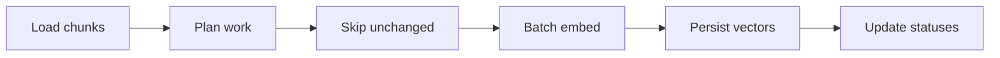

# Embeddings & Indexing

> **Spec ID:** 004  
> **Status:** Draft  
> **Goal:** Convert chunks into vectors and persist them in PostgreSQL (pgvector) for future retrieval.  
> **Scope:** Embedding generation and vector persistence only — no retrieval, chat, or reranking.

## 1. Purpose

Feature 003 (Chunking) produces ordered **Chunk** objects per `DocumentVersion`. Feature 004
embeds each chunk's text, stores the resulting vectors in PostgreSQL with the pgvector
extension, and marks the version ready for search.

Indexing sits at the end of the ingestion pipeline:

```text
DocumentVersion (chunked)
  → load chunk list
  → batch embed via EmbeddingProvider
  → persist Embedding records + vectors
  → DocumentVersion (indexed)
  → (future) retrieval
```

The HTTP API does not change. Indexing runs asynchronously and idempotently per version.

### Goals

| Goal | Description |
| --- | --- |
| Search readiness | Vectors are stored with lineage so a future retrieval layer can filter and rank |
| Cost efficiency | Skip unchanged chunks using `content_hash` |
| Reliability | Batch processing with bounded retries and clear failure states |
| Provider flexibility | All inference goes through `EmbeddingProvider`; default model is BGE-M3 |

### Non-goals

- Retrieval queries, hybrid search, or reranking
- Chat, citations, or answer generation
- Retrieval configuration management (separate spec)
- Dedicated vector database
- SQL migrations, ORM models, or table DDL in this document
- Re-chunking or re-extraction

---

## 2. Input contract

Indexing receives a **chunk list** produced by Feature 003 and persisted with stable IDs.

| Property | Requirement |
| --- | --- |
| Source | Chunks for one `DocumentVersion` in `chunked` status |
| Minimum fields per chunk | `chunk_id`, `document_version_id`, `text`, `content_hash` |
| Recommended fields | `chunk_index`, `language`, `start_char`, `end_char`, `heading` |
| Text | Non-empty UTF-8; already normalized — do not transform before embedding |
| Scope | All chunks belong to the same `document_version_id` and `knowledge_base_id` |
| Tenant context | `organization_id` and `workspace_id` available from the version |

### Trigger

A worker consumes versions in `chunked` status (or a `ChunksCreated` event) and claims
the indexing job.

---

## 3. Embedding provider

All embedding inference uses the existing application interface:

```text
backend/src/rag_enterprise/application/interfaces/embedding.py
  EmbeddingProvider
    model_key: str
    dimensions: int
    embed_texts(texts: list[str]) -> list[list[float]]
```

### Design rules

| Rule | Description |
| --- | --- |
| Provider-agnostic | Application code depends on `EmbeddingProvider` only, not vendor SDKs |
| Injected | Worker receives a concrete provider via dependency injection |
| Dimensions | Always read from `provider.dimensions`; stored on each embedding record |
| Async | `embed_texts` is async; callers batch and await |

### Default model (v1)

| Setting | Value |
| --- | --- |
| Model | **BAAI/bge-m3** (BGE-M3) |
| Typical dimensions | 1024 (authoritative value comes from `provider.dimensions`) |
| Deployment | Local inference or approved internal endpoint; configured per environment |

Organizations may enable other models in a future configuration spec. v1 indexes all chunks
with the platform default model unless a knowledge-base policy overrides it.

Do not add wrapper abstractions beyond `EmbeddingProvider` and a single adapter implementation
for the default model.

---

## 4. Output contract

Indexing produces **Embedding** records linked to chunks. This is the persistence contract;
no database schema or ORM is defined here.

### 4.1 Embedding record

| Field | Type | Required | Description |
| --- | --- | --- | --- |
| `id` | UUID | Yes | Unique embedding row identifier |
| `chunk_id` | UUID | Yes | FK to the source chunk |
| `document_version_id` | UUID | Yes | Denormalized lineage (from chunk) |
| `knowledge_base_id` | UUID | Yes | Denormalized scope for filtering |
| `organization_id` | UUID | Yes | Tenant scope |
| `embedding_model_id` | UUID | Yes | Catalog reference for the model used |
| `model_key` | string | Yes | Pinned model identifier (e.g. `BAAI/bge-m3`) |
| `vector` | float[] | Yes | Dense embedding; length equals `dimensions` |
| `dimensions` | int | Yes | Vector length; must match `len(vector)` |
| `content_hash` | string | Yes | Copy of chunk `content_hash` at embed time |
| `generation` | int | Yes | Monotonic generation per `(chunk_id, embedding_model_id)` |
| `index_status` | string | Yes | Lifecycle status (Section 6) |
| `created_at` | datetime | Yes | UTC timestamp when the vector was stored |

**Invariants:**

- One active `indexed` embedding per `(chunk_id, embedding_model_id)` for retrieval
- `content_hash` on the embedding matches the chunk text that was embedded
- `len(vector) == dimensions == provider.dimensions`
- Vectors are stored in PostgreSQL pgvector column type conceptually mapped from `float[]`

### 4.2 Indexing result envelope

| Field | Type | Description |
| --- | --- | --- |
| `document_version_id` | UUID | Version that was indexed |
| `embedding_model_id` | UUID | Model used |
| `embeddings_created` | int | New rows written |
| `embeddings_skipped` | int | Chunks skipped via `content_hash` match |
| `embeddings_failed` | int | Chunks that failed after retries |
| `warnings` | string[] | Non-fatal issues |

---

## 5. Storage

PostgreSQL is the system of record (ADR-003). Vectors live in the same database as chunk
metadata using the **pgvector** extension.

### 5.1 What is stored

Each embedding row stores:

- **Chunk reference** — `chunk_id` plus denormalized version and KB IDs
- **Embedding model** — `embedding_model_id` and `model_key`
- **Vector** — pgvector column holding the dense float array
- **Vector dimension** — `dimensions` integer for validation and migration checks
- **Created timestamp** — `created_at`

Additional lifecycle fields (`index_status`, `generation`, `content_hash`) support
re-indexing and skip logic.

### 5.2 pgvector usage (conceptual)

| Aspect | v1 approach |
| --- | --- |
| Column type | pgvector fixed-dimension vector matching `dimensions` |
| Similarity metric | Cosine distance (configurable; document in implementation ADR if changed) |
| Index type | HNSW per `INDEXING_STRATEGY.md`, scoped by `knowledge_base_id` + `embedding_model_id` |
| Tenant isolation | B-tree filters on `organization_id` / `knowledge_base_id` **before** vector search |
| Row placement | Vector on the same row as embedding metadata (preferred initially) |

No global cross-tenant vector index. Active retrieval considers only rows with
`index_status = indexed` and non-superseded chunks.

### 5.3 Chunk text

Chunk `text` remains on the chunk row (or object storage for large bodies). The embedding
row stores the vector and `content_hash`, not a duplicate of the full text.

---

## 6. Processing



| Step | Action |
| --- | --- |
| 1. Claim job | Set `DocumentVersion.processing_status` → `indexing` |
| 2. Load chunks | Fetch all chunks for the version |
| 3. Plan | Resolve `embedding_model_id` and `EmbeddingProvider` |
| 4. Skip unchanged | Drop chunks whose `content_hash` already has an `indexed` embedding for this model |
| 5. Batch embed | Call `embed_texts` in batches (Section 6.1) |
| 6. Persist | Insert embedding rows with vectors and `index_status = indexed` |
| 7. Supersede old | Mark prior-version chunks/embeddings `superseded` / `stale` when applicable |
| 8. Complete | Set version `processing_status` → `indexed`; emit `EmbeddingsIndexed` (future) |

### 6.1 Batch embedding

| Parameter | Default | Notes |
| --- | --- | --- |
| `batch_size` | 32 | Max texts per `embed_texts` call |
| `max_batch_chars` | 50_000 | Optional secondary limit to avoid provider overload |
| Ordering | `chunk_index` ascending | Preserves deterministic processing |

Batches are processed sequentially per version to bound memory. Different versions may
embed in parallel across workers.

### 6.2 Skipping unchanged chunks (`content_hash`)

Before calling the provider for a chunk, check whether an **active** embedding already exists:

```text
same chunk_id
AND same embedding_model_id
AND same content_hash
AND index_status = indexed
```

If true → **skip** (increment `embeddings_skipped`).

| Scenario | Skip? |
| --- | --- |
| Retry after transient DB failure | Yes, for already-persisted chunks |
| Re-run indexing on `indexed` version (no-op) | Yes, for all chunks |
| New `DocumentVersion` | No — new `chunk_id` values |
| Chunk text changed (`content_hash` differs) | No — embed and bump `generation` |
| Embedding model migration | No — different `embedding_model_id` |
| Prior embedding `stale` or `superseded` | No — create new `generation` |

When re-embedding the same chunk with new content, insert a new row with `generation + 1`
and mark the prior row `stale`.

### 6.3 Re-indexing after new document versions

When a newer version is indexed for the same document:

| Artifact | Action |
| --- | --- |
| New version chunks | Embed all (no skip unless hash collision on new IDs) |
| New version status | `indexed` |
| Prior version | `processing_status` → `superseded` |
| Prior chunks | `status` → `superseded` |
| Prior embeddings | `index_status` → `stale` |

Old embeddings remain for citation lineage; they are excluded from active retrieval.

### 6.4 Version and chunk status transitions

**DocumentVersion:**

| From | To | Meaning |
| --- | --- | --- |
| `chunked` | `indexing` | Worker claimed job |
| `indexing` | `indexed` | All required embeddings stored |
| `indexing` | `failed` | Unrecoverable or exhausted retries |
| `indexed` | `superseded` | Newer version indexed |

**Chunk:** `created` → `embedded` → `indexed` (or `superseded` when version superseded).

**Embedding:** `pending` → `indexed` (or `stale` on supersession / content change).

### 6.5 Idempotency

- Re-indexing an already `indexed` version with no changes is a no-op (all chunks skipped).
- At most one active indexing job per `document_version_id`.
- Partial writes must be resumable: already-persisted embeddings are skipped on retry.

---

## 7. Failure handling

### 7.1 Failure categories

| Code | When | Version status | Retryable |
| --- | --- | --- | --- |
| `empty_chunk_list` | Zero chunks supplied | `failed` | No |
| `model_unavailable` | Provider unreachable or model not loaded | `failed` | Yes |
| `embedding_timeout` | Batch exceeds timeout (default 120s per batch) | `failed` | Yes |
| `dimension_mismatch` | Provider returned wrong vector length | `failed` | No |
| `partial_embedding_failure` | Some chunks failed after per-item retries | `failed` | Yes |
| `storage_write_error` | Cannot persist vectors | `failed` | Yes |
| `unknown_error` | Unexpected exception | `failed` | Yes |

Store `failure_reason` as the code. Log `document_version_id`, `embedding_model_id`, and
`correlation_id` server-side. Do not log chunk text or vectors.

### 7.2 Model unavailable

| Condition | Behavior |
| --- | --- |
| Connection refused / 503 | Fail batch; retry with backoff |
| Model not found | Fail immediately (`model_unavailable`, not retryable) |
| Rate limited | Retry with exponential backoff |

### 7.3 Timeout

Each `embed_texts` call has a configurable timeout (default **120 seconds** per batch).
On timeout, cancel the call, record failed chunk IDs, and apply retry policy.

### 7.4 Partial failures

| Stage | Policy |
| --- | --- |
| Batch failure | Retry entire batch up to 2 times |
| Repeated batch failure | Split batch in half and retry |
| Single-item failure | Retry chunk individually up to 3 times |
| Mixed outcome | Version stays `indexing` until all chunks succeed or job fails |

Do not mark the version `indexed` if any required chunk lacks an `indexed` embedding.

### 7.5 Retry policy

| Attempt | Delay |
| --- | --- |
| 1st retry | 30 seconds |
| 2nd retry | 2 minutes |
| 3rd retry | 10 minutes |

After 3 job-level failures, stop auto-retry; version stays `failed` until manual retry
from `failed` → `chunked`.

---

## 8. Business rules

| ID | Rule |
| --- | --- |
| EM-01 | Every embedding references exactly one `chunk_id` and one `embedding_model_id`. |
| EM-02 | Embeddings are immutable once `indexed`; content changes create a new `generation`. |
| EM-03 | Skip provider calls when `content_hash` matches an existing active embedding. |
| EM-04 | New document versions always get fresh chunk IDs; prior embeddings become `stale`. |
| EM-05 | Empty chunk lists fail; indexing does not create placeholder embeddings. |
| EM-06 | Chunk text sent to the provider is exactly the stored chunk `text` — no normalization. |
| EM-07 | Tenant scope columns (`organization_id`, `knowledge_base_id`) are set on every embedding row. |
| EM-08 | Default model is BGE-M3 unless a future KB policy specifies otherwise. |
| EM-09 | Vectors are stored only after successful provider response and dimension validation. |
| EM-10 | Superseded chunks are never deleted during indexing; status change only. |

---

## 9. Module boundaries

### In scope

- Indexing service: chunk list → embedding records
- `EmbeddingProvider` adapter for BGE-M3
- Batch orchestration, skip logic, retries
- pgvector persistence (via repository layer)
- `DocumentVersion` status transitions

### Out of scope

- Retrieval, query APIs, hybrid search
- Chat and citation attachment
- `RetrievalConfiguration` publishing
- Chunking and text extraction
- ORM/table definitions in this spec

### Suggested package location

```text
backend/src/rag_enterprise/indexing/
  service.py          # IndexingService
  models.py           # EmbeddingRecord, IndexingResult
  exceptions.py
  providers/
    bge_m3.py         # EmbeddingProvider implementation
```

Follow existing patterns: `Result[T]`, structured logging, settings from `core/config`.

---

## 10. Acceptance criteria

### AC-01: Successful indexing

**Given** a `DocumentVersion` in `chunked` status with 10 valid chunks  
**And** the embedding provider is available  
**When** indexing runs with default BGE-M3  
**Then** 10 embedding records are created with `index_status = indexed`  
**And** each `vector` has length equal to `provider.dimensions`  
**And** `DocumentVersion.processing_status` becomes `indexed`

### AC-02: Empty chunk list

**Given** a version with zero chunks  
**When** indexing runs  
**Then** indexing fails with `empty_chunk_list`  
**And** `processing_status` becomes `failed`

### AC-03: Failed batch

**Given** a batch where the provider returns an error for the whole batch  
**And** retries are exhausted  
**When** indexing runs  
**Then** `processing_status` becomes `failed` with `partial_embedding_failure` or `model_unavailable`  
**And** no version is marked `indexed` while chunks lack embeddings

### AC-04: Re-indexing after new document version

**Given** document version A is `indexed` with embeddings  
**When** version B is uploaded, chunked, and indexed  
**Then** version B has new embeddings linked to B's chunks  
**And** version A becomes `superseded`  
**And** A's embeddings become `stale`

### AC-05: Unchanged chunks (content_hash skip)

**Given** a version already `indexed` with all chunks embedded  
**When** indexing runs again without content changes  
**Then** no provider calls are made  
**And** `embeddings_skipped` equals the chunk count  
**And** the version remains `indexed`

### AC-06: Changed chunk content

**Given** a chunk whose `content_hash` changed after re-chunking  
**When** indexing runs  
**Then** a new embedding row is created with `generation` incremented  
**And** the prior embedding for that chunk is marked `stale`

### AC-07: Dimension validation

**Given** the provider returns a vector with wrong length  
**When** indexing persists the result  
**Then** indexing fails with `dimension_mismatch`  
**And** no invalid vector is stored

---

## 11. Observability

Log structured events (no chunk text, no vectors):

| Event | Fields |
| --- | --- |
| `indexing_started` | `document_version_id`, `embedding_model_id`, `chunk_count` |
| `indexing_batch_completed` | `document_version_id`, `batch_size`, `latency_ms` |
| `indexing_completed` | `document_version_id`, `embeddings_created`, `embeddings_skipped` |
| `indexing_failed` | `document_version_id`, `failure_reason` |

Metrics (future): batches per minute, skip rate, provider latency p95, failure rate by code.

---

## 12. Related documents

- [003 Chunking](../003-chunking/SPEC.md)
- [002 Document Processing](../002-document-processing/SPEC.md)
- [001 Knowledge Management](../001-knowledge-management/README.md)
- [Entity Lifecycle — Embedding](../../docs/domain/ENTITY_LIFECYCLE.md)
- [Domain Model — Embedding](../../docs/domain/DOMAIN_MODEL.md)
- [Data Lifecycle — Re-indexing](../../docs/data/DATA_LIFECYCLE.md)
- [Indexing Strategy](../../docs/data/INDEXING_STRATEGY.md)
- [Storage Strategy](../../docs/data/STORAGE_STRATEGY.md)
- [ADR-003 Database Selection](../../docs/adr/003-database-selection.md)
- `EmbeddingProvider` — `backend/src/rag_enterprise/application/interfaces/embedding.py`
