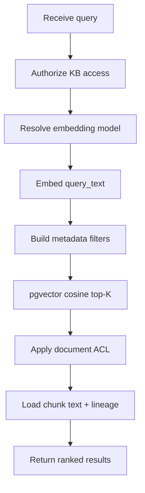

# Retrieval

> **Spec ID:** 005  
> **Status:** Draft  
> **Goal:** Given a user question, retrieve the most relevant chunks from authorized knowledge.  
> **Scope:** Dense vector search over pgvector with metadata filtering only.

## 1. Purpose

Feature 004 stores chunk embeddings in PostgreSQL (pgvector). Feature 005 answers:
**which chunks best match a user question?**

Retrieval is a read-only service used by chat, evaluation, and admin tools. It does not
generate answers, create citations, or call an LLM.

```text
User question
  → authorize caller and scope
  → embed query (same model as indexed chunks)
  → filter by tenant / KB / document / metadata
  → pgvector cosine top-K
  → ranked chunk results
  → (future) chat / citation assembly
```

### Goals

| Goal | Description |
| --- | --- |
| Relevance | Return the K most semantically similar chunks to the question |
| Safety | Authorization and metadata filters run **before** vector ranking |
| Simplicity | One search mode in v1: dense vectors only |
| Lineage | Results carry chunk and document identifiers for downstream citation |

### Non-goals (v1)

- BM25 or full-text lexical search
- Hybrid search (vector + keyword)
- Reranking (cross-encoder, LLM, or learned rerankers)
- Query expansion, HyDE, or multi-query retrieval
- LLM-based retrieval or agentic search
- Chat, answer generation, or citation attachment
- Web search or external connectors

---

## 2. Input contract

Retrieval accepts a **search request** from an authenticated application context.

### 2.1 Required fields

| Field | Type | Description |
| --- | --- | --- |
| `query_text` | string | User question or search phrase; non-empty after trim |
| `organization_id` | UUID | Tenant scope — mandatory on every query |
| `knowledge_base_id` | UUID | Corpus to search |
| `top_k` | int | Maximum results to return (default **8**, max **50**) |

### 2.2 Optional filters

| Field | Type | Description |
| --- | --- | --- |
| `document_ids` | UUID[] | Restrict search to specific documents |
| `language` | string | Filter chunks by `fa`, `en`, or `unknown` |
| `embedding_model_id` | UUID | Model to search; defaults to KB active model (BGE-M3 in v1) |

### 2.3 Caller context

The service receives trusted identity from the application layer (not from the client
payload alone):

| Context | Used for |
| --- | --- |
| `user_id` | Document ACL evaluation |
| `workspace_id` | Workspace membership and KB access |
| Role permissions | `knowledge_base:read`, `document:read` |

Empty or whitespace-only `query_text` is rejected before embedding.

---

## 3. Output contract

Retrieval returns an ordered list of **RetrievedChunk** results, best match first.

### 3.1 RetrievedChunk

| Field | Type | Description |
| --- | --- | --- |
| `chunk_id` | UUID | Matched chunk |
| `document_id` | UUID | Source document |
| `document_version_id` | UUID | Source version |
| `knowledge_base_id` | UUID | Source corpus |
| `score` | float | Cosine similarity; higher = more relevant (0.0–1.0) |
| `text` | string | Full chunk text |
| `chunk_index` | int | Sequence within the version |
| `start_char` | int | Offset in extracted text (inclusive) |
| `end_char` | int | Offset in extracted text (exclusive) |
| `heading` | string | Optional section heading |
| `language` | string | Optional chunk language |

### 3.2 Search result envelope

| Field | Type | Description |
| --- | --- | --- |
| `query_text` | string | Original query |
| `knowledge_base_id` | UUID | Corpus searched |
| `embedding_model_id` | UUID | Model used for query embedding |
| `top_k` | int | Requested K |
| `results` | RetrievedChunk[] | Ranked matches; length ≤ `top_k` |
| `result_count` | int | `len(results)` |
| `warnings` | string[] | Non-fatal issues (e.g. `no_results`) |

Results contain only chunks the caller is authorized to read. Unauthorized candidates
are excluded silently — never returned and never ranked.

### 3.3 Interface alignment

The application layer exposes retrieval through `SearchProvider`:

```text
backend/src/rag_enterprise/application/interfaces/search.py
  SearchProvider.search(organization_id, knowledge_base_id, query_text, top_k)
  SearchResult: chunk_id, score, excerpt
```

Implementation maps `RetrievedChunk` to `SearchResult`. Optional filters (`document_ids`,
`language`) are service parameters; the protocol may gain filter arguments in implementation
without changing v1 behavior for callers that omit them.

---

## 4. Retrieval flow



| Step | Action |
| --- | --- |
| 1. Validate | Reject empty query; clamp `top_k` |
| 2. Authorize | Verify caller has `knowledge_base:read` on the KB |
| 3. Resolve model | Use `embedding_model_id` or KB default (must match indexed embeddings) |
| 4. Embed query | Single-text call to `EmbeddingProvider.embed_texts([query_text])` |
| 5. Build filters | Tenant, KB, active status, optional document/language filters |
| 6. Vector search | pgvector cosine similarity, order descending, limit `top_k` |
| 7. ACL filter | Remove chunks whose parent document the caller cannot read |
| 8. Hydrate | Load chunk text and offsets; assemble `RetrievedChunk` list |
| 9. Return | Envelope with results and warnings |

Authorization runs in steps 2 and 7: metadata filters narrow the candidate set; ACL
removes any remaining unauthorized rows. Never rely on the embedding model to enforce access.

---

## 5. Top-K search

| Parameter | Default | Max | Notes |
| --- | --- | --- | --- |
| `top_k` | 8 | 50 | Configurable per call |

- pgvector returns the **K highest-scoring** candidates after metadata filters.
- If fewer than K chunks qualify, return all matches (`result_count < top_k`).
- If zero chunks qualify, return an empty list with warning `no_results`.
- Tie-breaking: when scores are equal, order by `document_id`, then `chunk_index`.

No oversampling or reranking in v1 — returned order is pure vector rank.

---

## 6. Cosine similarity

| Aspect | v1 rule |
| --- | --- |
| Metric | **Cosine similarity** between query vector and chunk vector |
| Storage | pgvector `<=>` cosine distance operator |
| Score | `1 - cosine_distance`, clamped to [0.0, 1.0] |
| Vectors | Same `embedding_model_id` and `dimensions` as indexed chunks |
| Normalization | Query and stored vectors use the same provider normalization |

Query embedding must use the **same model** that produced the stored vectors. Searching
with a mismatched model is rejected (`model_mismatch`).

Only embeddings with `index_status = indexed` participate in search.

---

## 7. Filtering

Filters are applied in the database **before** vector ranking (B-tree predicates first,
then HNSW scan over the filtered set — per `INDEXING_STRATEGY.md`).

### 7.1 Tenant filtering

| Filter | Rule |
| --- | --- |
| `organization_id` | **Required.** Every candidate row must match the request tenant. |
| Cross-tenant | Never allowed. Queries without a valid tenant context fail. |

`workspace_id` is enforced indirectly: the caller must belong to the workspace that
owns the knowledge base.

### 7.2 Knowledge Base filtering

| Filter | Rule |
| --- | --- |
| `knowledge_base_id` | **Required.** Search only embeddings/chunks in this KB. |
| KB status | KB must be `active` (not `archived` or `deleted`) |
| KB permission | Caller must have `knowledge_base:read` |

One request searches **one** knowledge base. Multi-KB search is out of scope for v1.

### 7.3 Document filtering

| Filter | Rule |
| --- | --- |
| `document_ids` | Optional. When provided, restrict to chunks whose `document_id` is in the list. |
| Document status | Only `active` documents (not `archived` or `deleted`) |
| Document ACL | Caller must have `document:read` on each result document |
| Version | Only chunks from `indexed` versions; exclude `superseded` versions and chunks |

When `document_ids` is omitted, search all authorized documents in the KB.

### 7.4 Metadata filtering (v1)

| Filter | Rule |
| --- | --- |
| `language` | Optional. Match chunk `language` when provided. |
| Chunk status | `indexed` only; exclude `superseded` |
| Embedding status | `index_status = indexed` only; exclude `stale` |
| Version status | Parent `DocumentVersion.processing_status = indexed` |

Classification labels and folder scoping may be added in a future spec. v1 supports
tenant, KB, document, and language filters only.

---

## 8. Business rules

| ID | Rule |
| --- | --- |
| RT-01 | Authorization filters are applied before and after vector search. |
| RT-02 | Retrieval never returns chunks from superseded versions or stale embeddings. |
| RT-03 | Query and corpus vectors must share the same `embedding_model_id`. |
| RT-04 | Empty queries are rejected; empty result sets are valid (not errors). |
| RT-05 | Result order reflects cosine similarity only — no reranking in v1. |
| RT-06 | Chunk text in results is the stored chunk body — not truncated unless caller requests excerpt mode. |
| RT-07 | Retrieval is read-only; it does not mutate chunks, embeddings, or indexes. |
| RT-08 | Tenant scope is mandatory; no global or cross-org search. |
| RT-09 | At most one KB per request in v1. |
| RT-10 | Log query metadata and result counts; do not log full query text in production if policy restricts it. |

---

## 9. Failure handling

### 9.1 Failure categories

| Code | When | HTTP-style | Retryable |
| --- | --- | --- | --- |
| `invalid_query` | Empty or whitespace-only query | 400 | No |
| `forbidden` | Caller lacks KB or document access | 403 | No |
| `knowledge_base_not_found` | KB does not exist or wrong tenant | 404 | No |
| `knowledge_base_unavailable` | KB archived or not searchable | 409 | No |
| `model_mismatch` | Requested model ≠ indexed model | 400 | No |
| `model_unavailable` | Query embedding provider unreachable | 503 | Yes |
| `embedding_timeout` | Query embed exceeds timeout (default 30s) | 504 | Yes |
| `search_timeout` | pgvector query exceeds timeout (default 10s) | 504 | Yes |
| `no_indexed_content` | KB has zero searchable embeddings | 200 + warning | No |
| `unknown_error` | Unexpected exception | 500 | Yes |

### 9.2 Degraded behavior

| Condition | Behavior |
| --- | --- |
| Zero results after filters | Return empty `results`; warning `no_results` |
| KB has no indexed documents yet | Return empty `results`; warning `no_indexed_content` |
| Provider transient failure | Retry up to 2 times with backoff; then fail |
| Partial ACL denial | Return only authorized subset; no error |

Retrieval does not fabricate chunks or fall back to keyword search in v1.

### 9.3 Retry policy (transient errors)

| Attempt | Delay |
| --- | --- |
| 1st retry | 1 second |
| 2nd retry | 3 seconds |

---

## 10. Module boundaries

### In scope

- Retrieval service: query → ranked chunks
- Query embedding via `EmbeddingProvider`
- pgvector cosine top-K with metadata filters
- Authorization integration (KB + document ACL)
- `SearchProvider` implementation

### Out of scope

- Chat and message generation
- Citation creation and validation
- BM25, hybrid, reranking, query expansion
- Retrieval configuration publishing (uses existing KB default model in v1)
- HTTP API design (separate spec; service is callable from application layer)

### Suggested package location

```text
backend/src/rag_enterprise/retrieval/
  service.py          # RetrievalService
  models.py           # SearchRequest, RetrievedChunk, SearchResponse
  filters.py          # Metadata filter builder
  exceptions.py
```

Follow existing patterns: `Result[T]`, structured logging, injected `EmbeddingProvider`.

---

## 11. Acceptance criteria

### AC-01: Successful retrieval

**Given** a knowledge base with indexed Persian and English documents  
**And** a caller with `knowledge_base:read` and `document:read`  
**When** the user searches with a relevant Persian question and `top_k = 5`  
**Then** up to 5 chunks are returned ordered by descending `score`  
**And** every result belongs to the requested `knowledge_base_id` and `organization_id`  
**And** each `score` is cosine similarity in [0.0, 1.0]

### AC-02: Tenant isolation

**Given** two organizations with identically worded questions  
**When** each searches its own knowledge base  
**Then** neither receives chunks from the other organization's data

### AC-03: Knowledge base scoping

**Given** a workspace with knowledge bases A and B  
**When** a search targets knowledge base A  
**Then** no chunks from B appear in results

### AC-04: Document filtering

**Given** documents D1 and D2 in the same knowledge base  
**When** search includes `document_ids = [D1]`  
**Then** all results reference D1 only

### AC-05: Unauthorized document excluded

**Given** a restricted document the caller cannot read  
**When** vector search would rank its chunks highly  
**Then** those chunks are absent from results

### AC-06: Superseded content excluded

**Given** document version A is superseded by version B  
**When** search runs after B is indexed  
**Then** only B's chunks appear; A's chunks are never returned

### AC-07: Empty query rejected

**Given** `query_text` is empty or whitespace  
**When** search is requested  
**Then** retrieval fails with `invalid_query`

### AC-08: No indexed content

**Given** a knowledge base with no indexed embeddings  
**When** search runs  
**Then** an empty result list is returned with warning `no_indexed_content`

### AC-09: Model mismatch rejected

**Given** chunks indexed with model M1  
**When** search requests model M2  
**Then** retrieval fails with `model_mismatch`

### AC-10: Mixed Persian–English corpus

**Given** indexed chunks in both Persian and English  
**When** a Persian question is searched without `language` filter  
**Then** results may include either language, ranked by similarity  
**When** `language = fa` is set  
**Then** only Persian-tagged chunks are candidates

---

## 12. Observability

Log structured events (avoid full query text if policy requires redaction):

| Event | Fields |
| --- | --- |
| `retrieval_started` | `organization_id`, `knowledge_base_id`, `top_k`, `embedding_model_id` |
| `retrieval_completed` | `result_count`, `latency_ms`, `warnings` |
| `retrieval_failed` | `failure_reason`, `latency_ms` |

Metrics (future): queries per minute, p95 latency, empty-result rate, zero-hit rate by KB.

---

## 13. Related documents

- [004 Embeddings & Indexing](../004-embeddings/SPEC.md)
- [003 Chunking](../003-chunking/SPEC.md)
- [Permission Model](../../docs/domain/PERMISSION_MODEL.md)
- [Multi-Tenancy](../../docs/domain/MULTI_TENANCY.md)
- [Indexing Strategy](../../docs/data/INDEXING_STRATEGY.md)
- [Entity Lifecycle — Chunk / Embedding](../../docs/domain/ENTITY_LIFECYCLE.md)
- [AI Engineering Rules](../../.cursor/rules/ai-engineering.md)
- `SearchProvider` — `backend/src/rag_enterprise/application/interfaces/search.py`
- `EmbeddingProvider` — `backend/src/rag_enterprise/application/interfaces/embedding.py`
