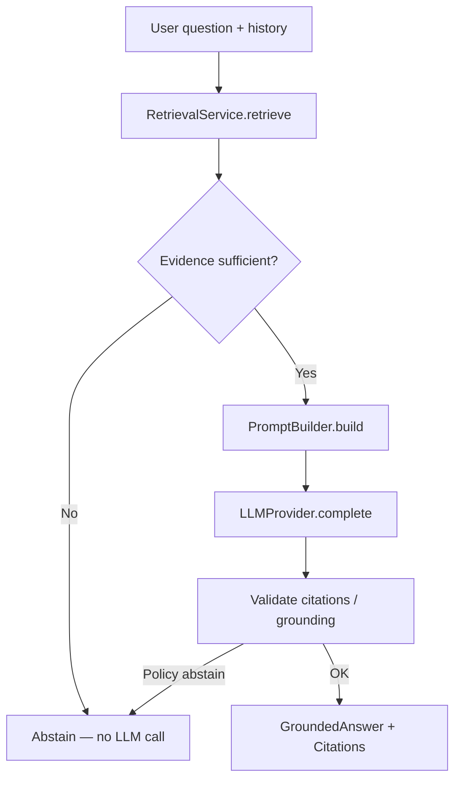

# RAG Generation

> **Spec ID:** 006  
> **Status:** Implemented  
> **Goal:** Generate grounded answers from retrieved chunks, with citations and abstention.  
> **Scope:** RAG generation only — no agents, tools, function calling, or long-term memory.

## 1. Purpose

Feature 005 retrieves authorized chunks for a user question. Feature 006 is the final AI
pipeline stage: assemble a prompt, call an LLM, return a **grounded answer** with
**citations**, or an explicit **abstention** when evidence is insufficient.

```text
Question (+ short history)
  → Retrieval (Feature 005)
  → PromptBuilder
  → LLMProvider
  → Grounded Answer | Abstention
  → Citations
```

Deterministic application code owns retrieval filters, prompt assembly policy, citation
validation, timeouts, and abstention. The model proposes text; it is not trusted for
authorization or truth without evidence.

### Goals

| Goal | Description |
| --- | --- |
| Groundedness | Answers are supported only by retrieved chunks |
| Traceability | Facts map to citations referencing chunk IDs |
| Safety | Insufficient evidence → abstain; never invent |
| Simplicity | Single-shot generation; short conversation history only |

### Non-goals (v1)

- Multi-agent orchestration, LangGraph workflows, tools, or function calling
- Query rewriting, HyDE, multi-hop retrieval, or self-reflection loops
- Streaming UX details (optional later; not required for this contract)
- Long-term memory, conversation summarization, or cross-conversation recall
- Automatic evaluation harness (separate quality spec)
- Full conversation CRUD API design (use this service from chat later)

---

## 2. Pipeline



| Step | Owner | Action |
| --- | --- | --- |
| 1. Validate input | Generation service | Non-empty question; clamp history length |
| 2. Retrieve | Feature 005 | Dense top-K over authorized KB |
| 3. Sufficiency gate | Generation service | Empty results or scores below threshold → abstain |
| 4. Build prompt | PromptBuilder | Versioned template + chunks + history |
| 5. Generate | LLMProvider | Single completion call with timeout |
| 6. Attach citations | Generation service | Map model markers to retrieved chunks |
| 7. Return | Generation service | `GenerationResult` envelope |

v1 makes **one** retrieval call and **at most one** LLM call per user turn.

---

## 3. Input contract

| Field | Type | Required | Description |
| --- | --- | --- | --- |
| `question` | string | Yes | Current user question (trimmed, non-empty) |
| `organization_id` | UUID | Yes | Tenant scope |
| `workspace_id` | UUID | Yes | Workspace scope |
| `knowledge_base_id` | UUID | Yes | Corpus to retrieve from |
| `conversation_id` | UUID | No | Optional conversation for history load |
| `history` | MessageTurn[] | No | Previous turns if not loading by ID |
| `document_ids` | UUID[] | No | Optional retrieval filter |
| `language_hint` | string | No | Optional `fa` / `en`; otherwise detect from question |
| `top_k` | int | No | Override retrieval K (default from settings) |
| `user_id` / permissions | context | Yes | Same auth context as Feature 005 |

### MessageTurn

| Field | Type | Description |
| --- | --- | --- |
| `role` | `user` \| `assistant` | Turn role |
| `content` | string | Prior message text |

History length: **last N turns**, configurable default **6**, allowed range **5–10**.
Oldest turns beyond N are dropped. No summarization.

---

## 4. Output contract

### 4.1 GenerationResult

| Field | Type | Description |
| --- | --- | --- |
| `status` | string | `completed` \| `abstained` \| `failed` |
| `answer` | string \| null | Grounded answer text; null when abstained/failed |
| `abstention_reason` | string \| null | Stable code when abstained |
| `citations` | Citation[] | Evidence links; empty on abstention |
| `retrieved_chunk_ids` | UUID[] | Chunks sent to the prompt (audit) |
| `model_key` | string \| null | LLM used, if called |
| `prompt_template_version` | string \| null | Template version used |
| `warnings` | string[] | Non-fatal issues |

Aligns with Message lifecycle: `completed`, `abstained`, `failed`
([ENTITY_LIFECYCLE.md](../../docs/domain/ENTITY_LIFECYCLE.md)).

### 4.2 Citation

| Field | Type | Description |
| --- | --- | --- |
| `chunk_id` | UUID | Evidence chunk |
| `document_id` | UUID | Source document |
| `document_version_id` | UUID | Source version |
| `rank` | int | Display order (1-based) |
| `relevance_score` | float | Retrieval score for the chunk |
| `excerpt` | string | Short supporting span from chunk text |
| `start_char` / `end_char` | int \| null | Optional offsets when known |
| `marker` | string | Placeholder used in prompt (e.g. `[1]`) |

Citations reference only chunks that were retrieved for this turn. No fabricated chunk IDs.

---

## 5. PromptBuilder

PromptBuilder assembles the LLM payload from **versioned prompt templates** and runtime
context. Prompt text is **not hard-coded** in application services.

### 5.1 Responsibilities

| Responsibility | Behavior |
| --- | --- |
| System instructions | Load system section from prompt template (grounding policy, safety) |
| User question | Insert current question in a clearly labeled user section |
| Conversation history | Append last N turns with role labels |
| Retrieved chunks | Format each chunk with `marker`, `heading`, `text`, lineage IDs |
| Citation placeholders | Instruct model to cite using markers like `[1]`, `[2]` |
| Language instruction | Require answer language = question language (Persian/English/…) |
| Formatting | Structure sections with explicit delimiters and trust labels |
| Size control | Truncate oldest history, then lowest-ranked chunks, before failing |

### 5.2 Prompt structure (logical sections)

```text
[SYSTEM — policy template]
[HISTORY — optional prior turns]
[EVIDENCE — retrieved chunks with markers]
[QUESTION — current user question]
[OUTPUT RULES — cite markers; abstain if unsupported]
```

Per [ai-engineering.md](../../.cursor/rules/ai-engineering.md): separate system policy,
retrieved context, and user input with explicit delimiters. Treat retrieved text as
untrusted (prompt-injection-aware framing).

### 5.3 Template ownership

| Asset | Rule |
| --- | --- |
| Template body | Versioned repository artifact or org `PromptTemplate` record |
| Locale | Template may be locale-aware; runtime still forces answer language = question language |
| Version pinning | Record `prompt_template_version` on every generation result |
| Change control | Template edits require review; generation code only selects/binds variables |

PromptBuilder outputs values compatible with `LLMCompletionRequest`
(`system_prompt`, `user_prompt`).

---

## 6. LLM Provider

Use the existing abstraction:

```text
backend/src/rag_enterprise/application/interfaces/llm.py
  LLMProvider
    model_key: str
    complete(request: LLMCompletionRequest) -> LLMCompletionResponse
```

### Design rules

| Rule | Description |
| --- | --- |
| Provider-agnostic | Application depends on `LLMProvider` only |
| One implementation in v1 | Single adapter (e.g. one OpenAI-compatible or approved vendor client) |
| Injected | Construction via DI / settings; no SDKs in domain code |
| Pinned model | `model_key` and inference params come from settings / catalog |
| Timeout | Every `complete` call has an explicit timeout (default **60s**) |

Do not add agent frameworks, tool routers, or multi-provider cascades in v1.

---

## 7. Grounding rules

| ID | Rule |
| --- | --- |
| GR-01 | Answer **only** from retrieved evidence in the prompt. |
| GR-02 | If evidence is missing, empty, or clearly irrelevant → **abstain** (no guessing). |
| GR-03 | Prefer abstention over unsupported claims. |
| GR-04 | Do not use parametric model knowledge as a substitute for missing chunks. |
| GR-05 | Conflicting evidence: state the conflict briefly and cite both sides, or abstain. |
| GR-06 | Application may abstain **before** calling the LLM when `result_count == 0` or max score &lt; threshold. |
| GR-07 | Application may abstain **after** generation if the model returns an abstain token/phrase per template contract, or if citation validation fails policy. |

### Sufficiency gate (v1 defaults)

| Condition | Outcome |
| --- | --- |
| Zero retrieved chunks | `abstained` / `insufficient_evidence` — **no LLM call** |
| Max `score` &lt; `min_evidence_score` (default **0.25**) | `abstained` / `insufficient_evidence` — **no LLM call** |
| Otherwise | Proceed to PromptBuilder + LLM |

Threshold is configurable; do not tune with production PII in this spec.

### Abstention response

Return a clear user-facing message (from template, not free invention) such as that
insufficient knowledge-base evidence was found, plus `status = abstained` and empty
`citations`.

---

## 8. Citations

| Requirement | Behavior |
| --- | --- |
| Traceability | Every factual claim in a completed answer should map to ≥ 1 citation |
| Markers | Prompt instructs the model to place `[n]` after claims |
| Validation | Keep only citations whose `chunk_id` / marker maps to retrieved evidence |
| Unknown markers | Drop unknown markers; if no valid citations remain for a nonempty answer, abstain or attach all retrieved chunks as weak citations — **v1 choice: abstain with `citation_validation_failed`** if answer has no valid markers |
| Persistence (future) | Chat layer stores Citation rows on Message; this spec defines the in-memory contract |

Returning citations **alongside** the answer is mandatory for `completed` results.

---

## 9. Conversation history

| Parameter | Default | Range |
| --- | --- | --- |
| `max_history_messages` | 6 | 5–10 |

- Include only prior `user` / `assistant` turns (no system dumps).
- Use history for pronoun/context resolution; retrieval still runs on the **current question**
  (optionally concatenated with the last user turn if the question is too short — v1: retrieve
  on current question only).
- No long-term memory store.
- No conversation summarization model.

---

## 10. Language behavior

| Rule | Description |
| --- | --- |
| Answer language | Same language as the **user's current question** |
| Evidence language | Chunks may be Persian, English, or mixed; do not force translation unless asked |
| Prompt instruction | PromptBuilder injects an explicit language rule each turn |
| Detection | Lightweight heuristic or reuse processing detector; `language_hint` overrides |

---

## 11. Failure handling

### 11.1 Failure categories

| Code | When | Status | Retryable |
| --- | --- | --- | --- |
| `invalid_question` | Empty question | `failed` | No |
| `forbidden` | Missing KB/document permission | `failed` | No |
| `retrieval_failed` | Retrieval service error | `failed` | Yes |
| `insufficient_evidence` | No usable chunks | `abstained` | No |
| `prompt_too_large` | Still over budget after truncation | `failed` | No |
| `model_unavailable` | LLM unreachable / 5xx | `failed` | Yes |
| `generation_timeout` | Exceeds timeout | `failed` | Yes |
| `citation_validation_failed` | Answer without valid citations | `abstained` | No |
| `unknown_error` | Unexpected exception | `failed` | Yes |

### 11.2 Timeouts and retries

| Call | Default timeout |
| --- | --- |
| Retrieval | Per Feature 005 |
| LLM `complete` | **60 seconds** |

Transient LLM failures: up to **2** retries with short backoff (1s, 3s). Do not retry
abstentions or validation failures.

### 11.3 Prompt too large

Order of reduction:

1. Drop oldest history turns (keep ≥ 0).
2. Drop lowest-ranked evidence chunks (keep ≥ 1 if any existed).
3. If still too large → `prompt_too_large`.

---

## 12. Business rules

| ID | Rule |
| --- | --- |
| RG-01 | Generation never bypasses retrieval authorization. |
| RG-02 | At most one LLM completion per user turn in v1. |
| RG-03 | Completed answers include ≥ 1 citation. |
| RG-04 | Abstained answers have empty citations and no speculative prose beyond the abstain template. |
| RG-05 | Log model_key, latency, token counts, template version — not full prompts/answers by default. |
| RG-06 | Tenant scope is mandatory; one knowledge base per turn in v1. |

---

## 13. Module boundaries

### In scope

- Generation service orchestration
- PromptBuilder + versioned templates
- One `LLMProvider` adapter
- Citation assembly and sufficiency gates
- Short history window

### Out of scope

- Agents, tools, MCP, function calling
- Streaming protocol design
- Full Conversation/Message HTTP API
- ORM/schema for conversations (chat feature later)
- Reranking or hybrid retrieval changes

### Suggested package location

```text
backend/src/rag_enterprise/generation/
  service.py          # GenerationService.generate()
  prompt_builder.py   # PromptBuilder
  models.py           # GenerationRequest, GenerationResult, Citation
  templates/          # Versioned prompt artifacts
  exceptions.py
  providers/          # One LLMProvider implementation
```

---

## 14. Acceptance criteria

### AC-01: Grounded answer

**Given** indexed chunks that answer a Persian HR policy question  
**When** generation runs with a matching question  
**Then** `status = completed`  
**And** `answer` is nonempty  
**And** `citations` contains ≥ 1 item referencing retrieved `chunk_id`s  
**And** answer language is Persian

### AC-02: Insufficient evidence

**Given** a knowledge base with no relevant indexed content (or scores below threshold)  
**When** the user asks an unrelated question  
**Then** `status = abstained`  
**And** `abstention_reason = insufficient_evidence`  
**And** the LLM is not called  
**And** `citations` is empty

### AC-03: Multilingual question

**Given** a mixed Persian/English corpus  
**When** the user asks in English  
**Then** the answer is in English  
**And** citations may still point to Persian or English chunks when relevant

### AC-04: Citations returned

**Given** a successful grounded generation  
**When** inspecting the result  
**Then** each citation includes `chunk_id`, `document_id`, `rank`, and `excerpt`  
**And** every `chunk_id` was present in the retrieval set for that turn

### AC-05: Conversation follow-up

**Given** prior turns within the history window (e.g. “What is the leave policy?” then “How many days?”)  
**When** generation runs with history length ≤ `max_history_messages`  
**Then** retrieval uses the current question  
**And** the prompt includes the clipped history  
**And** the answer resolves the follow-up using evidence + history context

### AC-06: Timeout

**Given** the LLM provider exceeds the generation timeout  
**When** generation runs  
**Then** `status = failed` with `generation_timeout`  
**And** no partial answer is returned as `completed`

### AC-07: Prompt too large

**Given** evidence and history that exceed the token/char budget after truncation  
**When** generation attempts prompt build  
**Then** `status = failed` with `prompt_too_large`

---

## 15. Observability

| Event | Fields |
| --- | --- |
| `generation_started` | `organization_id`, `knowledge_base_id`, `top_k`, `history_len` |
| `generation_abstained` | `abstention_reason`, `result_count` |
| `generation_completed` | `model_key`, `citation_count`, `latency_ms`, `prompt_template_version` |
| `generation_failed` | `failure_reason`, `latency_ms` |

Do not log full prompts, document text, or answer bodies by default.

---

## 16. Related documents

- [005 Retrieval](../005-retrieval/SPEC.md)
- [004 Embeddings & Indexing](../004-embeddings/SPEC.md)
- [Entity Lifecycle — Message / Citation](../../docs/domain/ENTITY_LIFECYCLE.md)
- [Domain Model — Conversation](../../docs/domain/DOMAIN_MODEL.md)
- [Domain Glossary — RAG / Citation](../../docs/domain/DOMAIN_GLOSSARY.md)
- [AI Engineering Rules](../../.cursor/rules/ai-engineering.md)
- `LLMProvider` — `backend/src/rag_enterprise/application/interfaces/llm.py`
- `SearchProvider` / retrieval — Feature 005
